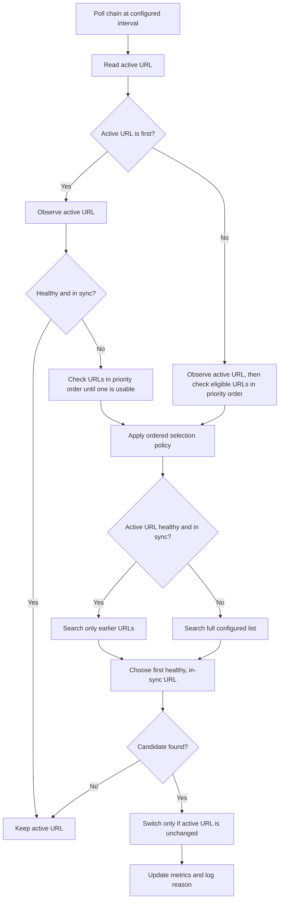
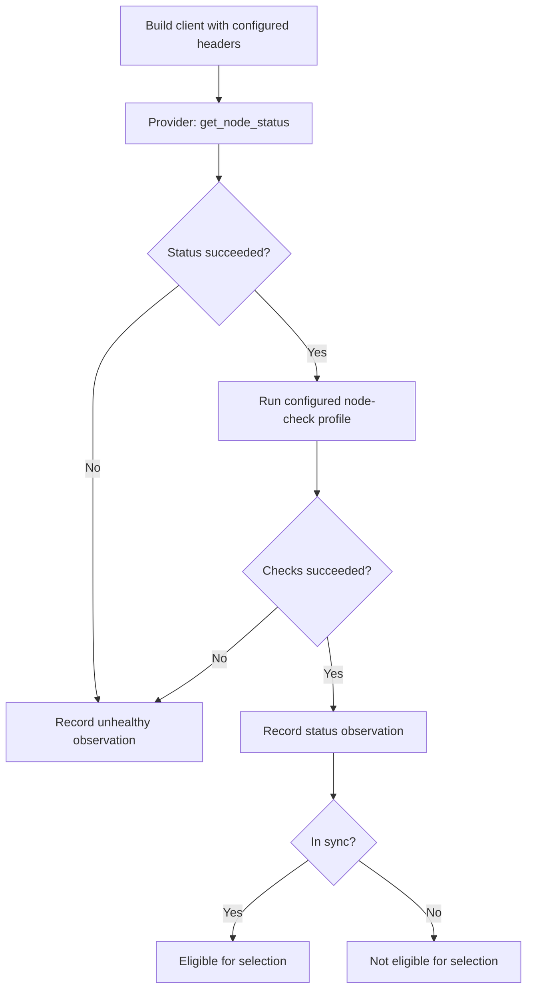

# Dynode Node Monitoring

Dynode monitoring keeps one active RPC URL per chain and moves traffic between configured URLs when health changes. The mechanism is chain-agnostic: each chain provider defines how node status and profile checks are performed.

## Core rules

- URL order is priority order. The first configured URL is preferred.
- A node is usable only when its status and configured profile checks succeed and it is in sync.
- If `monitoring.trigger.latency` is set, every required profile check must complete within that latency.
- A healthy fallback remains active until a higher-priority URL becomes healthy again.
- Selection uses configuration order among usable nodes.
- Switching is atomic: the selected URL is installed only if the active URL has not changed since the monitoring cycle started.
- Request retries and monitoring are separate. Retries select an upstream for one request; monitoring changes the active URL shared by later requests.

## Failure-triggered checks

Dynode also starts a monitoring cycle when the active URL reaches either configured threshold:

- `trigger.failures`: consecutive retryable failures.
- `trigger.rate`: retryable failure percentage within `trigger.window`, after at least `trigger.failures` failed requests.
- `trigger.latency`: maximum acceptable latency for any required profile check before alternatives are checked.

Transport errors always count. Responses count only when their HTTP status or JSON-RPC error message matches `retry.errors`. Cache hits and fallback attempts do not count. The window also acts as the cooldown between triggered checks for the active URL.

The rolling rate uses bounded time buckets, so memory use does not grow with request volume.

## Monitoring cycle

Monitoring runs only for chains with more than one configured URL.

The first-URL fast path avoids unnecessary checks while the preferred node is healthy. Other checks stop at the first usable URL in configuration order. A healthy fallback checks only higher-priority URLs; an unhealthy active URL searches the full list.

## Observing one URL

The monitoring layer does not name or require a protocol-specific RPC method.

`get_node_status` is implemented by each chain provider. For example, an EVM provider may use `eth_blockNumber`, while another chain uses its native status method. If the initial status call fails, profile checks are skipped because the node is already known to be unusable.

Every profile verifies the chain identity and latest block number. Additional checks depend on the configured profile:

- `basic` performs no additional checks.
- `wallet` checks the configured address balance on every chain and adds richer chain-specific checks where available.
- `parser` verifies the latest block number and that the node can return transactions for a recent block.

Failed required checks make the observation unhealthy. Optional checks may be recorded as warnings without rejecting the node.

## Ordered selection

Assume URLs are configured as `A, B, C`, where `A` has the highest priority.

| Active URL | State | Eligible search range | Result |
| --- | --- | --- | --- |
| `A` | Healthy | None | Keep `A`; lower-priority URLs are not checked |
| `A` | Unhealthy | `A, B, C` | Select the first healthy URL |
| `B` | Healthy | `A` | Return to `A` when it is healthy; otherwise keep `B` |
| `B` | Unhealthy | `A, B, C` | Select the first healthy URL |
| `C` | Healthy | `A, B` | Prefer `A`, then `B`; otherwise keep `C` |

An observation must be healthy, in sync, and within the latency threshold when configured. A faster or higher-block lower-priority node does not displace a higher-priority node that is still within threshold.

## Endpoint construction

An empty RPC path uses the configured base endpoint after removing trailing separators. Dynode does not append `/` when no path is requested. For a non-empty path, Dynode preserves an existing leading separator or inserts one when needed.

This matters for authenticated endpoints where `/v1/key` and `/v1/key/` can have different authorization behavior.

## Metrics

Each observed URL publishes its last check success, sync state, latest and current block, check latency, and check timestamp. A cycle counter distinguishes `scheduled` checks from `failure_trigger` checks.

Node-switch metrics use the same stable reasons as request retries: `status=<code>`, `timeout`, `connect_error`, and `request_error`. Profile failures use `request_error`. Error logs record the bounded type (`upstream`, `request`, or `node_check`) and one error detail containing the stable reason and provider message. Raw provider errors are not used as Prometheus labels.

## Code map

- [Monitoring worker](../apps/dynode/src/monitoring/worker.rs): creates one monitor per eligible chain.
- [Chain monitor](../apps/dynode/src/monitoring/chain_monitor.rs): schedules periodic and failure-triggered checks.
- [Node health evaluator](../apps/dynode/src/monitoring/evaluator.rs): observes eligible URLs and applies switches.
- [Node observer](../apps/dynode/src/monitoring/node_observer.rs): creates one chain-provider observation.
- [Selection policy](../apps/dynode/src/monitoring/selection.rs): applies configured priority and recovery behavior.
- [Telemetry](../apps/dynode/src/monitoring/telemetry.rs): records observations and switch outcomes.
- [Node service](../apps/dynode/src/node_service.rs): routes requests through the active URL and handles per-request retries.
- [URL construction](../crates/gem_client/src/query.rs): joins base endpoints and request paths.
