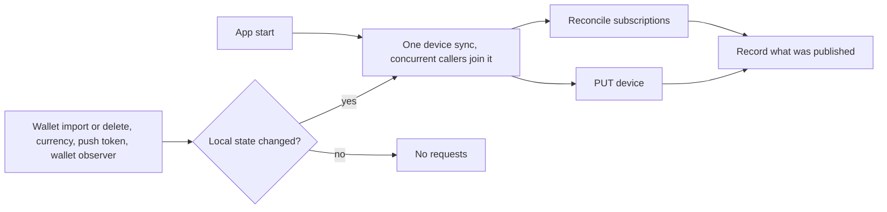

# Device

Every install registers a device with the backend, tells it which wallet addresses to watch, and streams updates over one authenticated WebSocket. Every `/v2/devices/*` request, including the stream upgrade, is signed with the device key.

## Authentication

```
Authorization: Gem base64(<device_id_hex>.<timestamp_ms>.<wallet_id>.<body_hash_hex>.<signature_hex>)
```

Five dot-separated parts: the 64-hex Ed25519 public key, the Unix timestamp in milliseconds, the wallet id (empty for a non-wallet endpoint, which leaves `..` between the timestamp and the hash), the SHA256 of the body, and the 128-hex Ed25519 signature over `{timestamp}.{method}.{path}.{walletId}.{bodyHash}`:

```
1706000000000.GET./v2/devices/assets.multicoin_0x742d35Cc6634C0532925a3b844Bc9e7595f0bEb.e3b0c44298fc1c149afbf4c8996fb92427ae41e4649b934ca495991b7852b855
```

The header lives in the shared `gem_auth` crate, used by the client and the backend; the device key never crosses the FFI boundary ([Keystore v4](KEYSTORE_V4.md)). Backend side: [signature verification](../core/apps/api/src/devices/signature.rs), [cryptographic check](../core/crates/gem_auth/src/device_signature.rs), [request guards](../core/apps/api/src/devices/guard/).

## Device record and subscriptions

One record per install, the shared `Device` primitive: push token, locale, currency, app version, push and price-alert flags, and `subscriptionsVersion`, bumped whenever the subscription set changes so either side can tell the two disagree.

```
GET/POST/PUT  /v2/devices          GET  /v2/devices/is_registered
GET/POST/DELETE  /v2/devices/subscriptions
```

Wallet-scoped endpoints such as `/v2/devices/assets` return `404` until that wallet is subscribed, so a wallet is subscribed before the first wallet-scoped fetch for it.



Subscriptions are reconciled by diffing local wallets against `GET /v2/devices/subscriptions`: missing addresses are added per wallet grouped by chain, and wallets the backend still knows but the device no longer has are removed in full. Registration comes first; if it fails nothing else assumes the device exists and the next sync retries. App start always checks the remote record so one lost by the backend is recreated; every other trigger runs only when local state diverges.

[`GemDeviceService`](../core/gemstone/src/services/device/mod.rs) owns registration, divergence detection, serialization of concurrent syncs and the published-state checkpoint; [`GemSubscriptionService`](../core/gemstone/src/services/subscription/mod.rs) owns reconciliation. Divergence is derived from the current device plus a deterministic wallet/account signature, so a service that writes a record value (currency, the price-alert flag) just writes it and the next occasion finds the difference; a new field needs the field and the comparison, no new call site. `set_push_enabled` is the one write that also syncs, because the push token is read from the platform at that moment.

| Occasion | Check |
|---|---|
| App start | `synchronize()`, unconditional |
| Any wallet-scoped device request | `DeviceSyncPreflight` before the request goes out |
| Stream connection | `prepareConnection` |
| Wallet or account change | iOS `SubscriptionsObserver` through `AppLifecycleService`; Android `DeviceObserverService` |

Rules both platforms keep:

- A wallet-scoped request never runs for a wallet the backend was not told about.
- Concurrent triggers produce one sync, not one per caller.
- Published state is recorded only after a successful sync; a failed sync leaves the divergence for the next trigger.
- Adding a wallet never removes other wallets' subscriptions; deleting one removes its own.
- Outside the app-start check, nothing changed since the last sync means no requests.

Code: [iOS device platform](../ios/Packages/GemstoneServices/Sources/Device/DevicePlatform.swift), [Android device platform](../android/data/services/gemstone/src/main/kotlin/com/gemwallet/android/data/services/gemstone/device/DevicePlatform.kt), [Android wallet trigger](../android/data/services/gemstone/src/main/kotlin/com/gemwallet/android/data/services/gemstone/device/DeviceObserverService.kt).

## WebSocket stream

`wss://api.gemwallet.com/v2/devices/stream`, authenticated once at upgrade with the header above, carries price, balance, transaction, price-alert, NFT, perpetual, in-app-notification, fiat-transaction and support updates. It runs as its own service (`api websocket_stream`); reconnects replay at most `DeviceStreamHistoryLimit` (default 25) missed events, and price updates are batched every 5 seconds.

Client messages are `{"type": ..., "data": {"assets": [...]}}` with the type `subscribePrices` (the first request on every connection, answered with current USD prices and fiat rates), `addPrices` (prices for the expanded set, no rates), `unsubscribePrices` and `getPrices` (once). `subscribeRealtimePrices` and `unsubscribeRealtimePrices` are still accepted and ignored.

Server events, defined by `StreamEvent`:

| `event` | Payload |
|---|---|
| `prices` | prices and optional fiat rates |
| `balances` | wallet and affected asset ids |
| `transactions` | wallet, transaction ids and affected asset ids (no separate balance event follows) |
| `priceAlerts` | affected asset ids |
| `nft`, `perpetual`, `fiatTransaction` | affected wallet id |
| `inAppNotification` | wallet id and notification |
| `support` | support-stream event |

Both balance and transaction events carry `assetIds` arrays; the singular `assetId` is gone and every release from [2.104](https://github.com/gemwalletcom/wallet/releases/tag/2.104) reads the arrays. The server closes the connection when a client message cannot be processed, so the client reconnects and replays its subscriptions instead of keeping a silently failed one.

How the apps drive it:

- Both apps use `GemStreamService` for connection preparation, session eligibility, device synchronization, reconnect resets and event application in the current currency; native observers own foreground and session observation, socket I/O, cancellation and ordered forwarding. Session changes while backgrounded cannot open a connection, and a wallet change finishes the previous observer before opening its replacement.
- Wallet setup and asset enable or disable rebuild the price subscription from the stored enabled assets; nothing calls `POST /v1/prices`. Extra requests from asset details and swaps are retained across reconnects and cleared on a wallet switch.
- Subscription changes are serialized; a failed send keeps the assets pending, and each new connection resets the sent state before resubscribing.
- Events are applied in order, rates before later prices. `GemStreamService::decode_event` applies only local effects (prices, rates, notifications, support); the network follow-up for balance, transaction, NFT, perpetual, price-alert and fiat events runs through `GemStreamService::sync`, started outside the socket loop so a replayed backlog never delays the price snapshot.

Backend: [stream handler](../core/apps/api/src/websocket_stream/stream.rs), [client logic](../core/apps/api/src/websocket_stream/client.rs), [message types](../core/crates/primitives/src/stream.rs), [price payload](../core/crates/primitives/src/websocket.rs).
