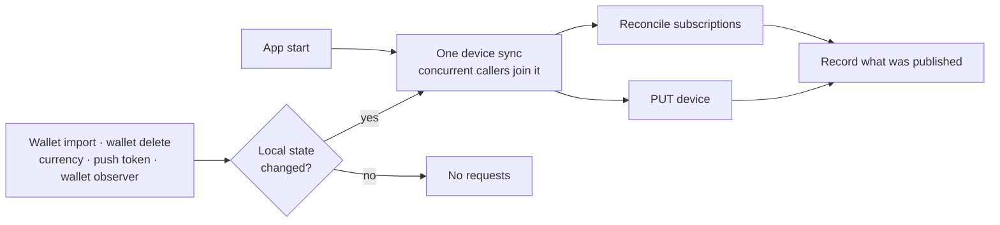

# Device and subscriptions

Every install registers a device with the backend and tells it which wallet addresses to watch. Wallet-scoped endpoints such as `/v2/devices/assets` return `404` until that wallet is subscribed, so both apps must subscribe a wallet before requesting anything scoped to it.

## Device record

One record per install, defined by the shared `Device` primitive: push token, locale, currency, app version, push and price-alert flags, and `subscriptionsVersion`. The version is bumped when the subscription set changes and lets either side detect that the backend and the client disagree about what is subscribed.

```
GET    /v2/devices/is_registered
GET    /v2/devices
POST   /v2/devices
PUT    /v2/devices
GET    /v2/devices/subscriptions
POST   /v2/devices/subscriptions
DELETE /v2/devices/subscriptions
```

Request signing for all of them: [Device Authentication](./DEVICE_AUTHENTICATION.md).

## Sync flow



Subscriptions are reconciled by diffing local wallets against `GET /v2/devices/subscriptions`: missing addresses are added per wallet grouped by chain, and wallets the backend still knows but the device no longer has are removed in full. Adding a wallet never removes another wallet's subscriptions.

Registration comes first. If the device is not registered, or registration fails, nothing else may assume the device exists — the next sync retries it.

App start always checks the remote device record so a record lost by the backend is recreated without waiting for a local change. Other triggers use local divergence and avoid a request when nothing changed.

## Ordering

A fresh install imports a wallet and immediately asks for its assets, so the subscription must not race that request. The wallet has to be subscribed before the first wallet-scoped fetch for it, either because the sync is part of that fetch or because it provably ran first.

## Failure and lifetime

The local record of what was published is written only after a successful sync, so a failed sync leaves the divergence in place and the next trigger retries it. A sync must never record success it did not achieve. Concurrent triggers collapse into a single network sync rather than one per caller.

## Shared ownership and platform triggers

[`GemDeviceService`](../core/gemstone/src/services/device/mod.rs) owns registration, divergence detection, serialization of concurrent syncs, and the published-state checkpoint on both platforms. [`GemSubscriptionService`](../core/gemstone/src/services/subscription/mod.rs) owns subscription reconciliation. Divergence is derived from the current device plus a deterministic wallet/account signature; mutation sites do not maintain a separate pending flag.

Both apps construct these Core services once. The registration client used by the sync services has no preflight, which prevents recursive synchronization.

Nothing announces a change. A service that writes a value the record carries — currency, the price-alert flag — writes it and stops; divergence is derived from the current device, so the next check finds it. Those checks are occasions the app already has, not notifications:

| Occasion | Check |
|---|---|
| App start | `synchronize()`, unconditional |
| Any wallet-scoped device request | `DeviceSyncPreflight` before the request goes out |
| Stream connection | `prepareConnection` |
| Wallet or account change | each app's device observer |

A new field on the device record therefore needs the field and the comparison, and no new call site. `GemDeviceService::set_push_enabled` is the one write that also syncs, because it is the record's own service and the push token is read from the platform at the same moment.

| Platform | Wallet-change trigger | Platform adapter |
|---|---|---|
| iOS | `SubscriptionsObserver`, consumed by `AppLifecycleService` | `GemstoneDevicePlatform` |
| Android | `DeviceObserverService` | `GemstoneDevicePlatform` |

## Rules

Changes on either platform must keep these true:

- A wallet-scoped request never runs for a wallet the backend was not told about.
- Concurrent triggers produce one sync, not one per caller.
- Published state is recorded only after a successful sync.
- Adding a wallet does not remove other wallets' subscriptions; deleting one removes its own.
- Outside the app-start existence check, nothing changed since the last sync means no requests.
- A command that changes a device-record value does not register the device; it writes the value and the next occasion finds the difference.

Keep this document current in the same change when the sync triggers, the reconcile rules, or the platform mechanisms above change.

## Code map

- [Core device sync](../core/gemstone/src/services/device/mod.rs)
- [Core subscription reconciliation](../core/gemstone/src/services/subscription/mod.rs)
- [iOS device platform](../ios/Packages/GemstoneServices/Sources/Device/DevicePlatform.swift)
- [iOS wallet/account trigger](../ios/Packages/FeatureServices/AppService/AppLifecycleService.swift)
- [Android device platform](../android/data/services/gemstone/src/main/kotlin/com/gemwallet/android/data/services/gemstone/device/DevicePlatform.kt)
- [Android wallet trigger](../android/data/services/gemstone/src/main/kotlin/com/gemwallet/android/data/services/gemstone/device/DeviceObserverService.kt)
