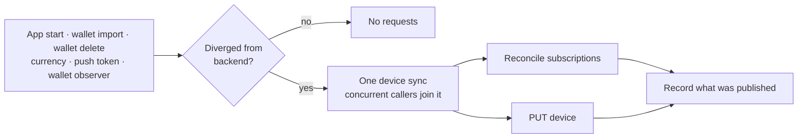

# Device and subscriptions

Every install registers a device with the backend and tells it which wallet addresses to watch. Wallet-scoped endpoints such as `/v2/devices/assets` return `404` until that wallet is subscribed, so both apps must subscribe a wallet before requesting anything scoped to it.

## Device record

One record per install, defined by the shared `Device` primitive: push token, locale, currency, app version, push and price-alert flags, and `subscriptionsVersion`. The version is bumped when the subscription set changes and lets either side detect that the backend and the client disagree about what is subscribed.

```
GET    /v2/devices/is_registered
GET    /v2/devices
POST   /v2/devices
PUT    /v2/devices
GET    /v2/devices/subscriptions
POST   /v2/devices/subscriptions
DELETE /v2/devices/subscriptions
```

Request signing for all of them: [Device Authentication](./DEVICE_AUTHENTICATION.md).

## Sync flow



Subscriptions are reconciled by diffing local wallets against `GET /v2/devices/subscriptions`: missing addresses are added per wallet grouped by chain, and wallets the backend still knows but the device no longer has are removed in full. Adding a wallet never removes another wallet's subscriptions.

Registration comes first. If the device is not registered, or registration fails, nothing else may assume the device exists — the next sync retries it.

## Ordering

A fresh install imports a wallet and immediately asks for its assets, so the subscription must not race that request. The wallet has to be subscribed before the first wallet-scoped fetch for it, either because the sync is part of that fetch or because it provably ran first.

## Failure and lifetime

The local record of what was published is written only after a successful sync, so a failed sync leaves the divergence in place and the next trigger retries it. A sync must never record success it did not achieve. Concurrent triggers collapse into a single network sync rather than one per caller.

## iOS and Android

| | iOS | Android |
|---|---|---|
| Entry point | `DeviceService.update()`, `synchronizeIfNeeded()` | `SyncDevice.syncDevice()` |
| Needs-sync decision | `isSynchronized`: registered and no pending-changes flag | `needsSynchronization()`: registered and current state equals the last published state |
| Change tracking | each mutation site sets the pending flag | none, divergence is derived by comparison |
| Concurrency | `DeviceSyncCoordinator` joins the in-flight task | `DeviceSyncCoordinator` joins the in-flight task |
| Wallet changes | `SubscriptionsObserver` on accounts, via `DeviceObserverService` | `DeviceObserverService` on wallets and accounts |

Deliberate differences today: iOS marks a flag at each mutation site while Android compares against the last published state, so Android needs no marking discipline and makes no requests on an unchanged relaunch; Android also runs the sync at the top of the device-assets fetch, while iOS relies on the sync having started at wallet insert.

## Rules

Changes on either platform must keep these true:

- A wallet-scoped request never runs for a wallet the backend was not told about.
- Concurrent triggers produce one sync, not one per caller.
- Published state is recorded only after a successful sync.
- Adding a wallet does not remove other wallets' subscriptions; deleting one removes its own.
- Nothing changed since the last sync means no requests.

Keep this document current in the same change when the sync triggers, the reconcile rules, or the platform mechanisms above change.

## Code map

- [iOS device sync](../ios/Packages/FeatureServices/DeviceService/DeviceService.swift)
- [iOS subscriptions](../ios/Packages/FeatureServices/DeviceService/SubscriptionService.swift)
- [Android device sync and subscriptions](../android/data/repositories/src/main/kotlin/com/gemwallet/android/data/repositories/device/DeviceRepository.kt)
