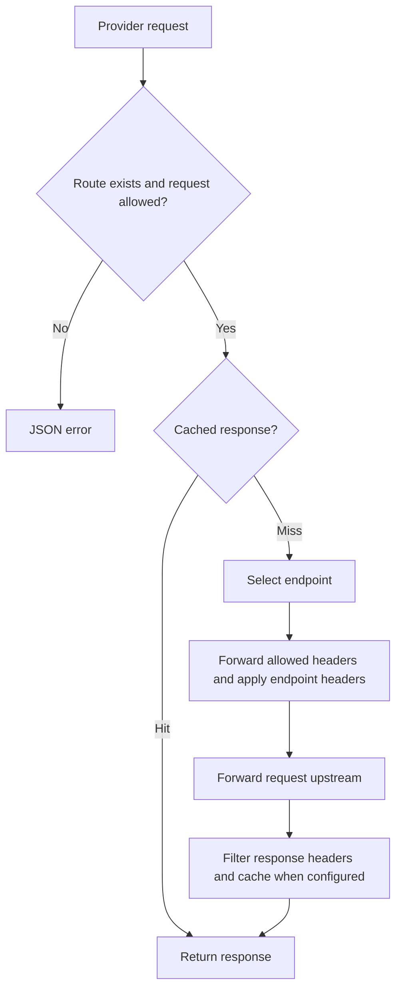

# Dynode

Dynode proxies blockchain RPC requests and provider services. It can serve either or both from one process.

Run from `core/`:

```sh
cargo run -p dynode
```

Configuration lives in [core/apps/dynode](../core/apps/dynode):

- `config.yml`: listener address, port, and metrics prefix/source.
- `chains.yml`: node inventory, monitoring, request settings, allowlists, and cache rules. Additional `chains*.yml` files load in filename order and override matching chains.
- `routes.yml`: provider services, endpoints, request settings, allowlists, and cache rules.

Supply the family files you need. Chains and provider routes share the cache implementation but have separate `cache.memory.max` budgets. Keep `allowlist` and `cache` rules separate.

## Routes

Chain requests use `/<chain>`. Provider requests use `/<source>/<service>/<path>`; `source` identifies the caller, and the route's configured `group` is used for metrics.



The local FastNear example allows:

```sh
curl http://localhost:3000/api/fastnear_transfers/
```

`/health` reports process health; `/metrics` exposes Prometheus metrics.

## Transaction broadcast metrics

`dynode_transaction_broadcasts_total` counts completed recognized broadcast requests once, after Dynode retries. Labels are `chain`, `source`, `group`, `service`, and `outcome` (`success` or `failure`). Success requires a 2xx response with a nonempty transaction identifier decoded by the chain's existing broadcast provider; it measures RPC acceptance, not on-chain confirmation. Failure includes HTTP or proxy errors and rejected, malformed, or unsupported responses without a usable identifier. A failure does not prove the transaction was never submitted.

`dynode_transaction_broadcast_latency_milliseconds` is a histogram with the same labels, measuring elapsed request time through completion, including retries. It records successes and failures. Metrics run independently of broadcast webhook configuration and delivery. Transaction identifiers, addresses, bodies, and free-form error messages are never metric labels.

Coverage follows the existing webhook request classifiers: single JSON-RPC calls and recognized HTTP/gRPC broadcast paths for configured chains. JSON-RPC batches, unrecognized requests, requests rejected before reaching the node service, and cancelled requests are excluded. Repeated client submissions count separately; these are request counts, not unique transactions.

The Dynode Grafana dashboard in `../infra` has a Transaction Broadcast section above Cache Performance with two panels: a time-series chart of per-chain total, success, and failure counts plus success/failure percentages, and a table of final broadcast errors grouped by chain, remote host, and message. Chart counts and percentages use the selected interval, with percentages on the right axis. Latency remains available as a metric. Source, region, group, and chain filters apply to both panels. Host and provider filters apply to the error table using the final attempted upstream; they do not apply to the per-chain metrics chart. The platform filter does not apply. Chart counts use Prometheus `increase`, so they are estimates from scrapes and cannot recover historical broadcasts before instrumentation was deployed.

Each accepted broadcast emits a `Broadcast accepted` log with its chain, request ID, and returned transaction ID, plus the remote hostname. Each final failure emits a `Broadcast failed` log with chain, chain group, remote hostname, and error message. The hostname comes from the final selected URL after method/path overrides and retries; `unknown` means no upstream was selected. URL credentials, paths, and query strings are omitted. All configured chain families reuse the existing user-facing broadcast decoders, preserving their errors instead of discarding them. When the chain response cannot be deserialized, plain `error`, `error.message`, or top-level `message` responses retain their message; other responses use a generic failure summary and transport errors use a bounded reason. Messages are limited to 1024 characters and one line; response bodies, error data, transaction payloads, and upstream URLs are excluded. The existing server-side Alloy pipeline indexes broadcast logs with `log_type="broadcast"`, allowing the error table to scan only broadcast logs. Error-table counts begin with that indexing rollout and cover retained logs; older entries remain queryable in Loki without the label filter. They may differ from Prometheus estimates.
