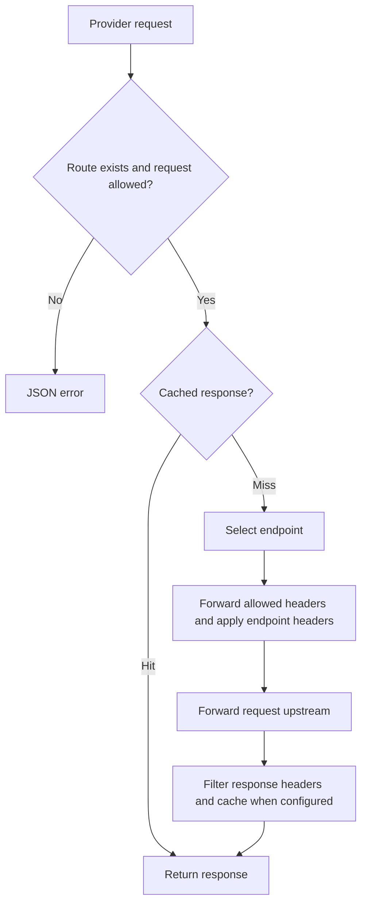

# Dynode

Dynode proxies blockchain RPC requests and provider services. It can serve either or both from one process.

Run from `core/`:

```sh
cargo run -p dynode
```

Configuration lives in [core/apps/dynode](../core/apps/dynode):

- `config.yml`: listener address, port, and metrics prefix/source.
- `chains.yml`: node inventory, monitoring, request settings, allowlists, and cache rules. Additional `chains*.yml` files load in filename order and override matching chains.
- `routes.yml`: provider services, endpoints, request settings, allowlists, and cache rules.

Supply the family files you need. Chains and provider routes share the cache implementation but have separate `cache.memory.max` budgets. Keep `allowlist` and `cache` rules separate.

## Routes

Chain requests use `/<chain>`. Provider requests use `/<source>/<service>/<path>`; `source` identifies the caller, and the route's configured `group` is used for metrics.



The local FastNear example allows:

```sh
curl http://localhost:3000/api/fastnear_transfers/
```

`/health` reports process health; `/metrics` exposes Prometheus metrics.
