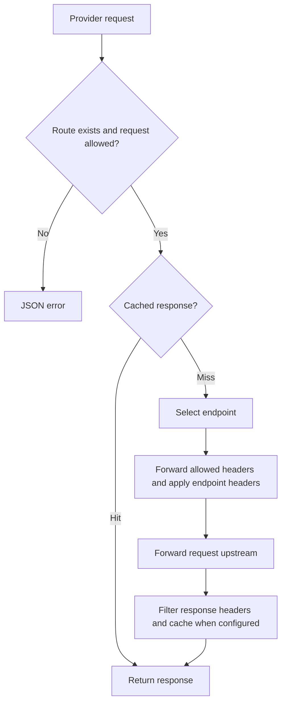
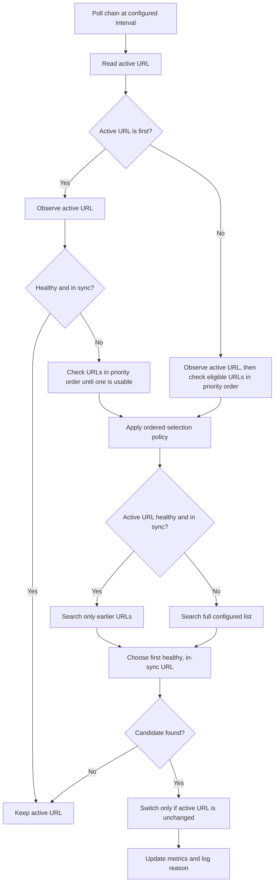
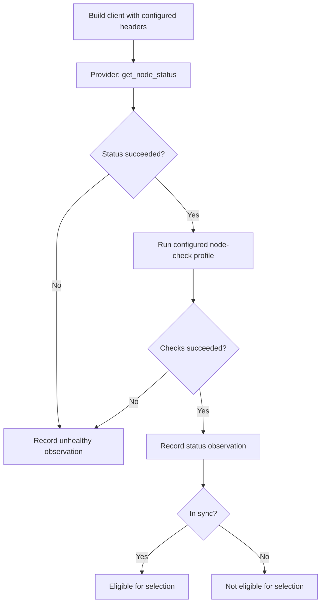

# Dynode

Dynode proxies blockchain RPC requests and provider services. It can serve either or both from one process.

Run from `core/`:

```sh
cargo run -p dynode
```

Configuration lives in [core/apps/dynode](../core/apps/dynode):

- `config.yml`: listener address, port, and metrics prefix/source.
- `chains.yml`: node inventory, monitoring, request settings, allowlists, and cache rules. Additional `chains*.yml` files load in filename order and override matching chains.
- `routes.yml`: provider services, endpoints, request settings, allowlists, and cache rules.

Supply the family files you need. Chains and provider routes share the cache implementation but have separate `cache.memory.max` budgets. Keep `allowlist` and `cache` rules separate.

## Routes

Chain requests use `/<chain>`. Provider requests use `/<source>/<service>/<path>`; `source` identifies the caller, and the route's configured `group` is used for metrics.



The local FastNear example allows:

```sh
curl http://localhost:3000/api/fastnear_transfers/
```

`/health` reports process health; `/metrics` exposes Prometheus metrics.

## Transaction broadcast metrics

`dynode_transaction_broadcasts_total` counts completed recognized broadcast requests once, after Dynode retries. Labels are `chain`, `source`, `group`, `service`, and `outcome` (`success` or `failure`). Success requires a 2xx response with a nonempty transaction identifier decoded by the chain's existing broadcast provider; it measures RPC acceptance, not on-chain confirmation. Failure includes HTTP or proxy errors and rejected, malformed, or unsupported responses without a usable identifier. A failure does not prove the transaction was never submitted.

`dynode_transaction_broadcast_latency_milliseconds` is a histogram with the same labels, measuring elapsed request time through completion, including retries. It records successes and failures. Metrics run independently of broadcast webhook configuration and delivery. Transaction identifiers, addresses, bodies, and free-form error messages are never metric labels.

Coverage follows the existing webhook request classifiers: single JSON-RPC calls and recognized HTTP/gRPC broadcast paths for configured chains. JSON-RPC batches, unrecognized requests, requests rejected before reaching the node service, and cancelled requests are excluded. Repeated client submissions count separately; these are request counts, not unique transactions.

The Dynode Grafana dashboard in `../infra` has a Transaction Broadcast section above Cache Performance with two panels: a time-series chart of per-chain total, success, and failure counts plus success/failure percentages, and a table of final broadcast errors grouped by chain, remote host, and message. Chart counts and percentages use the selected interval, with percentages on the right axis. Latency remains available as a metric. Source, region, group, and chain filters apply to both panels. Host and provider filters apply to the error table using the final attempted upstream; they do not apply to the per-chain metrics chart. The platform filter does not apply. Chart counts use Prometheus `increase`, so they are estimates from scrapes and cannot recover historical broadcasts before instrumentation was deployed.

Each accepted broadcast emits a `Broadcast accepted` log with its chain, request ID, and returned transaction ID, plus the remote hostname. Each final failure emits a `Broadcast failed` log with chain, chain group, remote hostname, and error message. The hostname comes from the final selected URL after method/path overrides and retries; `unknown` means no upstream was selected. URL credentials, paths, and query strings are omitted. All configured chain families reuse the existing user-facing broadcast decoders, preserving their errors instead of discarding them. When the chain response cannot be deserialized, plain `error`, `error.message`, or top-level `message` responses retain their message; other responses use a generic failure summary and transport errors use a bounded reason. Messages are limited to 1024 characters and one line; response bodies, error data, transaction payloads, and upstream URLs are excluded. The existing server-side Alloy pipeline indexes broadcast logs with `log_type="broadcast"`, allowing the error table to scan only broadcast logs. Error-table counts begin with that indexing rollout and cover retained logs; older entries remain queryable in Loki without the label filter. They may differ from Prometheus estimates.

## Node monitoring

Dynode monitoring keeps one active RPC URL per chain and moves traffic between configured URLs when health changes. The mechanism is chain-agnostic: each chain provider defines how node status and profile checks are performed.

### Core rules

- URL order is priority order. The first configured URL is preferred.
- A node is usable only when its status and configured profile checks succeed and it is in sync.
- If `monitoring.trigger.latency` is set, a node observation must complete within that latency.
- A healthy fallback remains active until a higher-priority URL becomes healthy again.
- Selection uses configuration order among usable nodes.
- Switching is atomic: the selected URL is installed only if the active URL has not changed since the monitoring cycle started.
- Request retries and monitoring are separate. Retries select an upstream for one request; monitoring changes the active URL shared by later requests.

### Failure-triggered checks

Dynode also starts a monitoring cycle when the active URL reaches either configured threshold:

- `trigger.failures`: consecutive retryable failures.
- `trigger.rate`: retryable failure percentage within `trigger.window`, after at least `trigger.failures` failed requests.
- `trigger.latency`: maximum acceptable latency for one node monitoring observation before alternatives are checked.

Transport errors always count. Responses count only when their HTTP status or JSON-RPC error message matches `retry.errors`. Cache hits and fallback attempts do not count. The window also acts as the cooldown between triggered checks for the active URL.

The rolling rate uses bounded time buckets, so memory use does not grow with request volume.

### Monitoring cycle

Monitoring runs only for chains with more than one configured URL.



The first-URL fast path avoids unnecessary checks while the preferred node is healthy. Other checks stop at the first usable URL in configuration order. A healthy fallback checks only higher-priority URLs; an unhealthy active URL searches the full list.

### Observing one URL

The monitoring layer does not name or require a protocol-specific RPC method.



`get_node_status` is implemented by each chain provider. For example, an EVM provider may use `eth_blockNumber`, while another chain uses its native status method. If the initial status call fails, profile checks are skipped because the node is already known to be unusable.

Every profile verifies the chain identity and latest block number. Additional checks depend on the configured profile:

- `basic` performs no additional checks.
- `wallet` checks the configured address balance on every chain and adds richer chain-specific checks where available.
- `parser` verifies the latest block number and that the node can return transactions for a recent block.

Failed required checks make the observation unhealthy. Optional checks may be recorded as warnings without rejecting the node.

### Ordered selection

Assume URLs are configured as `A, B, C`, where `A` has the highest priority.

| Active URL | State | Eligible search range | Result |
| --- | --- | --- | --- |
| `A` | Healthy | None | Keep `A`; lower-priority URLs are not checked |
| `A` | Unhealthy | `A, B, C` | Select the first healthy URL |
| `B` | Healthy | `A` | Return to `A` when it is healthy; otherwise keep `B` |
| `B` | Unhealthy | `A, B, C` | Select the first healthy URL |
| `C` | Healthy | `A, B` | Prefer `A`, then `B`; otherwise keep `C` |

An observation must be healthy, in sync, and within the latency threshold when configured. A faster or higher-block lower-priority node does not displace a higher-priority node that is still within threshold.

### Endpoint construction

An empty RPC path uses the configured base endpoint after removing trailing separators. Dynode does not append `/` when no path is requested. For a non-empty path, Dynode preserves an existing leading separator or inserts one when needed.

This matters for authenticated endpoints where `/v1/key` and `/v1/key/` can have different authorization behavior.

### Metrics

Each observed URL publishes its last check success, sync state, latest and current block, check latency, and check timestamp. A cycle counter distinguishes `scheduled` checks from `failure_trigger` checks.

Node-switch metrics use the same stable reasons as request retries: `status=<code>`, `timeout`, `connect_error`, and `request_error`. Profile failures use `request_error`. Error logs record the bounded type (`upstream`, `request`, or `node_check`) and one error detail containing the stable reason and provider message. Raw provider errors are not used as Prometheus labels.

### Code map

- [Monitoring worker](../core/apps/dynode/src/monitoring/worker.rs): creates one monitor per eligible chain.
- [Chain monitor](../core/apps/dynode/src/monitoring/chain_monitor.rs): schedules periodic and failure-triggered checks.
- [Node health evaluator](../core/apps/dynode/src/monitoring/evaluator.rs): observes eligible URLs and applies switches.
- [Node observer](../core/apps/dynode/src/monitoring/node_observer.rs): creates one chain-provider observation.
- [Selection policy](../core/apps/dynode/src/monitoring/selection.rs): applies configured priority and recovery behavior.
- [Telemetry](../core/apps/dynode/src/monitoring/telemetry.rs): records observations and switch outcomes.
- [Node service](../core/apps/dynode/src/node_service.rs): routes requests through the active URL and handles per-request retries.
- [URL construction](../core/crates/gem_client/src/query.rs): joins base endpoints and request paths.
