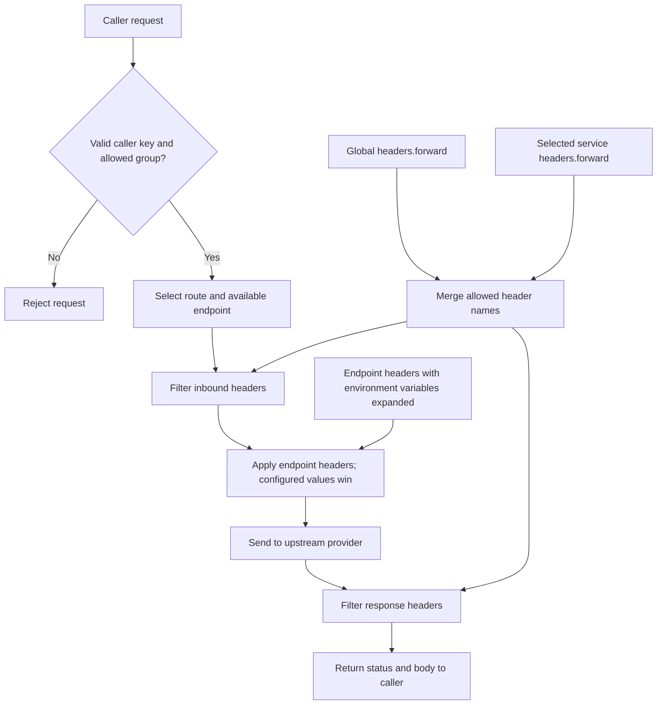

# Provider Egress

The [egress service](../core/apps/egress/src/main.rs) routes backend provider requests through configured upstream endpoints.

## Routing

Requests use `/<caller>/<key>/<group>/<service>/<upstream-path>`. Each caller has a key and an allowed set of groups. Routes select upstream endpoints and configure rate limits, retries, and optional outbound proxies.



## Headers

- Global `headers.forward` contains shared HTTP headers.
- `routes.<group>.<service>.headers.forward` adds headers for that service only. Omitted lists inherit the global set.
- Header names are case-insensitive, deduplicated, and validated when routes load.
- Endpoint `headers` inject configured values after forwarding and override matching inbound values.
- The effective forwarding list also filters upstream response headers.

```yaml
headers:
  forward: [accept, content-type, content-encoding, content-length, te, user-agent]
routes:
  security:
    hashdit:
      selection: ordered
      headers:
        forward: [x-api-key]
      endpoints:
        - name: direct
          url: https://service.hashdit.io
    tronscan:
      selection: ordered
      endpoints:
        - name: key_1
          url: https://apilist.tronscanapi.com
          headers:
            TRON-PRO-API-KEY: "${TRONSCAN_API_KEY}"
```

Forward dynamic signatures and caller-provided credentials only on the routes that consume them. Supply static upstream keys through environment variables, with placeholders in endpoint configuration. A key injected by an endpoint does not need a forwarding entry. Never commit real credentials.

## Configuration and Rollout

The [configuration file](../core/apps/egress/config.yml) is selected by `EGRESS_CONFIG`, or loaded from `config.yml` / `apps/egress/config.yml`.

Publish a compatible egress container before deploying configuration that depends on new fields. Older binaries do not apply service-level forwarding lists.

## Verification

Run from `core/`:

```sh
cargo test --locked -p egress --bins --all-features
cargo clippy --locked -p egress --all-features --all-targets -- -D warnings
```

Tests cover header inheritance, service isolation, endpoint overrides, invalid header names, route matching, endpoint selection, and cooldowns. Validate configuration and required environment variables before deployment.
