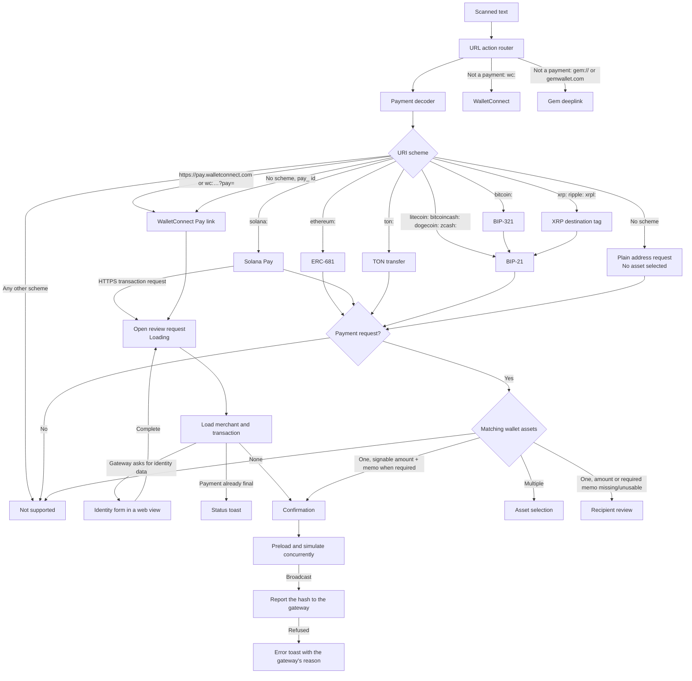
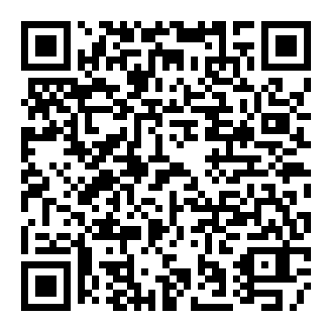
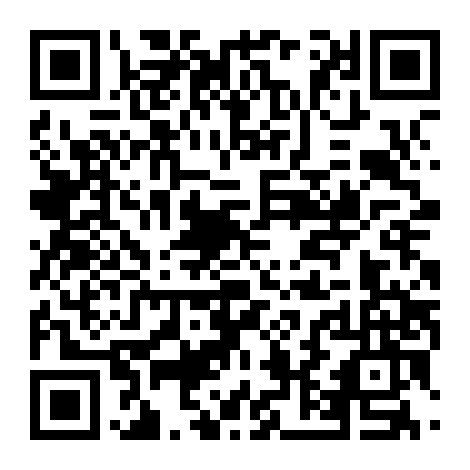

# Payment QR codes

The payment scanner decodes QR payloads in Core and opens confirmation, recipient review, or asset selection based on the result.

Open the scanner from the wallet screen and scan this page from another device. Use a test wallet and do not submit these example transactions.

## Supported formats

| Type | Supported fields | Core implementation |
|---|---|---|
| Plain address | A raw address with optional `amount`; the chain comes from the wallet assets it validates against | [Decoder](../core/crates/primitives/src/payment_decoder/decoder.rs) |
| BIP-21 | `bitcoin:`, `litecoin:`, `bitcoincash:`, `dogecoin:`, `zcash:` with `amount`, `memo`, and `label` | [BIP-21 decoder](../core/crates/primitives/src/payment_decoder/bip21.rs) |
| BIP-321 | `bitcoin:` may omit the address when `bc` carries it. Lightning, BOLT 12, silent payment and other instructions are ignored beside an on-chain address and rejected alone | [BIP-321 decoder](../core/crates/primitives/src/payment_decoder/bip321.rs) |
| XRP | `xrp:`, `ripple:`, `xrpl:` with destination tag `dt` | [XRP decoder](../core/crates/primitives/src/payment_decoder/xrp.rs) |
| ERC-681 | EVM native transfers and token `transfer` with `address` and `uint256` | [ERC-681 decoder](../core/crates/primitives/src/payment_decoder/erc681.rs) |
| Solana Pay | SOL and SPL-token transfers with `amount`, `spl-token`, repeated `reference`, `memo`, and `label` | [Solana Pay decoder](../core/crates/primitives/src/payment_decoder/solana_pay.rs) |
| TON transfer | Native TON transfer with atomic `amount` and text comment | [TON decoder](../core/crates/primitives/src/payment_decoder/ton_pay.rs) |
| WalletConnect Pay | Merchant payment links: `https://pay.walletconnect.com/?pid=pay_…`, `https://pay.walletconnect.com/pay_…`, `wc:…?pay=…` and a bare `pay_…` id | [WalletConnect Pay decoder](../core/crates/primitives/src/payment_decoder/wallet_connect_pay.rs) |

## How decoding works

Routing is decided in Core by [payment_destination](../core/gemstone/src/payment.rs): it matches wallet assets, validates and checksums the address, converts the amount exactly (excess precision is never rounded), and requires a memo only on chains where the QR tag identifies the deposit (Cosmos, TON, XRP, Stellar, Algorand). Solana Pay transfers confirm without a memo. A recipient-review destination carries the checksummed `GemRecipient` (address, memo, references) and the requested amount, so the apps prefill the recipient screen from Core's answer without re-checksumming.

`GemPaymentService` is the one payment object on both apps: it decodes URLs, routes destinations, builds transfer data, and loads, re-selects and confirms payment links through the alien provider it is constructed with.

Parameter keys are case-insensitive. Every format whose standard defines `label` parses it into `PaymentRequest.label`. Any unimplemented `req-` parameter rejects the whole URI, and so does a scheme the decoder does not list, so a new chain never gains a payment URI by accident. Payment instructions Gem cannot sign are ignored when the URI still carries an on-chain address, so `bitcoin:<address>?sp=<silent payment>` pays on chain; a URI that carries only such instructions is rejected.

Payments are routed before WalletConnect pairing and Gem deeplinks, so a `wc:` URI that carries a `pay` query opens the payment, not a session. Solana transaction links and WalletConnect Pay links load the merchant and encoded transaction through the payment service before opening confirmation. Confirmation then preloads the transaction and simulates it concurrently using the same transaction simulation service as WalletConnect.

WalletConnect Pay links resolve through the gateway in one `load` per screen: `/options` lists the merchant and one quote per wallet asset (coins only; token quotes that need typed-data signatures are dropped), `/fetch` builds the transaction for the selected quote, and the gateway answers `/fetch` with an identity-data error when the payer still has to fill in the merchant's form. Only that error opens the web form; `collectData` in `/options` stays after the form is done and is not a signal. Quotes are re-selected by asset id, never by option id: the gateway issues new option ids on every `/options` call and rejects the previous ones, so the option id is only valid for the `/confirm` that follows its own `/fetch`. Every quote carries `expiresAt`, and the built transaction's router deadline is that same instant, so a late signature fails on chain instead of being credited; the app does not keep its own expiry timer. A link whose payment is already final does not open a screen: `load` fails with the gateway status and the app shows it as a toast.

A payment is its own transaction input: `load` answers `GemPaymentLoad::Sign` with the transfer data already built, so neither app resolves an asset or maps a transaction; the payment service ensures the asset and builds `TransactionInputType::Payment { asset, invoice, extra }`, whose `invoice` holds the link, the merchant, the price when the rail quotes one, and every option, signed and preloaded like an encoded generic transaction; the option being paid is the one whose asset is the transfer's asset. Core answers the confirm's title, its price header and its merchant recipient row from that input, so the screen renders a payment the way it renders swap data, without calling the payment service; switching an option is a load option like a fee priority: `GemConfirmLoadOptions.asset_id` makes the confirm session re-select through the payment service and swap the transfer it holds before it preloads, every screen it answers names the transfer it was loaded for, and the broadcast hash is reported inside `execute`, with the transfer that was sent: succeeded and processing answer nothing, any other status comes back as the sent result's warning, so the app toasts only a refusal; the confirm's own sent toast and the activity list already cover success. Solana Pay transaction links answer the same `Sign` with an invoice that quotes nothing, so they keep the plain confirm. Confirm Core has no payment code.

Static Solana Pay transfer requests use the regular transfer flow. Each `reference` is preserved in URL order and added to the SOL or SPL-token transfer instruction as a read-only, non-signer account. A `memo` is emitted as the instruction immediately before the transfer.

Core entry points:

- [URL action routing](../core/crates/primitives/src/url_action.rs)
- [Payment decoder dispatch](../core/crates/primitives/src/payment_decoder/decoder.rs)
- [Payment service](../core/crates/payment/src/service.rs)
- [WalletConnect Pay provider](../core/crates/payment/src/wallet_connect_pay/provider.rs)
- [UniFFI bridge](../core/gemstone/src/payment.rs)

## Payment flows

| | |
|---|---|
| **Bitcoin amount**  `bitcoin:bc1qw508d6qejxtdg4y5r3zarvary0c5xw7kv8f3t4?amount=0.0001` Confirm `0.0001 BTC`. | **Bitcoin address only**  `bitcoin:bc1qw508d6qejxtdg4y5r3zarvary0c5xw7kv8f3t4` Open the recipient screen. |
| **Plain EVM address**  `0x1f9090aaE28b8a3dCeaDf281B0F12828e676c326` Select an asset when multiple EVM chains match. | **Ethereum USDC**  `ethereum:0xA0b86991c6218b36c1d19D4a2e9Eb0cE3606eB48@1/transfer?address=0x1f9090aaE28b8a3dCeaDf281B0F12828e676c326&uint256=1500000` Confirm `1.5 USDC`. |
| **Solana USDC**  `solana:HA4hQMs22nCuRN7iLDBsBkboz2SnLM1WkNtzLo6xEDY5?amount=1&spl-token=EPjFWdd5AufqSSqeM2qN1xzybapC8G4wEGGkZwyTDt1v` Confirm `1 USDC`. | **XRP destination tag**  `ripple:rEb8TK3gBgk5auZkwc6sHnwrGVJH8DuaLh?amount=10&dt=12345` Confirm amount `10` with tag `12345`. |
| **Uppercase parameter keys**  `bitcoin:bc1qw508d6qejxtdg4y5r3zarvary0c5xw7kv8f3t4?AMOUNT=0.001` Confirm `0.001 BTC`; the key case is ignored. | **Bitcoin address-less URI**  `bitcoin:?bc=bc1qw508d6qejxtdg4y5r3zarvary0c5xw7kv8f3t4&amount=0.001` Confirm `0.001 BTC` from the `bc` instruction. |
| **TON comment**  `ton://transfer/UQA5olhYULHkui4mTQM0LodWG0EqUaxmK6-e3mHrCZFO2diA?amount=1000000000&text=order+7` Confirm `1 TON` with comment `order 7`. | **Excess BTC precision**  `bitcoin:bc1qw508d6qejxtdg4y5r3zarvary0c5xw7kv8f3t4?amount=0.000000001` Do not round; open recipient review. |

### Partially specified payments

These payloads decode successfully but open the recipient screen for review or completion.

| | |
|---|---|
| **XRP without destination tag**  `ripple:rEb8TK3gBgk5auZkwc6sHnwrGVJH8DuaLh?amount=10` Amount `10` is preserved; add a destination tag only if required. | **XRP without amount**  `ripple:rEb8TK3gBgk5auZkwc6sHnwrGVJH8DuaLh?dt=12345` Tag `12345` is preserved; enter the amount. |

### Scanner rendering

The scanner must read a code however it is drawn, from the camera and from a picked image alike.

| | |
|---|---|
| **Light on dark**  `bitcoin:bc1qw508d6qejxtdg4y5r3zarvary0c5xw7kv8f3t4` WalletConnect and dark-mode screenshots draw the code this way; open the recipient screen. | |

Token tests require the exact token to be enabled in the wallet.
