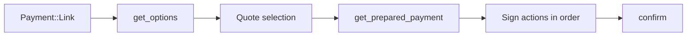

# Payments

Scanned and pasted payment URLs decode to one of two shapes. Core owns the decoding and every rule; the apps own the screens and the signing.

## Two shapes

`PaymentURLDecoder::decode` returns a `Payment`, and the variant decides which flow runs. The split predates hosted payments and is where a provider with a different flow attaches.

| URL | Shape | What runs |
|---|---|---|
| Bare address, BIP21, ERC-681 (`ethereum:`), TON (`ton://`) | `Request` | The ordinary send flow, recipient prefilled. No remote call. |
| Solana Pay transfer request | `Request` | As above. |
| Solana Pay transaction request | `Link(SolanaPay)` | Hosted flow below. |
| WalletConnect Pay | `Link(WalletConnectPay)` | Hosted flow below. |

WalletConnect Pay is matched before the URL is split on `:`, so a payment link is never read as a WalletConnect pairing URI or a BIP21 address.

Each shape reaches the wallet through its own scanner. The recipient scanner decodes to a `Request` and prefills the send form, and refuses a `Link` because a hosted payment is not a recipient. The wallet scanner starts the hosted flow.

## Hosted flow

Applies to `Payment::Link`. The four `PaymentService` calls are provider-agnostic; what a provider puts inside them is not.

`get_options` returns `Quotes` or a settled `Outcome`, so a link that is already paid, expired, or cancelled never reaches quote selection. A quote may carry a `collect_data_url`; the app opens it in a web view and continues once the page reports completion.

Only WalletConnect Pay implements this today, and parts of it are its shape rather than the contract. A quote list, a merchant price, an expiry, hosted data collection, and a multi-action list are things WalletConnect Pay happens to have. Solana Pay's transaction request is the counter-example already in the decoder: one GET for the label, one POST returning a single transaction, nothing to confirm afterwards. Such a provider fits by returning one quote and a one-element action list, with `confirm` reporting the outcome.

`PaymentProviderName` is the whole provider surface, and `PaymentService::provider` returns `NotSupported` for anything unimplemented — Solana Pay transaction requests decode but are refused rather than half-handled. `PaymentProviderName::has_status` reports whether polling exists, for the same reason `is_relayed` is computed in core: capability belongs beside the provider, not at the call site.

## Actions

`get_prepared_payment` returns an ordered `Vec<PaymentAction>`. The apps execute them in order and collect one result string per action, positionally — result `n` belongs to action `n`.

| Action | What the app does | Result |
|---|---|---|
| `SignMessage` | Signs an EIP-712 message after simulating it | Signature |
| `ApproveToken` | Broadcasts a token approval | Transaction hash |
| `SignTransaction` | Signs without broadcasting | Signature |
| `SendTransaction` | Broadcasts | Transaction hash |

A payment is relayed when it contains no `SendTransaction`: the provider broadcasts on the wallet's behalf, so signing never yields a hash.

## Validation

`PreparedPayment::validate` runs in core before any action reaches a signing screen, so both apps get the same refusals:

- A payment with no actions is rejected.
- An action on a chain the wallet has no address for is rejected.
- An `ApproveToken` on a chain other than the one the quote pays with is rejected, so a payment cannot use its approval step to reach another chain.

Quote and price amounts arrive as decimal strings from the provider. They are machine strings, never human input — see [Decision Records](../skills/decisions.md#number-parsing-human-input-vs-machine-strings).

## Failure and lifetime

A relayed payment is written to the activity list as pending as soon as the last action is signed, keyed by the payment id, because there is no hash yet and the amount must not be invisible while the provider settles it. Reconciliation later swaps that id for the real hash.

A failed `confirm` does not mean a failed payment. The actions are already signed and the provider may still settle it, so both apps report processing and let reconciliation decide.

Quotes expire. Each app watches the expiry it was given and disables the action rather than sending a doomed request; an expired confirm is still rejected by the provider as the backstop.

There is no execution journal. A payment interrupted between two actions is not resumable, and the user starts again from the link.

## iOS and Android

| | iOS | Android |
|---|---|---|
| Working entry point | wallet scanner | wallet scanner |
| Developer gate | `isDeveloperEnabled` | `userConfig.developEnabled()` |
| Flow driver | `PaymentManager.pay`, one async function awaiting each sheet | `PaymentViewModel`, a state machine over `ActivePayment` |
| Screen model | sheets via `PaymentSheetPresentable` | one `PaymentScreen` switching on `PaymentSceneState` |
| Action execution | `PaymentActionExecutor` → `SigningRequestInteractable` | `advance()` → `GemSignMessageOperator` / `ConfirmParams` |
| Pending record | `PaymentTransactionFactory` → `TransactionStateScheduler` | `RecordPayment` → `CreateTransaction` |
| Reconciliation | `TransactionStateService.paymentStateChanges` | `TransactionsRepositoryImpl.paymentStateChanges` |
| `Link` at recipient scanner | `notSupported` error | silently ignored |

Both platforms can also route a payment link from an incoming URL, but neither claims the payment host: the iOS entitlement lists only `applinks:gemwallet.com`, and the Android manifest only `gemwallet.com` paths and the `wc`/`gem` schemes. Until the host is registered, that path is reachable only by an explicit intent.

Deliberate difference today: iOS drives the flow as one linear `async` function awaiting each sheet, while Android drives it as a state machine whose single screen re-renders per step. Both consume the same ordered action list and produce the same positional results, so the difference is presentation only.

Everything else is shared on purpose. Payments reuse the existing signing, simulation, confirmation, and transaction-update stacks rather than parallel ones — the same message-signing and confirm screens as WalletConnect, and the same update path, with both platforms implementing `paymentStateChanges` returning `TransactionChanges` carrying a hash change. Once recorded, a payment is an ordinary transaction.

## Rules

Changes on either platform must keep these true:

- Provider capability is decided in core. No platform branches on `PaymentProviderName`.
- A `Request` goes to the send flow and a `Link` to the hosted flow. Neither scanner learns the other's shape.
- Action results stay positional and complete. Never reorder, skip, or substitute one.
- A relayed payment is recorded before the provider is confirmed, not after.
- A failed `confirm` is never reported to the user as a failed payment.
- Amounts from a provider are parsed as machine strings and validated before use.
- A new provider adds a `PaymentProviderName` arm and nothing on either platform. If its flow does not fit the four calls, widen them in core rather than adding a second path through the apps.

Keep this document current in the same change when the decoded shapes, the action set, the validation rules, provider coverage, or the platform mechanisms above change.

## Code map

- [Link decoding](../core/crates/primitives/src/payment_decoder/decoder.rs)
- [Payment service](../core/crates/payment/src/service.rs)
- [Actions and validation](../core/crates/payment/src/action.rs)
- [WalletConnect Pay provider](../core/crates/payment/src/wallet_connect_pay/service.rs)
- [Gemstone bridge](../core/gemstone/src/payment/mod.rs)
- [iOS flow](../ios/Features/Payments/Sources/Payments/Services/PaymentManager.swift)
- [iOS reconciliation](../ios/Packages/FeatureServices/TransactionStateService/TransactionStateService.swift)
- [Android flow](../android/features/payment/viewmodels/src/main/kotlin/com/gemwallet/android/features/payment/viewmodels/PaymentViewModel.kt)
- [Android reconciliation](../android/data/repositories/src/main/kotlin/com/gemwallet/android/data/repositories/transactions/TransactionsRepositoryImpl.kt)
