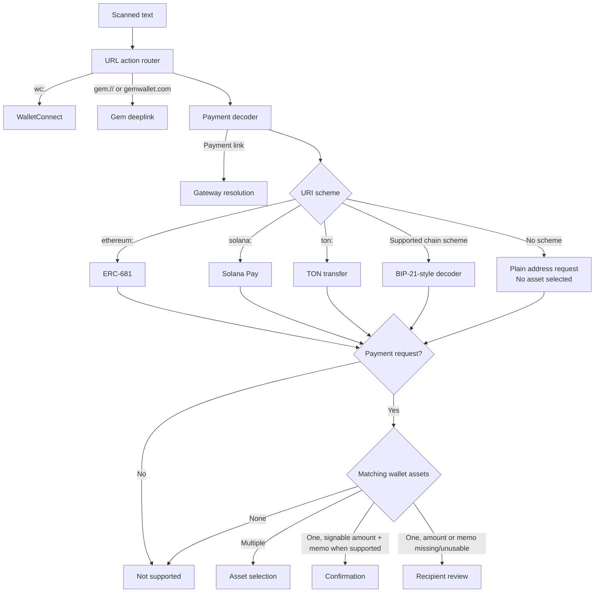
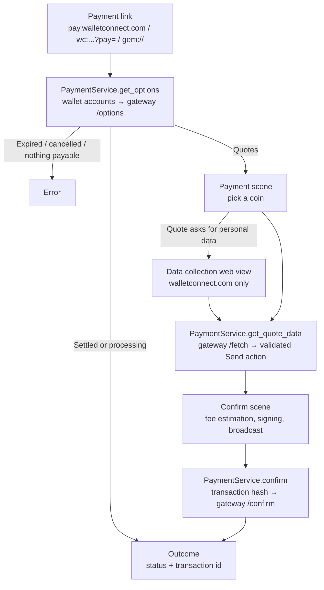

# Payments

Core decodes every scanned payload and returns one of two things: a payment request, which carries a recipient and optionally an amount the wallet builds a transfer for, or a payment link, which carries only an id the wallet must resolve with a payment gateway before anything can be signed.

## Decoding

| Type | Supported fields | Core implementation |
|---|---|---|
| Plain address and BIP-21-style URI | Raw addresses or recognized chain schemes with `amount` and `memo`. XRP accepts `xrp:`, `ripple:`, `xrpl:`, and destination tag `dt` | [BIP-21-style decoder](../core/crates/primitives/src/payment_decoder/bip21.rs) |
| ERC-681 | EVM native transfers and token `transfer` with `address` and `uint256` | [ERC-681 decoder](../core/crates/primitives/src/payment_decoder/erc681.rs) |
| Solana Pay | SOL and SPL-token transfers with `amount`, `spl-token`, and `memo` | [Solana Pay decoder](../core/crates/primitives/src/payment_decoder/solana_pay.rs) |
| TON transfer | Native TON transfer with atomic `amount` and text comment | [TON decoder](../core/crates/primitives/src/payment_decoder/ton_pay.rs) |
| WalletConnect Pay link | Payment id from `pay.walletconnect.com`, `wc:...?pay=`, or `gem://wc?uri=` | [WalletConnect Pay decoder](../core/crates/primitives/src/payment_decoder/wallet_connect_pay.rs) |

Payment links are tried before the request decoders because WalletConnect Pay arrives on `https:`, `wc:`, and `gem:` — schemes the pairing and deeplink routers also claim. A pairing URI without a `?pay=` payload still reaches WalletConnect unchanged.

## Payment links (WalletConnect Pay)

A link carries a payment id, not an amount and a recipient. The wallet asks the gateway what the payment can be settled with, shows the payable coins, and hands the chosen quote to the standard confirm scene. Today the wallet settles coins on EVM chains only: options priced in a token, or asking for anything other than one plain transfer, are dropped in Core — token settlement is a later integration that lands in that same filter. Options quoted against an account the wallet did not offer are always refused.

The raw gateway option rides inside `PaymentQuote.provider_data`, so Core stays stateless across the app round trip — the same shape as the swapper's opaque `route_data`. The recorded transaction keeps the link and merchant in `TransactionPaymentMetadata`, which the activity list uses to show the merchant instead of the settlement address.

## Failure and lifetime

The gateway confirm runs after broadcast and is fire-and-forget: a confirm failure is logged, never surfaced as a payment failure, and never rolls back the broadcast — the payment's final state is the gateway's to report against the on-chain transaction.

The gateway never learns wallet identity: `App-Id` is the WalletConnect project id and `Client-Id` is a random UUID per process. Wallet addresses appear only in request bodies as the accounts offered for payment.

## iOS and Android

| | iOS | Android |
|---|---|---|
| Entry point | `NavigationHandler` resolves the link before any scene opens | `PaymentRoute` opens the scene, which loads |
| Settled or failed link | Toast, the scene never opens | Toast from the scene, which closes |
| State model | `PaymentState` struct with `StateViewType` fields | sealed `PaymentSceneState` |
| Refresh or prepare failure | Quotes stay on screen with Try Again | Toast closes the scene; reopening refetches the link |
| Watch wallet | Refused before the scene | Refused by the scene |

Deliberate differences today: iOS gates the link behind a pre-fetch so a dead payment never opens UI, while Android follows its route-first navigation and resolves inside the scene; iOS keeps a failed scene alive for retry, Android's sealed states replace the scene and recover by re-resolving the link.

## Rules

Changes on either platform must keep these true:

- No gateway action reaches a signer unvalidated: exactly one action, `eth_sendTransaction`, signer equal to the quoted account, chain equal to the quoted asset's chain, value equal to the quoted amount.
- An option Core cannot settle is dropped in Core, never passed on for the apps to filter; today that means coins on EVM only.
- An option quoted for an account the wallet did not offer is never shown or signed.
- Data collection opens only `https` URLs on `walletconnect.com`.
- Payment links open only with developer mode enabled; every other scan behavior is unchanged.
- A watch wallet never reaches the confirm scene from a payment link.
- The gateway receives no wallet-identifying headers.

Keep this document current in the same change when decoders, gateway validation, or the platform flows above change.

## QR test cases

Open the scanner from the wallet screen and scan this page from another device. Use a test wallet and do not submit these example transactions.

| | |
|---|---|
| **Bitcoin amount**  `bitcoin:bc1qw508d6qejxtdg4y5r3zarvary0c5xw7kv8f3t4?amount=0.0001` Confirm `0.0001 BTC`. | **Bitcoin address only**  `bitcoin:bc1qw508d6qejxtdg4y5r3zarvary0c5xw7kv8f3t4` Open the recipient screen. |
| **Plain EVM address**  `0x1f9090aaE28b8a3dCeaDf281B0F12828e676c326` Select an asset when multiple EVM chains match. | **Ethereum USDC**  `ethereum:0xA0b86991c6218b36c1d19D4a2e9Eb0cE3606eB48@1/transfer?address=0x1f9090aaE28b8a3dCeaDf281B0F12828e676c326&uint256=1500000` Confirm `1.5 USDC`. |
| **Solana USDC**  `solana:HA4hQMs22nCuRN7iLDBsBkboz2SnLM1WkNtzLo6xEDY5?amount=1&spl-token=EPjFWdd5AufqSSqeM2qN1xzybapC8G4wEGGkZwyTDt1v` Confirm `1 USDC`. | **XRP destination tag**  `ripple:rEb8TK3gBgk5auZkwc6sHnwrGVJH8DuaLh?amount=10&dt=12345` Confirm amount `10` with tag `12345`. |
| **TON comment**  `ton://transfer/UQA5olhYULHkui4mTQM0LodWG0EqUaxmK6-e3mHrCZFO2diA?amount=1000000000&text=order+7` Confirm `1 TON` with comment `order 7`. | **Excess BTC precision**  `bitcoin:bc1qw508d6qejxtdg4y5r3zarvary0c5xw7kv8f3t4?amount=0.000000001` Do not round; open recipient review. |

### Partially specified payments

These payloads decode successfully but open the recipient screen for review or completion.

| | |
|---|---|
| **XRP without destination tag**  `ripple:rEb8TK3gBgk5auZkwc6sHnwrGVJH8DuaLh?amount=10` Amount `10` is preserved; add a destination tag only if required. | **XRP without amount**  `ripple:rEb8TK3gBgk5auZkwc6sHnwrGVJH8DuaLh?dt=12345` Tag `12345` is preserved; enter the amount. |

Token tests require the exact token to be enabled in the wallet.

## Code map

- [URL action routing](../core/crates/primitives/src/url_action.rs)
- [Payment decoder dispatch](../core/crates/primitives/src/payment_decoder/decoder.rs)
- [Payment facade](../core/crates/payment/src/service.rs)
- [Gateway client and parsers](../core/crates/payment/src/wallet_connect_pay)
- [Gemstone bridge](../core/gemstone/src/payment/mod.rs)
- [iOS service](../ios/Packages/FeatureServices/PaymentService/PaymentService.swift)
- [iOS payment scene](../ios/Features/Payments)
- [Android service](../android/blockchain/src/main/kotlin/com/gemwallet/android/blockchain/services/PaymentService.kt)
- [Android payment screen](../android/features/payment)
