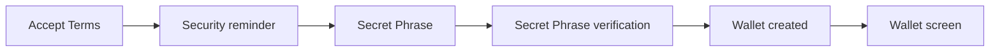
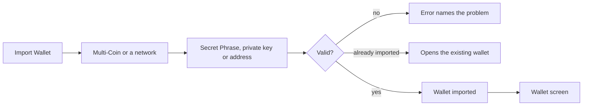
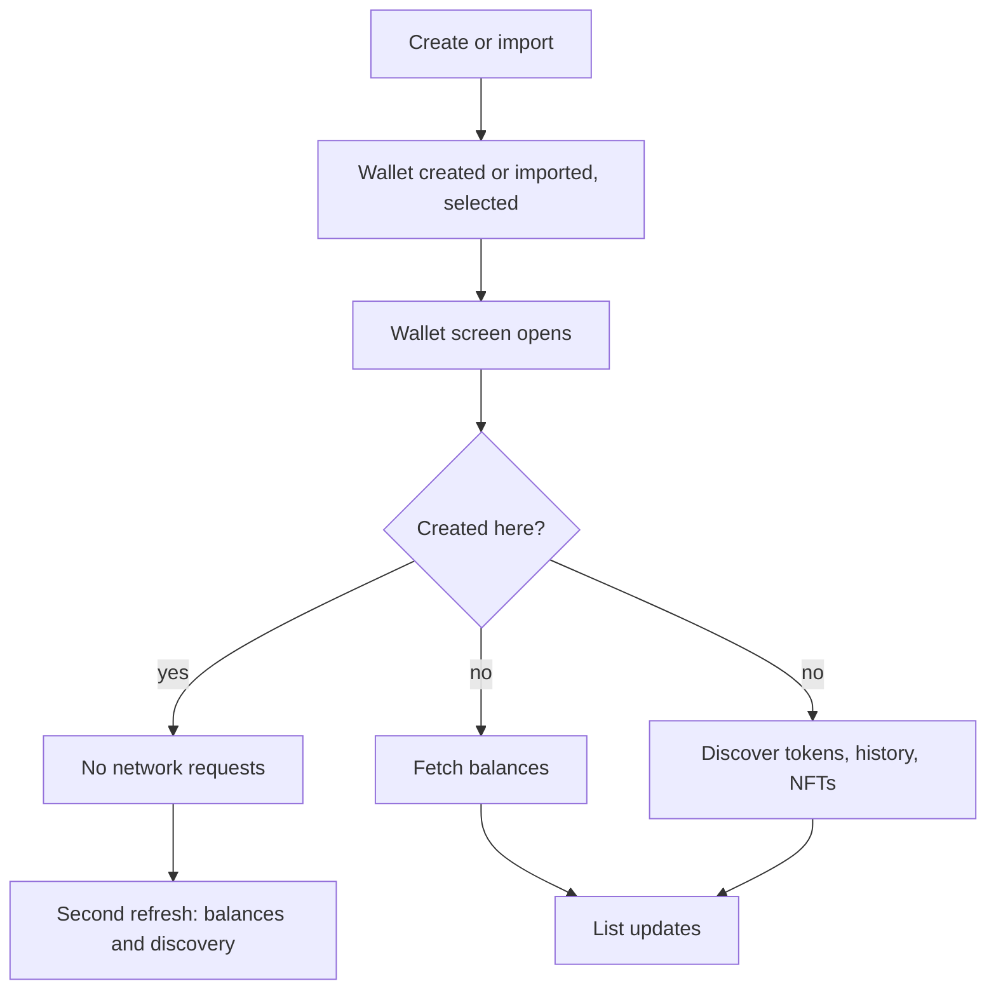
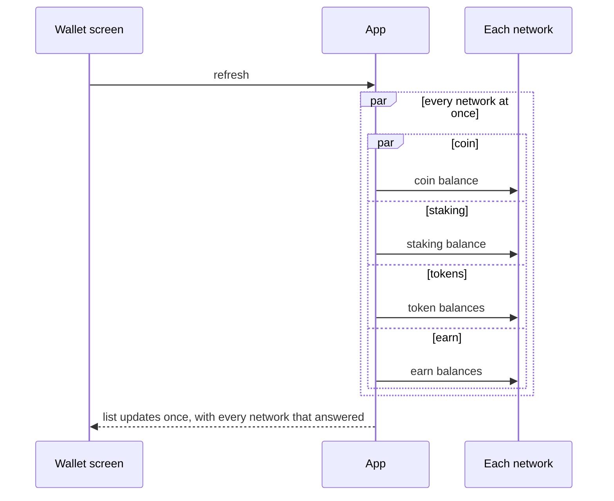

# Product behavior

This file describes how the wallet behaves from the user's side, one section per area. It defines the intended behavior and the rules behind it. How the code delivers it lives in [ARCHITECTURE.md](ARCHITECTURE.md); the gaps live in [TODO.md](TODO.md).

Before changing how an area works, read its section. A change that breaks a rule written here is a product decision, not a cleanup: ask first, and update this file in the same change when the intent moves.

Each section has the same parts: what the user gets, how it works, the rules with their reason, what happens when something fails, the differences between iOS and Android that we chose on purpose, and open questions where the app and the intent still disagree.

## Principles

**Secure.** The user always sees what they are about to sign: amount, recipient, network and fee. Nothing is signed or sent without that screen. A Secret Phrase or private key never leaves the device's secure storage and never reaches a log, a screenshot or an unprotected clipboard. When something security-related is missing or unsupported, the wallet refuses instead of guessing.

**Fast.** Whatever the app already knows shows at once; a refresh updates it in place and never blanks the screen. Independent requests start together and none waits for a slower one. When one source fails, the others still show; the failed one keeps its last known values.

**Native.** Each app looks and feels like a first-class app of its platform: system navigation, sheets, share, paste, biometrics and the user's locale for numbers and dates. Both apps follow the same rules and make the same decisions; only the drawing is platform-specific. A difference between the apps is either listed in its section with a reason, or it is a bug.

**Simple.** Every screen uses patterns the user already knows: a list of rows, a sheet, a segmented picker, a button that says what it does. The same thing looks and works the same everywhere in the app: one asset row, one address row, one confirmation screen, one way to copy, one way to pick an asset. A new screen copies an existing one rather than inventing a layout. Each screen asks for one decision at a time, shows the outcome where the action happened, and needs no explanation to use. If something needs a tooltip to be understood, the screen is wrong, not the user.

**Smooth.** Scrolling, typing and transitions hold the frame rate. The app never freezes or flickers. A price update changes only the rows it touches, and a result for a wallet or asset the user has already left is dropped, not drawn. A visible hitch, a flash of empty content, or a glimpse of another wallet's data is a defect.

## Create wallet

**What the user gets.** Tap "Create a New Wallet", accept the terms once, read the security reminder, see a new 12-word Secret Phrase, verify it by tapping the words back in order, and land on the wallet screen with the new wallet selected and named "Wallet #N". A wrong tap during verification changes nothing and reveals nothing. The Secret Phrase never leaves the device.

**How it works.**

1. Accept Terms: three statements (self custody, no recovery, responsibility). "Agree and Continue" enables when all three are ticked. Asked once per install.
2. Security reminder: "Store It Somewhere Safe", "Do Not Share It With Anyone", "We Can't Help You Recover It". Shown on every create.
3. Secret Phrase (the "New Wallet" screen): 12 words shown in two numbered columns, with a Copy button.
4. Secret Phrase verification (the "Confirm" screen): the words are shuffled inside groups of four and the user taps them back in order. Only the correct next word is accepted. Continue enables when every word is placed.
5. Wallet created: the wallet is created, named "Wallet #N" and selected. The wallet screen replaces onboarding. On iOS the app then asks for push permission if the system has not asked before.

**Rules.**

- All three terms must be ticked, and they are asked once per install, because they bind the person, not the wallet.
- The security reminder shows on every create, because the Secret Phrase is the only way to recover the wallet and the user must hear that before seeing it.
- Every create generates a new random 12-word Secret Phrase. It is never reused or predictable.
- A copied Secret Phrase is a sensitive clipboard value that expires after one minute, because other apps can read the clipboard.
- Verification shuffles only inside groups of four, accepts only the next word, and never hints which word is next.
- Creating, naming and selecting the wallet is one step. A blank name is refused.
- The user never types or sees a password for the wallet's secure storage.
- If creating the wallet fails, nothing is left behind and the user can try again.
- The Secret Phrase is never written to a log.

**If something fails.**

| What happens | What the user sees |
| --- | --- |
| The Secret Phrase cannot be generated | An error; the reminder screen stays |
| The secure-storage prompt is cancelled (iOS) | Back on the Confirm screen, no error |
| The wallet cannot be created | An error; the user can retry, nothing was saved |
| A setup step fails after the wallet is selected (assets, banners, balances) | The wallet screen shows anyway |

**Platform differences.**

- Android blocks screenshots and screen recording on the Secret Phrase screens. iOS cannot block, so it detects a screenshot, warns, and hides the content during recording.
- Android keeps the launch screen until the wallet is ready. iOS shows the tabs as soon as a wallet exists.
- Creating a further wallet on iOS may ask for Face ID, because iOS secure storage can be protected by biometrics. Android does not prompt.
- On Android, uninstalling the app deletes the keys, so reinstalling without the Secret Phrase loses the wallet. On iOS they survive removal. Support must never suggest a reinstall.

**Open questions.**

- Android skips Accept Terms when create or import starts from the wallets list; iOS asks at every entry. Which is intended?
- A wrong tap during verification shakes the chip red on Android and does nothing visible on iOS. Which is intended?
- On Android a failure after verification shows no message on that screen. Where should it show?
- When to ask for push permission is D75 in [TODO.md](TODO.md#decisions-to-make).

## Import wallet

**What the user gets.** Pick Multi-Coin or one network, then type, paste or (on iOS) scan a Secret Phrase, a private key or an address. The wallet is validated, imported, named and selected in one step. While typing a Secret Phrase, word suggestions follow the cursor. Invalid input is refused with a message that names the problem. Importing a wallet that already exists is not an error: the app names it and opens it. A watch-only wallet (an address) shows balances and history but cannot send.

**How it works.**

1. Import Wallet screen: Multi-Coin first, then every network in order, with a search field.
2. Import types: Multi-Coin accepts only a Secret Phrase. A network accepts a Secret Phrase, a private key where the network supports one, and an address.
3. Input: no autocorrect. Pasting a Secret Phrase or a private key clears the clipboard afterwards; pasting an address does not. An address can be typed as a name and is resolved while typing.
4. Import: the input is validated. If that wallet already exists, the app names it and opens it. Otherwise the wallet is imported, named and selected.
5. A Multi-Coin wallet automatically gains the networks that later app versions add.

**Rules.**

- Multi-Coin accepts only a Secret Phrase. A private key is offered only where the network can use one.
- Word suggestions appear only for a Secret Phrase, follow the word at the cursor, and never repeat the word already typed.
- Changing the import type clears the input, so a Secret Phrase never lingers in the private key field.
- The clipboard is cleared after pasting a Secret Phrase or a private key, never after pasting an address.
- A Secret Phrase is lowercased and split on whitespace. Unknown words are named in the error ("Invalid Secret Phrase word: …"); a bad checksum says "Invalid Secret Phrase".
- A private key or an address is validated for its network before anything is imported.
- The same secret imported as a different wallet type (Multi-Coin, single network, watch-only) is a different wallet, not a duplicate.
- A watch-only wallet holds no secret and never offers one to export.
- Naming, secure-storage, cleanup and logging follow the same rules as Create wallet.

**If something fails.**

| What happens | What the user sees |
| --- | --- |
| Invalid Secret Phrase, private key or address | The message naming the problem; nothing is imported |
| Name resolution is still running or fails | The typed text is treated as an address |
| The wallet already exists | A sheet with its name and "This wallet has already been imported."; Continue opens it |
| The import fails | An error; the user can retry, nothing was saved |

**Platform differences.**

- iOS offers a QR scan for a single-network import; Android has no scan on this screen. No reason is recorded.
- Android colors invalid Secret Phrase words while typing; iOS shows the error after Import. No reason is recorded.
- iOS shows import errors in an alert; Android shows them under the field. Each follows its platform's form style.

**Open questions.**

- Should both apps paste the same way? Android adds a trailing space after a pasted Secret Phrase; iOS trims it (VM126 in [TODO.md](TODO.md)).
- Should iOS highlight invalid words while typing, or should Android stop (VM92)?
- Should Android get the QR scan?
- When an import finds an existing wallet, that wallet is already selected before the sheet shows. On Android, backing out of the sheet leaves it selected. Intended?

## After create and import

Both flows end on the wallet screen. They differ only in what the app asks the network for.

**A created wallet** has no history, so nothing is fetched. It shows its default assets at zero, live prices, and the welcome banner with Buy and Receive. The first pull-to-refresh fetches nothing; from the second one on it behaves like any wallet.

**An imported wallet** has history, so two things start at once and neither waits for the other: the balances of its default assets are fetched (see [Balances](#balances)), and asset discovery finds every token the wallet's addresses have ever held, adds each one with its balance, and loads the first transactions and NFTs. A "Loading" row sits above the list until discovery completes, so the user knows tokens may still appear. Later refreshes look only for what is new since the last discovery.

**Rules.**

- Never ask a network about a wallet created in the app until its second refresh, because there is nothing to find and the request only delays the screen.
- Every wallet shows its default assets before any network answers, so the list is never empty.
- For an imported wallet, balances and discovery run at the same time, and discovery runs even if the balance fetch fails.
- The loading row stays until discovery completes, and a failed discovery is retried on the next refresh.
- Discovery never adds a token that mirrors a network's native coin.

**If something fails.**

| What happens | What the user sees |
| --- | --- |
| The first balance fetch of an imported wallet fails | Rows stay at zero, no message, until the next pull |
| Discovery fails | The loading row stays; a pull retries |
| A discovered token's balance fetch fails | The token appears at zero until the next refresh |

## Wallet

**What the user gets.** The wallet screen opens instantly with what the app already knows: the wallet name, the total in the chosen currency with its 24h change, the action buttons, the asset rows with balance, price and value, and any banner. Nothing on screen waits for the network. A refresh runs behind the rows and changes only the rows whose values moved. A slow or offline network never hides a fast one, a failed refresh keeps what is on screen, and a late answer for a wallet the user switched away from never shows up on the wrong wallet. The user can always switch wallet, search, manage the token list, hide balances, pin or hide an asset, and pull to refresh.

**How it works.**

- **Header.** The total is every enabled asset's balance times its price, plus perpetual collateral when the wallet has a perpetual account. The 24h change shows only when the wallet holds value and moved.
- **Buttons.** Send, Receive and Buy for every wallet that can sign. Swap for a Multi-Coin wallet, or a single-network wallet whose network supports swaps. A watch-only wallet shows "Watch-only wallet. You don't control these funds." instead of buttons.
- **List.** Pinned assets first, then the rest by value, then by rank. Hidden assets are not in the list. A native coin is titled by its network; the price and its change sit under the name; balance and value on the right, greyed when empty.
- **Hide balances.** One switch masks the header, the rows and the perpetual preview. Toggled from the header or Settings.
- **Banners.** Only two can appear here: the warning that an account can be controlled by someone else (always on, cannot be closed, disables the buttons) and the welcome for a wallet created in the app (shows while every balance is zero). Closing a banner is permanent.
- **Refresh.** Pull-to-refresh fetches balances and runs asset discovery at the same time. Prices are not part of a pull: they arrive live, a full snapshot when the app connects and updates after. There is deliberately no timer that refreshes the screen.
- **Switching wallet.** The screen rebuilds for the new wallet, live prices follow its assets, and any pending answer for the previous wallet is dropped.

**Rules.**

- The screen shows what the app knows first; nothing on it waits for the network.
- The 24h change shows only when the wallet holds value and moved.
- Swap is offered only where a swap is possible for that wallet.
- The buttons are disabled while the "controlled by someone else" warning is visible, because sending from such an account can lose the funds.
- The welcome banner exists only for a wallet created in the app and only while every balance is zero.
- A closed banner never returns; an always-on warning cannot be closed.
- Pinned assets stay in their own section above the rest.
- A pull refreshes balances and discovery together; discovery runs even when balances fail.
- No interval refresh on this screen; prices arrive live.
- A failed refresh keeps what is on screen.

**If something fails.**

| What happens | What the user sees |
| --- | --- |
| Balances fail on every network | Rows and total unchanged; no message |
| Discovery fails | Rows unchanged; on a first load the loading row stays |
| Live prices are disconnected | Prices and change stay as last known; a banner says "Balances and activity may be outdated." Reconnecting refreshes every price |
| A setup step fails on a wallet switch | The screen still opens with what the app knows |

**Platform differences.**

- Android shows the Play in-app update as a row in the wallet list; iOS asks with an alert at launch, because the store delivery differs.

**Open questions.**

- A pull does not request prices; if live prices are disconnected, prices stay stale. Keep it, or fetch prices on a pull while disconnected?
- iOS shows only the first banner; Android pages through all of them (D74 in [TODO.md](TODO.md#decisions-to-make)).
- A failed pull shows nothing while online. Keep it silent, or show a short message after the pull settles?

### Balances

**What the user gets.** A refresh asks every network of the wallet at the same time, and on each network asks for the coin balance, the staking balance, the token balances and the earn balances as separate requests. The coin answers fastest, and a slow or failing request must not hold back the others. Whatever answered updates the list in one go; rows that did not change are not touched; a network that failed keeps its previous values; and an old answer never overwrites a newer one.

**How it works.**

One request per network that has an enabled asset, all at once. Inside a network the four requests also run at once. When they are done, the app keeps every network that answered, ignores any answer older than one it already has, merges each answer into its own fields (a staking answer never clears a coin balance), and updates only the rows that changed, all in one go. If something failed, the failure is reported after the update. A balance row shows available, frozen, locked, staked, pending, rewards, reserved and earn amounts plus network-specific extras such as Tron energy and bandwidth. Prices are kept in USD and converted once to the chosen currency, so every screen shows the same converted value.

**Rules.**

- Coin, staking, token and earn balances are separate requests that run at the same time. Never merge them into one request, because the coin answers faster and one slow or failing request must not hold back the others. (Decided in AUD39; see [TODO.md](TODO.md#ledger-of-closed-sections).)
- Every network that answered updates the list in one go, and the first failure is reported after that. A failed network keeps its last known values; there is no "unknown" state.
- Only rows whose values changed are updated, and each answer updates only its own fields.
- An answer that arrives after a newer one for the same asset is ignored.
- An answer always belongs to the wallet it was requested for, never the wallet on screen.
- A new wallet shows its default assets at once. A wallet created in the app asks no network until its second refresh.
- Hiding an asset also unpins it, in one go.
- A token that mirrors a network's native coin is never added.
- Prices are kept in USD and converted once; a refresh that started before a currency change shows in the new currency.

**If something fails.**

| What happens | What the user sees |
| --- | --- |
| One network fails | Other networks update; the failed one keeps its values |
| One request fails on a network (say staking) while the coin answered | Nothing changes on that network today (open question below) |
| The update itself fails | Rows unchanged |
| The first fetch after adding a token fails | The token sits at zero until the next refresh |
| A price arrives in a currency with no known rate | The price stays as it was |

**Open questions.**

- Today a failed request discards the whole network's answers: if staking fails, the coin and token balances that succeeded on that network are thrown away too. The intent says they should be kept. Options: show what answered and report the failure; or keep the network as all-or-nothing and write that down as the rule.
- "As soon as possible" versus one update. Today the app waits for every network and every request before updating the list once, so the fastest network's coin balance shows only when the slowest has answered or failed. One update was chosen on purpose (fewer updates, no mixed-age totals). Options: keep one update; update per network as each finishes; or update coin and tokens first and staking and earn when they arrive.
- The first fetch after adding a token fails silently (AUD59 in [TODO.md](TODO.md)). Keep it silent, or report it?
