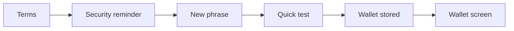
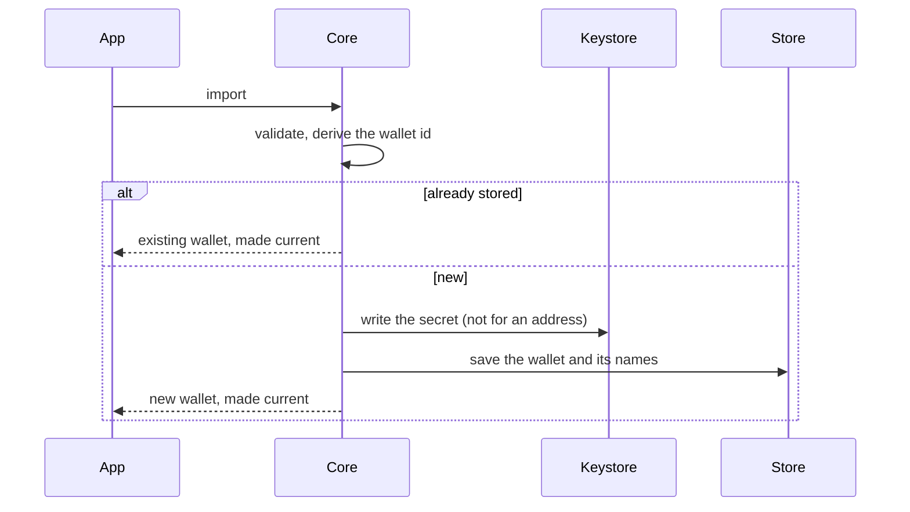
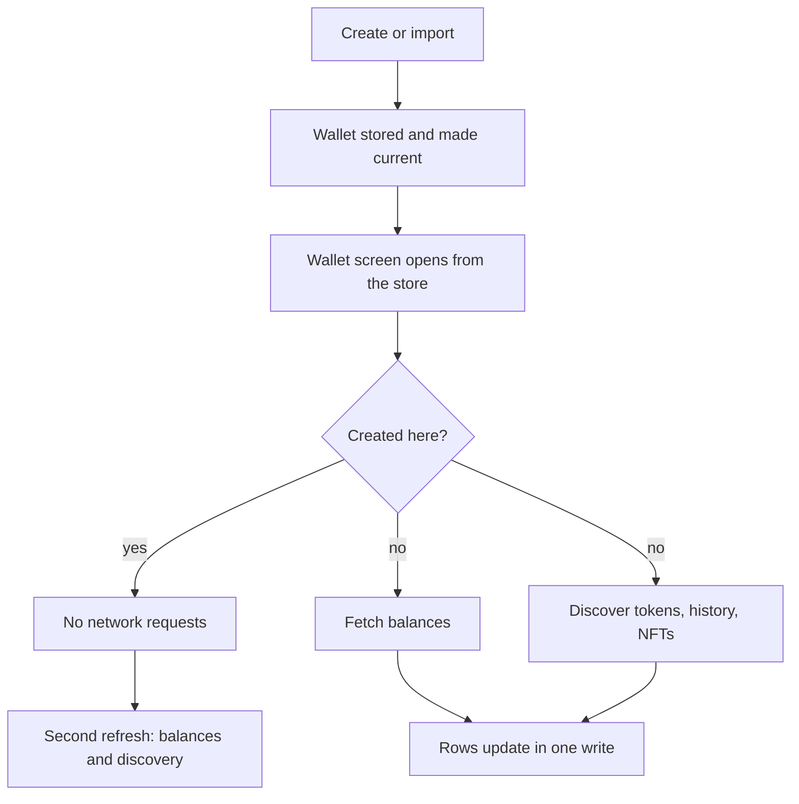
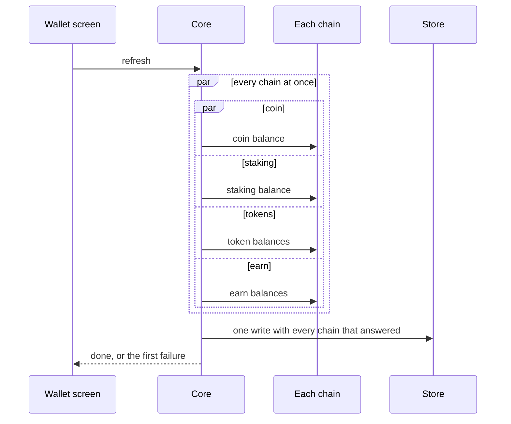

# Product behavior

This file says how the wallet is meant to behave, in plain words, one section per area. It is the intent. [ARCHITECTURE.md](ARCHITECTURE.md) says how the code is built to deliver it, and [TODO.md](TODO.md) tracks the gaps.

Before changing how an area works, read its section. If a change would break a rule written here, it is a product decision, not a cleanup: ask first. When the intent changes on purpose, change this file in the same commit.

Every section has the same parts: what the user gets, how it works, the rules with their reason, what happens when something fails, the platform differences we chose on purpose, and open questions where the code and the intent still disagree.

## Principles

**Secure.** The user always sees what they are about to sign: amount, recipient, network and fee. Nothing is signed or sent without that screen. Secret phrases and keys stay in the platform's secure storage and never reach a log, a screenshot or an unprotected clipboard. When something security-related is missing or unsupported, the wallet refuses instead of guessing. Details are in [Security](../skills/security.md).

**Fast.** Whatever is already stored shows at once, and a refresh replaces it in place; the screen never goes blank while loading. Independent requests start together and none waits for a slower one. A source that fails keeps what was on screen and never hides the sources that answered. Budgets are in [Performance](PERFORMANCE.md).

**Native.** Each app looks and feels like a first-class app of its platform: SwiftUI on iOS, Compose on Android, system navigation, sheets, share, paste, biometrics and locale formatting. The product rules are shared in Core so both apps decide the same thing; how it is drawn is each platform's own. A difference between the apps is either listed in its section with a reason, or it is a bug.

**Smooth.** Scrolling, typing and transitions hold the frame rate. The app never freezes or flickers. Heavy work stays off the UI thread, views render prepared state, a price tick updates only the rows it touches, and late results for a wallet or asset the user has left are dropped, not drawn. A visible hitch, a flash of empty content, or a glimpse of another wallet's data is a defect.

## Create wallet

**What the user gets.** Tap "Create a New Wallet", accept the terms once, read the security reminder, see a fresh 12-word phrase, prove you saved it by tapping the words back in order, and land on the wallet screen with the new wallet current and named "Wallet #N". A wrong tap in the test changes nothing and reveals nothing. The phrase never leaves the device.

**How it works.**

1. Terms: three items (self custody, recovery, responsibility). "Agree and Continue" enables when all three are ticked. Asked once per install.
2. Security reminder: "Store It Somewhere Safe", "Do Not Share It With Anyone", "We Can't Help You Recover It". Shown on every create.
3. Phrase: 12 English words from the system's random source, shown in two numbered columns with a Copy button.
4. Quick test: the words are shuffled inside groups of four and the user taps them back in order. Only the correct next word is accepted. Continue enables when every word is placed.
5. Store: one Core call stores the wallet, names it and makes it current. The wallet screen replaces onboarding. On iOS the app then asks for push permission if the system has not decided yet.

**Rules.**

- All three terms must be ticked, and they are asked once per install, because they bind the person, not the wallet.
- The security reminder shows on every create, because the phrase is the only way to recover the wallet and the user must hear it before seeing it.
- Every visit generates a new random 12-word phrase. A phrase is never reused or predictable.
- A copied phrase is a sensitive clipboard value that expires after one minute, because other apps read the clipboard.
- The test shuffles only inside groups of four, accepts only the next word, and never hints which word is next.
- Storing, naming and making the wallet current is one step. A blank name is refused.
- The keystore password is created once, while the keystore is empty, and the user never types it.
- If the wallet record cannot be stored, the secret just written is deleted, so a retry starts clean.
- Nothing about the phrase is ever written to a log.

**If something fails.**

| Step | What the user sees | What is stored |
| --- | --- | --- |
| Phrase generation fails | An error; the reminder screen stays | Nothing |
| Keystore prompt cancelled (iOS) | Back on the test screen, no error | Nothing |
| Keystore or wallet write fails | An error; the user can retry | Nothing |
| A setup step fails after the wallet is current (assets, banners, balances) | The wallet screen shows anyway | The wallet; the step is logged |

**Platform differences.**

- Android blocks screenshots and recording on the phrase screens. iOS cannot block, so it detects a screenshot, warns, and hides the content during recording.
- Android keeps the system splash until the wallet is ready. iOS shows the tabs on the first frame that has a wallet.
- Storing a further wallet on iOS may ask for Face ID, because the iOS keystore can be protected by biometrics. Android reads it without a prompt.
- On Android an uninstall wipes the keys, so reinstalling without the phrase loses the wallet. On iOS the Keychain survives removal. Support must never suggest a reinstall.

**Open questions.**

- Android skips the terms check when create or import starts from the wallets list; iOS checks at every entry. Which is intended?
- A wrong tap in the test shakes the chip red on Android and does nothing visible on iOS. Which is intended?
- On Android a failure after the quick test shows no message on that screen. Where should it show?
- When exactly to ask for push permission is D75 in [TODO.md](TODO.md#decisions-to-make).

## Import wallet

**What the user gets.** Pick Multi-Coin or one network, then type, paste or (on iOS) scan a secret phrase, a private key or an address. The wallet is validated, stored, named and made current in one step. While typing a phrase, word suggestions follow the cursor. Invalid input is refused with a message that names the problem. Importing a wallet that already exists is not an error: the app names it and opens it. A watch wallet (an address) shows balances and history but cannot send.

**How it works.**

1. Type picker: Multi-Coin first, then every network by rank, with a search field.
2. Kinds: Multi-Coin offers only a phrase. A network offers a phrase, a private key where the network supports one, and an address.
3. Input: no autocorrect. Pasting a phrase or a key clears the clipboard afterwards; pasting an address does not. An address can be typed as a name and is resolved while typing.
4. Import: Core validates the input, derives the wallet id, and if that wallet already exists returns it and makes it current. Otherwise it writes the secret to the keystore (never for an address), stores the wallet with its address names, and makes it current.
5. Multi-coin wallets automatically gain the networks that later app versions add.

**Rules.**

- Multi-Coin accepts only a phrase. A private key is offered only where the network can use one.
- Word suggestions appear only for a phrase, follow the word at the cursor, and never repeat the word already typed.
- Changing the kind clears the input, so a phrase never lingers in a key field.
- The clipboard is cleared after pasting a phrase or a key, never after pasting an address.
- A phrase is lowercased and split on whitespace. Unknown words are named in the error ("Invalid Secret Phrase word: …"); a bad checksum says "Invalid Secret Phrase".
- A key or an address is validated for its network before anything is stored.
- The same secret imported as a different wallet type (multi-coin, single network, watch) is a different wallet, not a duplicate.
- A watch wallet never touches the keystore and never offers a secret to export.
- The naming, password, cleanup and logging rules of Create wallet apply, because both share one store path.

**If something fails.**

| Step | What the user sees | What is stored |
| --- | --- | --- |
| Invalid phrase, key or address | The message naming the problem | Nothing |
| Name resolution is pending or fails | The typed text is validated as an address | As validated |
| Wallet already exists | A sheet with its name and "This wallet has already been imported."; Continue opens it | Nothing new; it becomes current |
| Keystore or wallet write fails | An error; the user can retry | Nothing; a new keystore file is deleted |

**Platform differences.**

- iOS offers a QR scan for a single-network import; Android has no scan on this screen. No reason is recorded.
- Android colors invalid phrase words while typing; iOS shows the error after Import. No reason is recorded.
- iOS shows import errors in an alert; Android shows them under the field. Each follows its platform's form style.

**Open questions.**

- Should both apps paste the same way? Android adds a trailing space after a pasted phrase; iOS trims it (VM126 in [TODO.md](TODO.md)).
- Should iOS highlight invalid words while typing, or should Android stop (VM92)?
- Should Android get the QR scan?
- When an import finds an existing wallet, it is already made current before the sheet shows. On Android, backing out of the sheet leaves the wallet switched. Intended?

## After create and import

Both flows end on the wallet screen. They differ only in what the network is asked for.

**A created wallet** has no history, so nothing is fetched. It gets its default assets at zero, the price subscription so prices show at once, and the welcome banner with Buy and Receive. The first pull-to-refresh fetches nothing; from the second one on it behaves like any wallet.

**An imported wallet** has history, so two things start at once and neither waits for the other: the balances of its default assets are fetched (see [Balances](#balances)), and asset discovery finds every token the backend has seen for its addresses, enables each one and fetches its balance, and loads the first transactions and NFTs. A "Loading" row sits above the list until discovery completes, so the user knows tokens may still appear. Later refreshes ask only for what was seen since the last discovery.

**Rules.**

- Never ask a network for a wallet created in the app until its second refresh, because there is nothing to find and the request only delays the screen.
- Every wallet gets its default rows before any network answer, so the list is never empty.
- For an imported wallet, balances and discovery run at the same time, and discovery runs even if the balance fetch fails.
- The loading row stays until discovery completes, and a failed discovery step is retried on the next refresh.
- Discovery never enables a token that mirrors a network's native coin.

**If something fails.**

| Step | What the user sees | What is stored |
| --- | --- | --- |
| The first balance fetch of an imported wallet fails | Rows stay at zero, no message, until the next pull | The rows; no balances |
| Discovery fails | The loading row stays; a pull retries | Balances that answered |
| A discovered token's balance fetch fails | The token appears at zero until the next refresh | The token, enabled |

## Wallet

**What the user gets.** The wallet screen opens instantly from what is stored: the wallet name, the total in the chosen currency with its 24h change, the action buttons, the asset rows with balance, price and fiat value, and any banner. Nothing on screen waits for the network. A refresh runs behind the rows and changes only the rows whose values moved. A slow or offline network never hides a fast one, a failed refresh keeps what is on screen, and a response that arrives after a wallet switch goes to the wallet it belongs to. The user can always switch wallet, search, manage the token list, hide balances, pin or hide an asset, and pull to refresh.

**How it works.**

- **Header.** The total is the sum of every enabled asset's balance times its price, plus perpetual collateral when the wallet has a perpetual account. The 24h change shows only when the wallet holds value and moved.
- **Buttons.** Send, Receive and Buy for every signing wallet. Swap for a multi-coin wallet, or a single-network wallet whose network supports swaps. A watch wallet shows "Watch-only wallet. You don't control these funds." instead of buttons.
- **List.** Pinned assets first, then the rest ordered by fiat value, then by rank. Hidden assets are not in the list. A native coin is titled by its network; the price and change sit under the name; balance and fiat value on the right, greyed when empty.
- **Hide balances.** One preference masks the header, the rows and the perpetual preview. Toggled from the header or Settings.
- **Banners.** Only two can appear here: the warning that an account can be controlled by someone else (always on, cannot be closed, disables the buttons) and the welcome for a wallet created in the app (shows while every balance is zero). Closing a banner is permanent.
- **Refresh.** Pull-to-refresh fetches balances and runs asset discovery at the same time. Prices are not part of a pull: they come from the live socket, which sends a full snapshot on connect and batched updates after. There is deliberately no timer that refreshes the screen.
- **Switching wallet.** Navigation resets, the new wallet's setup runs, the price subscription is rebuilt from its enabled assets, and the previous wallet's pending results are dropped.

**Rules.**

- The screen renders from the store first; nothing on it waits for the network.
- The 24h change shows only when the wallet holds value and moved.
- Swap is offered only where a swap is possible for that wallet.
- The buttons are disabled while the "controlled by someone else" warning is visible, because sending from such an account can lose the funds.
- The welcome banner exists only for a wallet created in the app and only while every balance is zero.
- A closed banner never returns; an always-on warning cannot be closed.
- Pinned assets stay in their own section above the rest.
- A pull refreshes balances and discovery together; discovery runs even when balances fail.
- No interval refresh on this screen; prices come from the socket.
- A failed refresh keeps what is on screen.

**If something fails.**

| Situation | What the user sees | What is stored |
| --- | --- | --- |
| Balances fail on every network | Rows and total unchanged; no message | Nothing; discovery still runs |
| Discovery fails | Rows unchanged; on a first load the loading row stays | Balances that answered |
| Socket down | Prices and change stay as last stored; a banner says "Balances and activity may be outdated." | Nothing; reconnect resubscribes and re-prices everything |
| A setup step fails on a wallet switch | The screen still opens from the store | The steps that succeeded |

**Platform differences.**

- Android shows the Play in-app update as a row in the wallet list; iOS asks with an alert at launch, because the store delivery differs.

**Open questions.**

- A pull does not request prices; if the socket is down, prices stay stale. Keep socket-only, or fetch prices on a pull when the socket is down?
- iOS shows only the first banner; Android pages through all of them (D74 in [TODO.md](TODO.md#decisions-to-make)).
- A failed pull shows nothing while online. Keep it silent, or show a short message after the pull settles?

### Balances

**What the user gets.** A refresh asks every network of the wallet at the same time, and on each network asks for the coin balance, the staking balance, the token balances and the earn balances as separate requests. The coin answers fastest, and a slow or failing request must not hold back the others. Whatever answered is written in one go; rows that did not change are not touched; a network that failed keeps its previous values; and an old answer never overwrites a newer one.

**How it works.**

Core builds one request per network that has an enabled asset and runs them all at once. Inside a network the four requests also run at once. Then Core keeps every network that answered, drops any answer older than one already stored for the same asset, merges each answer onto its own fields (a staking answer never clears a coin balance), keeps only the rows that changed, and writes them in a single transaction. The first failure is reported after the write. A balance row carries available, frozen, locked, staked, pending, rewards, reserved and earn amounts plus network-specific extras such as Tron energy and bandwidth. Prices are stored in USD and converted once with the current currency rate, so no screen converts anything itself.

**Rules.**

- Coin, staking, token and earn balances are separate concurrent requests. Never merge them into one snapshot, because the coin answers faster and one slow or failing request must not hold back the others. (Decided in AUD39; see [TODO.md](TODO.md#ledger-of-closed-sections).)
- Every network that answered is written in one atomic write, and the first failure is reported after it. A failed network keeps its old values on screen; there is no "unknown" state.
- Only rows whose values changed are written, and each answer updates only its own fields.
- An answer that arrives after a newer one for the same asset is dropped.
- Every write is keyed by the wallet it was asked for, never the wallet on screen.
- A new wallet gets its default rows at setup. A wallet created in the app asks no network until its second refresh.
- Hiding an asset also unpins it, in one write.
- A token that mirrors a network's native coin is never enabled or discovered.
- Prices are stored in USD and converted once; a refresh that started before a currency change is committed in the new currency.

**If something fails.**

| Situation | What the user sees | What is stored |
| --- | --- | --- |
| One network fails | Other networks update; the failed one keeps its values | One write with the networks that answered |
| One request fails on a network (say staking) while the coin answered | Nothing changes on that network today | Nothing for that network (open question below) |
| The write fails | Rows unchanged | Nothing; it is one transaction |
| The first fetch after enabling a token fails | The token sits at zero until the next refresh | The token, enabled |
| A price arrives in a currency with no stored rate | The price stays | Dropped until a rate exists |

**Open questions.**

- Today a failed request discards the whole network's answers: if staking fails, the coin and token balances that succeeded on that network are thrown away too. The intent says they should be kept. Options: publish what answered and report the failure; or keep the network as all-or-nothing and write that down as the rule.
- "As soon as possible" versus one write. Today Core waits for every network and every request before writing once, so the fastest network's coin balance shows only when the slowest has answered or failed. [ARCHITECTURE](ARCHITECTURE.md#publish-a-multi-source-refresh-as-one-batch) chose one write on purpose (fewer updates, no mixed-age totals). Options: keep one write; write per network as each finishes; or write coin and tokens first and staking and earn when they arrive.
- The first fetch after enabling a token swallows its error (AUD59 in [TODO.md](TODO.md)). Keep it silent, or report it?
