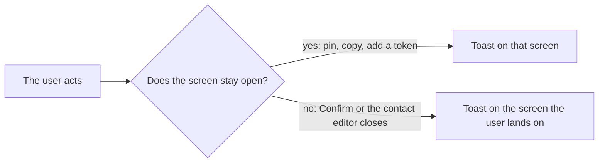

# Product behavior

This is the high-level definition of how the wallet behaves, from the user's side. The principles below apply to every screen, and so do the shared sections after them: numbers, asset logos, the Network Fee, names, asset search, charts, secrets, feature availability and toasts. Each area has its own short page under [product/](product/): the success path as steps, a diagram where it reads faster than words, the expected results and the platform differences as tables, and the few rules no table can hold. How the code delivers it lives in [ARCHITECTURE.md](ARCHITECTURE.md); the gaps live in [TODO.md](TODO.md).

Before changing how an area works, read its page. A change that breaks a rule written there is a product decision, not a cleanup: ask first, and update the page in the same change when the intent moves.

## Principles

**Secure.** The user always sees what they are about to sign: amount, recipient, network and fee. Nothing is signed or sent without that screen. A Secret Phrase or private key never leaves the device's secure storage and never reaches a log, a screenshot or an unprotected clipboard. When something security-related is missing or unsupported, the wallet refuses instead of guessing.

**Fast.** Whatever the app already knows shows at once; a refresh updates it in place and never blanks the screen. Independent requests start together and none waits for a slower one. When one source fails, the others still show; the failed one keeps its last known values. Speed of use comes first: the app is kept small only where that costs no noticeable speed.

**Native.** Each app looks and feels like a first-class app of its platform: system navigation, sheets, share, paste, biometrics and the user's locale for numbers and dates. Both apps follow the same rules and make the same decisions; only the drawing is platform-specific. Where the apps differ, the area's Platform differences table says so and why; any other difference is a bug.

**Simple.** Every screen uses patterns the user already knows: a list of rows, a sheet, a segmented picker, a button that says what it does. The same thing looks and works the same everywhere in the app: one asset row, one address row, one confirmation screen, one way to copy, one way to pick an asset. A new screen copies an existing one rather than inventing a layout. Each screen asks for one decision at a time, shows the outcome where the action happened, and needs no explanation to use. If something needs a tooltip to be understood, the screen is wrong, not the user.

**Smooth.** Scrolling, typing and transitions hold the frame rate. The app never freezes or flickers. A price update changes only the rows it touches, and a result for a wallet or asset the user has already left is dropped, not drawn. A visible hitch, a flash of empty content, or a glimpse of another wallet's data is a defect.

## Look

**Feature symbol.** A screen or sheet that introduces one feature or asks for one decision shows one large symbol from the platform's own set, in the brand blue with no background, above a bold title and a short description, at the size of an info sheet. Every such screen uses this one look so the user recognizes it; a new one copies it rather than drawing an icon.

## Numbers

Both apps write every number the same way. The examples are in US English and US dollars; separators and where the currency symbol goes follow the user's locale.

### Money

Fees, prices, balances and every other value in money. Money always shows its cents, so it never reads `$0.9`, and it is rounded to the nearest.

| Value | Shows as | Rule |
|---|---|---|
| 1234.5 | `$1,234.50` | two places from $0.99 |
| 1 | `$1.00` | |
| 1.89999 | `$1.90` | rounded to the nearest |
| 0.9 | `$0.90` | under $0.99, at least two places |
| 0.5 | `$0.50` | |
| 0.1235 | `$0.1235` | and up to four significant digits |
| 0.0039 | `$0.0039` | |
| 0.00000783 | `$0.00000783` | |
| 0 | `$0.00` | also anything under $0.0000000001 |
| 5 | `+$5.00` | a gain or a loss shows its sign |
| -1.2 | `-$1.20` | |

**In list rows:** the wallet's assets, asset lists, stake and perpetual markets. A row has no room for `$0.00000783`.

| Value | Shows as | Rule |
|---|---|---|
| 0.0345 | `$0.0345` | as above |
| 0.00000783 | `<$0.0001` | under $0.0001 |

**Totals and payments:** the wallet total and its gain or loss, Buy and Sell amounts, a perpetual's margin, and the medium and large price widgets. They are counted in cents.

| Value | Shows as | Rule |
|---|---|---|
| 1234.56 | `$1,234.56` | always two places |
| 0.9 | `$0.90` | |
| 0.004 | `$0.00` | |

**Large values:** market cap, fully diluted valuation, trading volume and the small price widget.

| Value | Shows as | Rule |
|---|---|---|
| 1235999 | `$1.24M` | shortened from $100,000 |
| 2450000000 | `$2.45B` | |
| 99999 | `$99,999.00` | under it, as money |

### Amounts

Coin and token amounts. An amount is cut, never rounded up, so the wallet never shows more than the user has. It drops trailing zeros: an amount is not money, and `5.20 ATOM` adds nothing.

| Value | Shows as | Rule |
|---|---|---|
| 1239999 | `1,239,999 ATOM` | from 1, up to two places |
| 5.205516 | `5.2 ATOM` | |
| 1 | `1 ATOM` | |
| 0.1992 | `0.1992 ATOM` | under 1, up to four significant digits |
| 0.099999 | `0.09999 ATOM` | cut, not rounded up |
| 0.00000546 | `0.00000546 ATOM` | |

**Exact:** balance changes and approval amounts on Confirm, so the user sees exactly what they sign.

| Value | Shows as | Rule |
|---|---|---|
| 1234.567891 | `1,234.567891 ETH` | every digit |
| 0.000021 | `0.000021 ETH` | |

**In list rows:** the wallet's assets, activity, stake and supply.

| Value | Shows as | Rule |
|---|---|---|
| 267123.456 | `267.12K BTC` | shortened from 100,000 |
| 5.205516 | `5.2 BTC` | from 0.1, up to two places |
| 0.0345678 | `0.0345 BTC` | under 0.1, up to four places |
| 0.00001 | `<0.0001 BTC` | under 0.0001 |

### Percentages

| Value | Shows as | Used for |
|---|---|---|
| 2.5 | `+2.50%` | a change: price change, profit and loss, funding rate |
| -2 | `-2.00%` | |
| 5 | `5.00%` | a rate: APR, slippage |
| 0.08 | `0.08%` | |
| 5 | `5%` | a preset the user picks, such as a price alert step |
| 2.5 | `2.5%` | |

### Other numbers

**Gas prices in Gwei, exchange rates and chart candle prices**

| Value | Shows as | Rule |
|---|---|---|
| 3456.789 | `3,456.79` | two places from 0.99 |
| 24 | `24.00` | |
| 0.123456789 | `0.1235` | under 0.99, up to four significant digits |
| 0.000838216 | `0.0008382` | |

**Leverage**

| Value | Shows as | Rule |
|---|---|---|
| 5 | `5x` | up to two places |
| 2.5 | `2.5x` | |

## Asset logos

Every list, header and sheet draws an asset's logo the same way. The logos that ship with the app show at once; any other logo is loaded.

| When the asset is | Expected | Why |
|---|---|---|
| A network's coin | its logo, at once | |
| ETH on an Ethereum layer 2, such as Base | the Ether logo with the network as a badge | the coin is ETH; the badge tells the networks apart |
| A token | its logo with its network as a badge | |
| USDT, USDC, USDS, USDe, USD1, USDG or PYUSD on a network its issuer deploys it to; USDT0 counts as USDT | its logo, at once | these are the tokens most users hold, so they never wait for a logo |
| USDT or USDC on BNB Smart Chain | its logo, at once | it is the USDT and USDC users hold on BNB Smart Chain, though Binance issues it |
| Any other token, bridged copies included, such as `USDC.e` | its logo once loaded, and its token standard, such as `ERC20`, until then | only a logo that ships with the app can show at once |

## Network Fee

Confirm and Transaction details show the Network Fee the same way.

| When | Expected | Why |
|---|---|---|
| The fee's coin has a price | Network Fee shows its value only: `$0.01` | the value is the number the user weighs |
| The fee's coin has no price | the fee in that coin: `0.000021 ETH` | |
| There is not enough of the coin that pays the fee | the fee in that coin above its value: `0.0000129 BNB` over `$0.01` | that is the amount the user has to add |
| The user can pick which asset pays the fee | its value and the asset: `$0.01` with `USDC` | |
| The user taps Network Fee on Confirm | the fee in its coin above its value, and faster, slower or custom fees where the network allows | |
| Confirm refreshes while the user types a custom fee | the typed value stays until they confirm it or leave the custom fee screen | a refresh never takes back what the user typed |
| The fee rows are built on an EVM network | the price that is signed: the network's current base fee with 20% headroom, plus a tip | the base fee can rise by up to 12.5% per block and Confirm refreshes once a minute, so without headroom a transaction that misses the next block gets stuck; the user pays only the actual base fee, so the headroom is never charged |
| The fee rows are built on Ethereum | the next block's base fee with no headroom; Normal adds a small tip and Fast a larger one, following Etherscan's gas tracker (Average and High) | the fee shown matches what Etherscan quotes; a base fee rise in the next block can delay the transaction until it falls again |
| The user sets a custom fee on an EVM network | two fields in Gwei that open empty with what Normal signs as the placeholder: Base Fee, the most they agree to pay the network, never under the base fee Normal signs; and Priority Fee, the tip, never under the network's minimum tip; an empty field means the suggested value and keeps following the network after a refresh, only typed values are kept; each field is capped at ten times the Normal price; a network whose base fee is zero (BNB Chain) shows only the Priority Fee field | a custom fee never has less headroom than Normal, so it does not get stuck more easily, and the tip is what makes it faster |
| Transaction details show the fee | as on Confirm: `$0.01`, or without a price `0.000021 ETH`; a tap shows `0.000021 ETH` over `$0.01` | the fee the user approved reads the same afterwards |

## Names

Wherever the user types an address (Send, Import Wallet, Contacts), a name such as `vitalik.eth` can stand in for it.

| When | Expected | Why |
|---|---|---|
| A typed name is not registered, or has no address for the network | not found | a name never becomes an empty or zero address |
| A `.sol` name is typed while SRS resolution is paused | not found | `.sol` is never guessed from `.sns`; the two names can have different owners |
| The name service cannot be reached | an error, not a missing name | |

## Asset search

Wallet search, every asset picker and its recents match typed text the same way.

| When the user types | Expected | Why |
|---|---|---|
| Part of a name or symbol: `teth`, `usd` | every asset whose name or symbol contains it | |
| A network: `ethereum` | that network's coin, ETH, and not its tokens | otherwise one word lists every token on the network |
| Part of a contract address: `0xdac17` | the token with that contract | |

## Charts

| When | Expected | Why |
|---|---|---|
| The price chart, a portfolio chart or the price widget cannot load | it shows that there is no data; only being offline shows an error | server text is not written for users |
| The user pinches the price chart or a market's candlestick chart | it zooms toward the newest point while that point is on screen, and around the fingers once panned back, down to 14 points on screen; a zoomed chart pans back in time with a swipe; pinching out stops at the whole period | the newest point is what the user watches, and fewer points stop reading as a trend |
| The user touches the price chart or a market's candlestick chart | a short hold shows the point under the finger; a sideways slide shows it at once while the chart is not zoomed and pans a zoomed chart; a drag that starts upright scrolls the page, and once the point shows the page stays put; a second finger hides the point | the price is read by sliding along the line; the short hold lets a pinch or a page scroll start without the point flashing |

## Secrets

A Secret Phrase or private key shows when a wallet is created and from "Show Secret Phrase" or "Show Private Key".

| When | Expected | Why |
|---|---|---|
| The user copies the Secret Phrase or private key | it leaves the clipboard after one minute and is kept off other devices; whatever the user copies after it stays | only a secret is dangerous to leave behind |
| The user copies an address or anything else | it stays until something replaces it | only a secret is dangerous to leave behind |

| When | iOS | Android | Expected |
|---|---|---|---|
| The user takes a screenshot of the Secret Phrase or private key screen | the screenshot is detected and the user is warned | the screenshot is blocked | Intentional |

- The Secret Phrase and private key screens hide their content during screen recording and whenever the app is not active.

## Feature availability

If an action is unavailable, show the Not Available sheet and stop. Learn More opens [regional availability](https://docs.gemwallet.com/faq/feature-availability/).

| Feature | Show the sheet when |
|---|---|
| Buy | Continue on the Buy screen, before opening the provider's checkout |
| Sell | Continue on the Sell screen, before opening the provider's checkout |
| Swap | Continue / Swap on the Swap screen, before preparing the trade |
| Perpetuals | Deposit, Long, Short, Increase or Reduce before the amount screen; Modify before the options |
| Staking | Stake on the staking screen, before opening the amount screen |
| Rewards | Invite Friends, before opening the share sheet |

Load config at startup and use the stored flags for actions. Features default to enabled until config is loaded. Keep quotes visible, and Withdraw and Close available.

## Toasts

A toast is the short message at the bottom of the screen that confirms what the user just did, or says why it failed. Each area lists the toasts it shows in a Toasts section on its page, and the ones no area owns are below. Anything not listed shows no toast.

```mermaid
flowchart LR
    A[The user acts] --> B{Does the screen stay open?}
    B -- yes: pin, copy, add a token --> C[Toast on that screen]
    B -- no: Confirm or the contact editor closes --> D[Toast on the screen the user lands on]
```

The emoji in a Toast column stands for the icon the toast shows:

| Icon | Means |
|---|---|
| ✅ | done |
| ❌ | failed, with the reason |
| 📌 | pinned or unpinned |
| ➕ | added to the wallet |
| 🔔 | price alert |
| 📋 | copied |
| 🌐 | connecting or loading |

| When | Toast | Shows on |
|---|---|---|
| An address is copied | 📋 Copied: Ethereum (0x12…34) | where it was copied |
| The Secret Phrase is copied | 📋 Copied: Secret Phrase | Show Secret Phrase |
| A private key is copied | 📋 Copied: Private Key | Show Private Key |
| Any other value is copied | 📋 Copied: 0x5f…e3 | where it was copied |
| A link or a notification cannot open | ❌ the reason | any screen |
| A scanned QR code cannot be read | ❌ Failed to decode the QR code. Please try again with a different QR code. | the scanner |

| When | iOS | Android | Expected |
|---|---|---|---|
| A value is copied | 📋 Copied: Ethereum (0x12…34) | Android 13 and newer show the system's own clipboard notice; older versions toast "Copied to clipboard" | Intentional: Android already confirms every copy |

- A toast confirms or explains; it never asks for a decision. Anything the user must act on is an alert or a sheet.
- A toast reuses the words the user tapped or already saw: a menu item, a button, an action's name. No toast has wording of its own.
- A transaction never shows a toast: its Pending row in Activity and its push say how it went. Only an action that leaves no transaction to follow, such as a perpetual order, shows one after Confirm.
- When the screen the action happened on closes, the toast shows on the screen the user lands on, whichever it is; it is never lost because that screen has nowhere to show it.
- A failure shows ❌ with the reason; a success never shows ❌.

## Areas

- [Onboarding](product/onboarding.md) — create a wallet, import a wallet, and what happens right after
- [Wallet](product/wallet.md) — the wallet screen, balances, search, and the wallets list: switching, pinning, rename, avatar, secrets, delete
- [Assets](product/assets.md) — the asset screen with its price chart and market data, manage tokens, recent assets
- [Transfer](product/transfer.md) — send, recipient, amount, confirm, and scanned payment codes and links
- [Transactions](product/transactions.md) — activity, filters, transaction details, pending tracking
- [Swap](product/swap.md) — quotes, providers, slippage, price impact, approval
- [Buy and Sell](product/fiat_connect.md) — buy and sell through providers
- [Stake](product/stake.md) — validators, stake, unstake, rewards, earn
- [Perpetuals](product/perpetuals.md) — markets, positions, leverage, take profit and stop loss
- [NFT](product/nft.md) — collections, an NFT's details and actions, unverified collections
- [WalletConnect](product/wallet_connector.md) — connecting dapps, requests, signing, WalletConnect Pay
- [Price Alerts](product/price_alerts.md) — alerts on an asset's price
- [In-app Notifications](product/in_app_notifications.md) — the notifications list in Settings
- [Settings](product/settings.md) — preferences, security and lock, push notifications, networks, about, app update
- [Contacts](product/contacts.md) — saved addresses and the recipient picker
- [Rewards](product/rewards.md) — referral codes, points, redeeming
- [Support](product/support.md) — support chat and help

## Writing a page

One page per area, named after the area's feature module on both apps (`product/<android_module>.md`, [Cross-Platform Awareness rule 7](../skills/cross-platform-awareness.md)). Use the product's own names from the app strings. No internals, no code, no test names. A page has, in order:

1. One sentence on what the area is for, and at most two diagrams of the main flow with one-line labels.
2. **Steps:** the success path as numbered user stories, one line each.
3. **Expected results:** a `When | Expected | Why` table, one row per situation, with example values in the app's wording (`$0.01`, `0.000021 ETH`, "Not supported"). A rule someone might simplify away becomes a row, and its reason goes in Why.
4. **Platform differences:** a `When | iOS | Android | Expected` table with every recorded difference in the area; an intentional one says Intentional, an open one names the [TODO.md](TODO.md) item that removes it, and a page without any says "None recorded."
5. **Rules:** only the always and never invariants that no single situation triggers, one line each with its reason.

A rule that holds in more than one area lives once in a shared section of this page, and each area points to it instead of repeating it. A page with more than one flow gives each flow its own steps and table. Transfer ([transfer.md](product/transfer.md)) is the worked example. Edge cases and open questions stay in [TODO.md](TODO.md).
