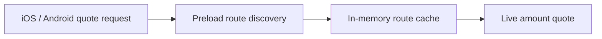

# Swapper

Core `GemSwapper` selects compatible providers, preloads reusable route discovery, and runs quote requests. Preloading never caches prices, amounts, balances, approvals, or transaction data.

## Quote routing

`GemSwapper` finds providers whose mode and supported chains match the request. Those providers quote concurrently, validate their provider-specific asset rules, and return either a quote or a provider error. Successful quotes are sorted by output amount.

Providers with route discovery use the cache in two ways:

- Pool discovery is direction-independent because the same pool can serve both token directions.
- The last winning route is direction-specific and is tried first on the next quote.

A cached route is only a hint. Every quote still calls the provider with the current amount and live chain state. If the route no longer quotes successfully, the provider tries other cached or newly discovered candidates.

## Preload routing

iOS and Android call `preload_routes` when a quote is requested, immediately before `get_quote`. Selecting assets does not start network work. The first quote for a pair discovers reusable route data; later quotes normally resolve discovery from the cache. Providers without discovery work use the default no-op preload implementation.

Current preload implementations discover:

- Uniswap V3 and V4 pool existence by chain, token pair, and fee tier.
- Cetus pool IDs and shared-object versions for direct and intermediary pairs.
- STON.fi router, pool, and jetton-wallet metadata.

| Provider | Preload reads | Quote reads |
| --- | --- | --- |
| Uniswap | Factory or StateView pool existence | Quoter output for the current amount |
| Cetus | Pool IDs and shared-object versions | Live pool quote simulation |
| STON.fi | Router wallets and pool addresses | Live pool data used to calculate output |

EVM, Sui, and TON providers use the same generic `RouteCache`. It owns the one-day expiration, pair keys, missing-probe tracking, completed discovery results, and winning-route hints. Providers only supply their protocol-specific probes and candidates.

`get_quote` reads the discovery populated immediately before it, so successful route requests are not repeated. `GemGateway` and `GemSwapper` share the same RPC coalescer: exact concurrent requests use one in-flight RPC. The coalescer does not cache quote results; every `get_quote` still uses current amounts and chain state.

Preload and quote are sequential stages of the client quote request. Preload fetches reusable route metadata; the amount-dependent provider quote remains live.

## Failure and retry

Explicit preloading is best-effort and returns no user-facing error. Only completed probes are marked as explored:

- Successful positive and negative discovery results are cached.
- Transport errors, rate limits, invalid responses, and incomplete discovery remain uncached.
- `get_quote` immediately retries missing probes through the provider's normal discovery path.

If Uniswap discovery fails during a quote, it falls back to its full live quote request set. Cetus and STON.fi retry missing discovery through their normal quote paths. Preload never suppresses a valid live quote.

## App lifetime

iOS and Android run preload only from the existing quote request path; they do not start a task when assets are selected. Each app keeps one `GemSwapper` for the app process, so the cache survives swap screen recreation but is cleared when the process restarts.

The swapper is not recreated for each quote. A process restart creates a new swapper and the next quote repopulates the cache.

## Code map

- [Core swapper](../core/crates/swapper/src/swapper.rs): provider selection, preload fan-out, and quote fan-out.
- [Swapper trait](../core/crates/swapper/src/swapper_trait.rs): default no-op preload contract.
- [Route cache](../core/crates/swapper/src/route_cache.rs): discovery expiration and winning-route hints.
- [Uniswap discovery](../core/crates/swapper/src/uniswap/discovery.rs): V3 and V4 pool checks.
- [Cetus discovery](../core/crates/swapper/src/cetus_clmm/client.rs): Sui pool discovery and routing.
- [STON.fi discovery](../core/crates/swapper/src/stonfi/provider.rs): TON router and pool discovery.
- [Gemstone bridge](../core/gemstone/src/gem_swapper/mod.rs): Swift and Kotlin API.
- [RPC coalescing](../core/gemstone/src/alien/coalescing_provider.rs): joins identical in-flight app requests.
- [iOS quote path](../ios/Packages/FeatureServices/SwapService/SwapService.swift): calls Gemstone `getQuote`.
- [Android quote path](../android/data/coordinators/src/main/kotlin/com/gemwallet/android/data/coordinators/swap/GetSwapQuotesImpl.kt): calls Gemstone `getQuote`.
