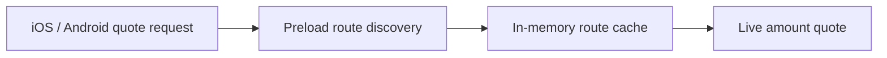

# Swapper

`GemSwapper` selects compatible providers, preloads reusable route data, and requests live quotes.

## Quote flow

`GemSwapService` calls `preload_routes` immediately before `get_quote`; iOS and Android request quotes through that Core service. Asset selection does not start preload work. Providers without reusable route discovery use the default no-op implementation.

The current providers preload:

- Uniswap V3 and V4 pool existence.
- Cetus pool IDs and shared-object versions.
- STON.fi routers, pools, and jetton wallets.
- Chainflip broker asset IDs and minimums; live quotes use the Broker as a Service native quote endpoint.
- THORChain and MayaChain inbound addresses.

## Shared cache

EVM, Sui, and TON use the generic `RouteCache` with a one-day process-local TTL. It stores direction-independent pool discovery and direction-specific winning-route hints. Providers supply only their protocol-specific keys, probes, and candidates.

A route is only a hint. Every quote still uses the current amount and live chain state. If the cached route fails, the provider tries other discovered routes.

Exact concurrent RPC requests are joined by the same Gemstone coalescer used by `GemGateway`. Quote results, prices, balances, approvals, and transaction data are never cached.

The Gem API adds every Swaps.xyz quoted deposit address to the seven-day vault watchlist while proxying the action request. Source-chain memo and destination-tag values returned as `tx.toExtra` are preserved in `SwapQuoteData.memo`; Sui deposits also receive a prebuilt transfer payload. Status polling uses the confirmed source-chain transaction hash directly; clients do not register broadcasts or persist a provider transaction-ID mapping.

## Max amount

A max swap of a native coin cannot spend the whole balance: the transaction still pays the network fee, and some providers attach native value on top of the swapped amount. Core owns that arithmetic; the apps only flag `use_max_amount` when the entered value equals the available balance.

- `Swapper::get_quotes` reduces the value quoted to every `SwapAmountMode::Fixed` provider by the chain's `RESERVED_NATIVE_FEES` entry (`fees/reserve.rs`), which covers the wallet's own fee.
- A provider whose transaction attaches native value on top of the swapped amount subtracts that attachment itself before quoting, because only it knows the number. STON.fi keeps the forward gas its TON-to-jetton message carries (0.31 TON, the v2 amount, which also covers v1 routes) out of a max native quote, and reports the chain reserve plus the attachment as the minimum when the balance cannot cover them; a builder test keeps that constant above what either router version attaches.
- The chain preload turns the real attachment into the confirm fee: TON's `calculate_transaction_fee` reads it from the quote data, the message value minus the quoted amount for a native swap and the whole message value for a jetton swap, instead of a constant, so the balance check at confirm is exact for the route that was quoted.
- `TransferAmountInput::calculate` never trims a max amount the transaction cannot carry. A `Contract` swap sends the quoted value, so the confirm shows that value or an insufficient-balance error, never a smaller number than the one signed. Transfer-type swaps still trim by the fee at confirm.

Issue #1154 was the missing attachment: a max TON swap was quoted at the balance minus 0.02 TON, STON.fi attached 0.31 TON, the confirm displayed a trimmed amount, and the wallet skipped the message on chain.

Known gap: for a transfer-type max swap the confirm trims by the fee only when the fee exceeds the chain reserve, while the EVM and Tron signers always subtract the fee (`SignerInput::swap_value`) and the other signers never do, so the confirmed and signed amounts can differ by up to the fee on those providers.

## Failure and lifetime

Preloading is best-effort. Completed probes are cached; transport failures and incomplete responses remain missing, so `get_quote` retries them through the provider's normal discovery path. Uniswap falls back to its full quote request set when discovery is unavailable.

The apps keep one `GemSwapper` per process. The cache survives swap screen recreation and resets on process restart.

## Code map

- [Core swapper](../core/crates/swapper/src/swapper.rs)
- [Route cache](../core/crates/swapper/src/route_cache.rs)
- [Max amount reserve](../core/crates/swapper/src/fees/reserve.rs)
- [Uniswap discovery](../core/crates/swapper/src/uniswap/discovery.rs)
- [Cetus discovery](../core/crates/swapper/src/cetus_clmm/client.rs)
- [STON.fi discovery](../core/crates/swapper/src/stonfi/provider.rs)
- [Gemstone bridge](../core/gemstone/src/gem_swapper/mod.rs)
- [Core quote orchestration](../core/gemstone/src/services/swap/mod.rs)
- [Core screen-facing quote service](../core/gemstone/src/services/swap/quote.rs)
- [RPC coalescing](../core/gemstone/src/alien/coalescing_provider.rs)
- [iOS quote path](../ios/Features/Swap/Sources/ViewModels/SwapSceneViewModel.swift)
- [Android quote path](../android/data/coordinators/src/main/kotlin/com/gemwallet/android/data/coordinators/swap/RequestSwapQuotesImpl.kt)
