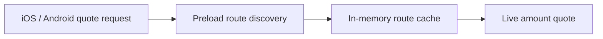

# Swapper

`GemSwapper` selects compatible providers, preloads reusable route data, and requests live quotes.

## Quote flow

iOS and Android call `preload_routes` immediately before `get_quote`. Asset selection does not start preload work. Providers without reusable route discovery use the default no-op implementation.

The current providers preload:

- Uniswap V3 and V4 pool existence.
- Cetus pool IDs and shared-object versions.
- STON.fi routers, pools, and jetton wallets.

## Shared cache

EVM, Sui, and TON use the generic `RouteCache` with a one-day process-local TTL. It stores direction-independent pool discovery and direction-specific winning-route hints. Providers supply only their protocol-specific keys, probes, and candidates.

A route is only a hint. Every quote still uses the current amount and live chain state. If the cached route fails, the provider tries other discovered routes.

Exact concurrent RPC requests are joined by the same Gemstone coalescer used by `GemGateway`. Quote results, prices, balances, approvals, and transaction data are never cached.

## Failure and lifetime

Preloading is best-effort. Completed probes are cached; transport failures and incomplete responses remain missing, so `get_quote` retries them through the provider's normal discovery path. Uniswap falls back to its full quote request set when discovery is unavailable.

The apps keep one `GemSwapper` per process. The cache survives swap screen recreation and resets on process restart.

## Code map

- [Core swapper](../core/crates/swapper/src/swapper.rs)
- [Route cache](../core/crates/swapper/src/route_cache.rs)
- [Uniswap discovery](../core/crates/swapper/src/uniswap/discovery.rs)
- [Cetus discovery](../core/crates/swapper/src/cetus_clmm/client.rs)
- [STON.fi discovery](../core/crates/swapper/src/stonfi/provider.rs)
- [Gemstone bridge](../core/gemstone/src/gem_swapper/mod.rs)
- [RPC coalescing](../core/gemstone/src/alien/coalescing_provider.rs)
- [iOS quote path](../ios/Packages/FeatureServices/SwapService/SwapService.swift)
- [Android quote path](../android/data/coordinators/src/main/kotlin/com/gemwallet/android/data/coordinators/swap/GetSwapQuotesImpl.kt)
