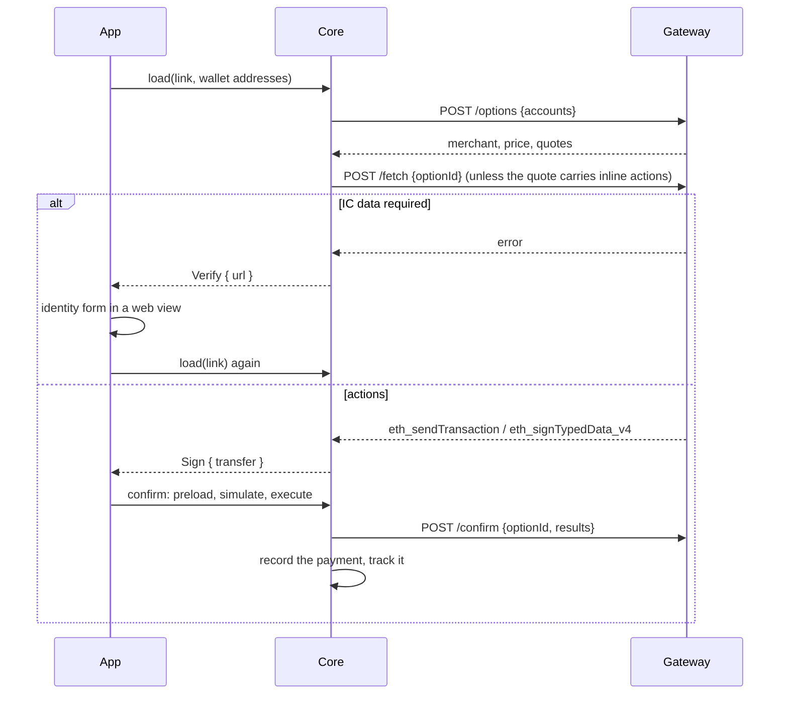

# WalletConnect Pay

A merchant shows a WalletConnect Pay link; the wallet resolves it through the WalletConnect gateway, pays with the coin or token the user picks, reports the result to the gateway and records the payment in activity. Core owns the whole flow; the apps render screens and host the identity form. Decoding of the link itself, and of every other payment QR, is in [product/transfer.md](product/transfer.md).

## Payment links

A decoded `PaymentLink` is either `WalletConnectPay { payment_id }` or `SolanaPay { url }` (a Solana Pay transaction request). Both go through the same session: `GemPaymentService` is the one payment object on each app, and `load(link, addresses)` answers one of three things.

| `load` answers | Meaning | App |
|---|---|---|
| `GemPaymentLoad::Sign { transfer }` | The transfer data is built: `TransactionInputType::Payment { asset, invoice, extra }` | Open the confirm with it |
| `GemPaymentLoad::Verify { invoice, asset_id, url }` | The gateway wants identity data before it builds the transaction | Show the form at `url`, then load the link again |
| `PaymentError::Status { status }` | The payment is already final (succeeded, failed, expired, cancelled) | Toast the status, open nothing |

`invoice` carries the link, the merchant (name and icon), the price when the rail quotes one, every quote the wallet can pay with, and the pending verification when there is one. The quote being paid is the one whose asset is the transfer's asset, so the confirm renders the payment from that input alone: title, price header, merchant recipient row, pay-with row, and the verification row in place of the fee while a quote still needs the form.

Switching the asset on the confirm is a load option like a fee priority: `GemConfirmLoadOptions.asset_id` makes the confirm session call `select_asset`, which repeats `/options` and `/fetch` for that asset and swaps the transfer the session holds before it preloads. The session owns no gateway call of its own; every one goes through the payment service.

## Gateway

Base `https://api.pay.walletconnect.com/v1/gateway/payment/{payment_id}`, headers `WCP-Version: 2026-02-18`, `App-Id` (the WalletConnect project id) and `Client-Id` (a UUID minted per process).

| Call | Request | Answer |
|---|---|---|
| `POST …/options?includePaymentInfo=true` | `accounts`: CAIP-10 accounts of the wallet's EVM chains | `info` (status, merchant, price), `options` (one per payable asset: `id`, `account`, CAIP-19 `amount`, optional inline `actions`, optional `collectData`), optional response-level `collectData` |
| `POST …/fetch` | `optionId`, `data` | `actions` the wallet must perform, or the error `IC data required` |
| `POST …/confirm` | `optionId`, `results` (one per action, in order) | status |
| `GET …/status?maxPollMs=0` | | status, `info.txId` once the payment settled |

Facts the code relies on:

- Only options whose account is one of the wallet's are kept; EVM token ids are checksummed on the way in because the gateway sends them lowercase. No usable option is `PaymentError::NoPaymentOptions`.
- Option ids are ephemeral: every `/options` call issues new ids and rejects the previous ones, so a quote is re-selected by asset id and an option id is only valid for the `/confirm` that follows its own `/fetch`.
- Token options usually carry their actions inline; coin options and `build` options need `/fetch`. The gateway refuses a `/fetch` for an option that already carries actions ("corrupted contents"), so inline actions are used as they are.
- The built transaction and the typed data carry the quote's deadline. A late signature fails on chain instead of being credited, so the app keeps no expiry timer.
- `/confirm` answering `succeeded` or `processing` is success; any other status is `PaymentError::Status`, which the app toasts as a localized `GemErrorText`.
- Identity data is collected per account (chain and address). The response-level `collectData` URL covers every account that was sent; an option's URL covers only that account. `Verify` uses the response-level one first. Only `/fetch` refusing with `IC data required` opens the form; `collectData` URLs on options are not a signal.

## Actions

`/fetch` (or the inline actions) is mapped to one `PaymentAction`; anything else is refused with `PaymentError::InvalidRequest` before the user sees a confirm.

| Gateway actions | `PaymentAction` | The wallet | Checks before it is accepted |
|---|---|---|---|
| `eth_sendTransaction` | `Send { recipient, data }` | Signs and broadcasts the router call the gateway built, pays its gas | `from` is the quote's account, `chainId` is the quote's chain, `value` equals the quote |
| `eth_signTypedData_v4` | `Sign(TypedDataTransfer)` | Signs a Permit2 `PermitTransferFrom` or an EIP-3009 `ReceiveWithAuthorization`; the gateway's relayer sends it, so the payment has no network fee | Signer and `from` are the quote's account, `chainId` matches, token and amount equal the quote, the typed data names its verifying contract |
| `eth_sendTransaction` + `eth_signTypedData_v4` | `ApproveAndSign { approval, sign }` | Sends an ERC-20 approve first, then signs the permit; reports the approve hash and the signature in one `/confirm` | The approve is a token approval of the quote's token to the permit's verifying contract (Permit2) and carries no value |
| Anything else (`personal_sign`, three actions, a foreign method) | refused | | |

Every action of a payment is signed as `TransactionInputType::Payment`; `is_broadcast` sends the router call and the approve leg and hands back the signature. A signature-only payment preloads a zero fee.

## Identity verification

The form is the gateway's web page, opened in a web view restricted to the link's host. The page tells the wallet it is done through the bridge it finds: `window.webkit.messageHandlers.payDataCollectionComplete.postMessage({type})` on iOS, `window.AndroidWallet.onDataCollectionComplete(json)` on Android, with `IC_COMPLETE` or `IC_ERROR`; Core's `payment_verification_outcome` reads the type. On `IC_ERROR` the form closes and the app shows the generic error. On completion the app loads the link again, or reloads the confirm when the form was opened from its verification row, and lands on a signable transfer. Closing the form leaves the confirm untouched underneath. iOS hosts the form in `PaymentVerificationScene` (a sheet from both entry points); Android in `PaymentVerificationScreen` from a scanned link and in a full bottom sheet from the confirm.

## On chain

Neither address the wallet interacts with is the merchant's, and the gateway never exposes the merchant's payout address:

| Payment | The record's `to` | What happens on chain |
|---|---|---|
| Coin | The WalletConnect Pay router (`eth_sendTransaction.to`) | The router wraps the coin and forwards it through the settlement contract to the merchant's payout address |
| Token | The permit `spender`, a WalletConnect settlement contract | The relayer calls the router, the spender pulls the token through Permit2 (or the token pulls it through `receiveWithAuthorization`) and forwards it to the merchant |

The confirm therefore shows the merchant by name, taken from the invoice, never by an address.

## Activity and tracking

Every payment leg is recorded as a `Transfer` to the address the gateway named, with `TransactionPaymentMetadata { link, merchant }`, so activity reads it as a sent transfer and the tracker knows which payment it belongs to. Naming that address after the merchant in activity is deferred. The approve leg is a plain token approval without payment metadata.

A coin payment has its own hash and is tracked on chain like any transfer. A token payment has no hash until the relayer sends it, so it is recorded with the payment id as its hash after `/confirm` accepted it, and while a record still carries that id the transaction tracker asks `/status` instead of the chain: `succeeded` swaps the hash for `info.txId` and confirms the record, a final status fails it, anything else keeps polling. Once the hash is a chain hash the tracker is back on chain.

The backend indexer has no parser for the WalletConnect Pay router, so it cannot name the merchant. An indexed router call would arrive as a smart-contract call without metadata and the stores would replace the local record with it; the relayed token transaction is never indexed for the payer, because the token leaves the payer inside a call the relayer sent. Keeping local metadata across a sync is open work ([TODO D28](TODO.md)).

## Failure and lifetime

- A refused action, a chain or account mismatch, or a value that differs from the quote never reaches the confirm: `load` fails with the reason, and the app shows a scan error.
- A payment that is final when scanned, or whose `/confirm` is refused, is shown as its status; nothing is retried.
- A cancelled payment whose router call was already sent still executes on chain; the gateway answers `cancelled` and the app toasts the failure.
- `/status` is polled with the chain's transaction timeout; a payment that never settles is failed like a stuck swap.

## Testing

Fixtures captured from the live gateway live in [`core/crates/payment/testdata/wallet_connect_pay`](../core/crates/payment/testdata/wallet_connect_pay) (options with and without allowance, identity required, send, receive-with-authorization, every status); `wallet_connect_pay/testkit.rs` builds quotes and actions from them. On a device or simulator, the WalletConnect dashboard's test merchant issues real payments that settle to the receiving addresses configured there; its "require personal details for every payment" switch exercises the identity form and must be turned off afterwards. The iOS app registers no `wc:` scheme, so a link reaches the simulator only as a QR picked from the photo library.

## Code map

- [Payment service facade](../core/crates/payment/src/service.rs) and [provider trait](../core/crates/payment/src/provider.rs)
- [Gateway client](../core/crates/payment/src/wallet_connect_pay/client.rs), [targets](../core/crates/payment/src/wallet_connect_pay/target.rs), [models](../core/crates/payment/src/wallet_connect_pay/model.rs)
- [Provider flow](../core/crates/payment/src/wallet_connect_pay/provider.rs): options, fetch, verify, confirm, status
- [Options and record mapping](../core/crates/payment/src/wallet_connect_pay/payment_mapper.rs), [action mapping](../core/crates/payment/src/wallet_connect_pay/action_mapper.rs), [typed data](../core/crates/payment/src/wallet_connect_pay/typed_data_mapper.rs)
- [Gemstone payment service](../core/gemstone/src/payment.rs): `load`, `select_asset`, `confirm`, `record_hash`, `transaction_update`
- [Confirm execute and report](../core/gemstone/src/services/confirm/transfer.rs), [broadcast rule](../core/gemstone/src/services/confirm/rules.rs), [signing](../core/gemstone/src/signer/chain.rs)
- [Record metadata](../core/gemstone/src/services/transfer/rules.rs), [activity rules](../core/gemstone/src/services/transactions/rules.rs), [tracker rule](../core/gemstone/src/services/transaction_state/rules.rs)
- [iOS entry](../ios/Gem/Navigation/NavigationRouter.swift), [verification scene](../ios/Features/Transfer/Sources/Scenes/PaymentVerificationScene.swift), [web view bridge](../ios/Packages/Components/Sources/WebView.swift)
- [Android entry](../android/app/src/main/kotlin/com/gemwallet/android/PaymentNavigation.kt), [confirm view model](../android/features/confirm/viewmodels/src/main/kotlin/com/gemwallet/android/features/confirm/viewmodels/ConfirmViewModel.kt), [verification screen](../android/features/confirm/presents/src/main/kotlin/com/gemwallet/android/features/confirm/presents/PaymentVerificationScreen.kt), [web view](../android/ui/src/main/kotlin/com/gemwallet/android/ui/components/WebView.kt)
