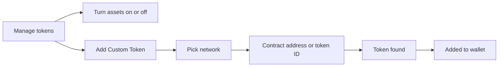

# Assets

One asset's screen, the tokens a wallet shows, and the assets the user picks from.

## Asset screen

1. Tapping an asset shows its balance and value, the price with its change, the actions the asset allows (Send, Receive, Buy, Swap, Stake), its price chart and market data ([Market](market.md)), its balance breakdown, and its transactions.
2. The user can pin or hide the asset, open it on the explorer, share it, and set Price Alerts.

| When | Expected | Why |
|---|---|---|
| The asset screen opens | chart, history and market data load at the same time; the header is usable while they arrive | |

## Manage tokens

1. The user turns assets on or off for the wallet.
2. A custom token is looked up by its contract address or token ID and added to the wallet.

| When | Expected | Why |
|---|---|---|
| An asset is turned off | it leaves the list and keeps its data | |
| The custom token is unverified | "Know What You're Adding" shows before it is added | |
| The user picks an asset | Recents: the assets the user recently used, per wallet, most recent first | |
| The list below Recents is filtered | Recents follow the same filters | picking an asset to sell never offers one that cannot be sold |

## Platform differences

| When | iOS | Android | Expected |
|---|---|---|---|
| A network's asset list opens | lists only assets on networks the wallet has an address for | also lists assets on networks without an address | Android matches iOS (BD373) |
