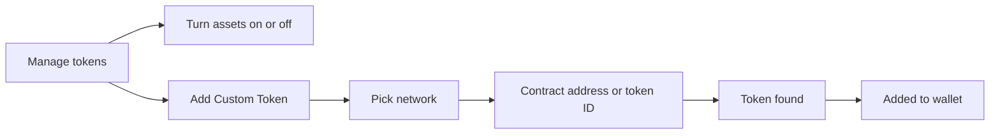

# Assets

One asset's screen, the tokens a wallet shows, and the assets the user picks from.

## Asset screen

- Tapping an asset shows its balance and value, the price with its change, the actions the asset allows (Send, Receive, Buy, Swap, Stake), its price chart and market data ([Market](market.md)), its balance breakdown, and its transactions.
- The user can pin or hide the asset, open it on the explorer, share it, and set Price Alerts.
- Chart, history and market data load at the same time; the header is usable while they arrive.

## Manage tokens

- The user turns assets on or off for the wallet; a turned-off asset leaves the list and keeps its data.
- A custom token is looked up by its contract address or token ID; an unverified one shows "Know What You're Adding" before it is added.
- Assets the user recently used appear as Recents when picking an asset, per wallet, most recent first.
- Recents follow the same filters as the list below them, so picking an asset to sell never offers one that cannot be sold.
