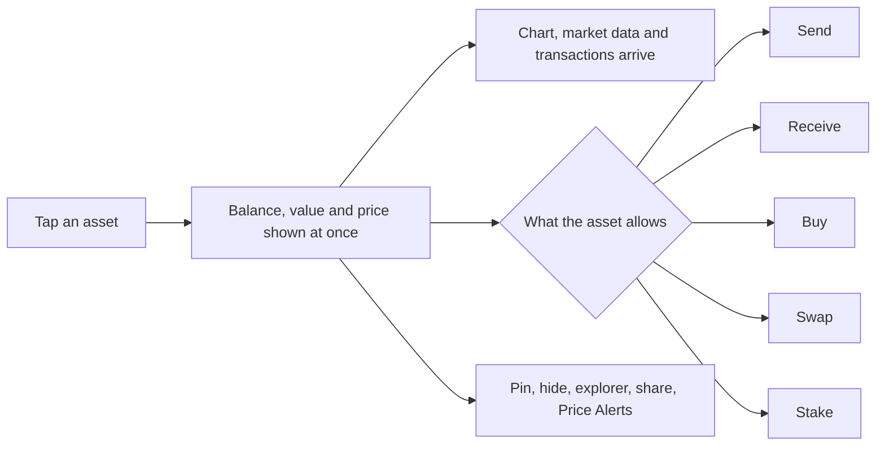
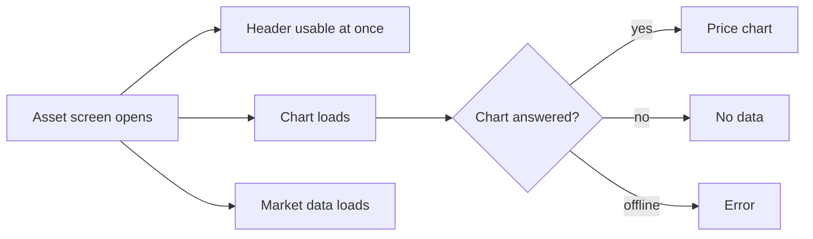
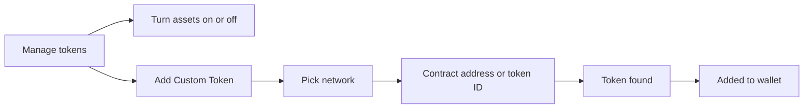

# Assets

One asset's screen, the tokens a wallet shows, and the assets the user picks from.

## Asset screen

```mermaid
flowchart LR
    A[Tap an asset] --> B[Balance, value and price shown at once]
    B --> C[Chart, market data and transactions arrive]
    B --> D{What the asset allows}
    D --> E[Send]
    D --> F[Receive]
    D --> G[Buy]
    D --> H[Swap]
    D --> I[Stake]
    B --> J[Pin, hide, explorer, share, Price Alerts]
```

1. Tapping an asset shows its balance and value, the price with its change, the actions the asset allows (Send, Receive, Buy, Swap, Stake), its price chart and market data ([Market](#market)), its balance breakdown, and its transactions.
2. The user can pin or hide the asset, open it on the explorer, share it, and set Price Alerts.

| When | Expected | Why |
|---|---|---|
| The asset screen opens | chart, history and market data load at the same time; the header is usable while they arrive | |
| The asset still needs activation, or its account is blocked by multisig | the header actions are disabled, the empty history offers no Buy or Swap, and the Stake balance row opens nothing | the asset cannot receive yet, or this wallet cannot sign for the account; a purchase, swap or stake would fail `test_details_state_offers_no_empty_state_action_behind_an_activation_or_multi_signature_banner`, `test_details_sections_open_no_stake_behind_an_activation_or_multi_signature_banner` |
| Receive opens for an asset that was never refreshed, or not in the last hour | the asset is refreshed, so the network selector lists every network the wallet holds it on | the networks are known only once the asset has been fetched |

## Market

```mermaid
flowchart LR
    A[Asset screen opens] --> B[Header usable at once]
    A --> C[Chart loads]
    A --> D[Market data loads]
    C --> E{Chart answered?}
    E -- yes --> F[Price chart]
    E -- no --> G[No data]
    E -- offline --> H[Error]
```

1. The asset screen shows the price chart and the asset's market data under the header.

| When | Expected | Why |
|---|---|---|
| The price chart cannot load | it shows that there is no data; only being offline shows an error | server text is not written for users |

## Manage tokens

```mermaid
flowchart LR
    A[Manage tokens] --> B[Turn assets on or off]
    A --> C[Add Custom Token] --> D[Pick network] --> E[Contract address or token ID] --> F[Token found] --> G[Added to wallet]
```

1. The user turns assets on or off for the wallet.
2. A custom token is looked up by its contract address or token ID and added to the wallet.

| When | Expected | Why |
|---|---|---|
| An asset is turned off | it leaves the list and keeps its data | |
| The custom token is unverified | "Know What You're Adding" shows before it is added | |
| The user picks an asset | Recents: the assets the user recently used, per wallet, most recent first | |
| The list below Recents is filtered | Recents follow the same filters | picking an asset to sell never offers one that cannot be sold |
