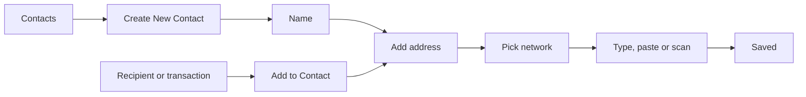

# Contacts

Saved addresses with a name, so the user never types an address twice.

1. The user creates a contact: a name, an optional description, and one or more addresses, each on a network, with a memo where that network uses one.
2. From a recipient or a transaction the user saves the address as a new contact or adds it to an existing one.
3. When sending, the recipient screen offers the contacts that have an address on that network.

## Expected results

| When | Expected | Why |
|---|---|---|
| An address is typed as a name | it is resolved | |

## Platform differences

None recorded.

## Rules

- Contacts belong to the app, not to a wallet, so every wallet sees the same list.
