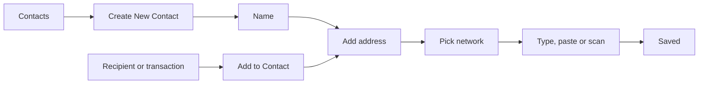

# Contacts

Saved addresses with a name, so the user never types an address twice.

```mermaid
flowchart LR
    A[Contacts] --> B[Create New Contact] --> C[Name] --> D[Add address] --> E[Pick network] --> F[Type, paste or scan] --> G[Saved]
    H[Recipient or transaction] --> I[Add to Contact] --> D
```

1. The user creates a contact: a name, an optional description, and one or more addresses, each on a network, with a memo where that network uses one.
2. From a recipient or a transaction the user saves the address as a new contact or adds it to an existing one.
3. When sending, the recipient screen offers the contacts that have an address on that network.

## Expected results

| When | Expected | Why |
|---|---|---|
| The sender of a received transfer is saved as a contact | the contact gets no memo; a sent transfer keeps its memo | a received memo identifies the user's own account, so sending with it would credit the wrong one |
| The user picks another network for an address | the memo is cleared; picking the network already selected keeps it | a memo belongs to one network, and the form does not show it, so a lost one goes unnoticed |

Names follow the shared [Names](../PRODUCT.md#names) section.

## Toasts

Toasts follow the shared [Toasts](../PRODUCT.md#toasts) section.

| When | Toast | Shows on |
|---|---|---|
| A new contact is saved | ✅ Create New Contact | where the user lands: Contacts, or the screen it was saved from |

## Platform differences

None recorded.

## Rules

- Contacts belong to the app, not to a wallet, so every wallet sees the same list.
