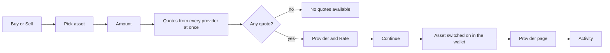

# Buy and Sell

Buy crypto from a partner provider, or sell to one, from inside the wallet: the app compares the providers' quotes and the provider's own page completes the payment.

- The user taps Buy on the wallet screen, an asset or the welcome banner and picks an asset; the screen opens as "Buy X", with a Buy | Sell switch when the asset can be sold.
- The amount is in US dollars, $50 to start for Buy and $100 for Sell, with $100, $250 and a random preset; whole dollars between $5 and $10,000.
- Shortly after typing stops, every provider (MoonPay, Mercuryo, Transak, Banxa, Paybis, Cash App) is asked at once; the Provider row shows the best one with its Rate and about how much crypto that is.
- The user can pick another provider when more than one quoted; the choice survives refreshes.
- Quotes refresh every 5 minutes while the screen is open, and a shown quote stays usable for 15 minutes on the device that asked for it, even after a network change, so Buy never fails just because the refresh came late.
- Continue opens the provider's page; the asset is already switched on in the wallet so the coins are visible on return.
- The activity icon lists every buy and sell with its provider, amounts and status; a row opens the provider's order page.
