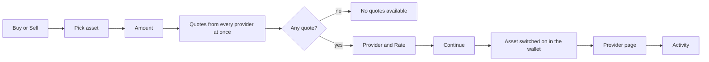

# Buy and Sell

Buy crypto from a partner provider, or sell to one, from inside the wallet: the app compares the providers' quotes and the provider's own page completes the payment.

1. The user taps Buy on the wallet screen, an asset or the welcome banner and picks an asset; the screen opens as "Buy X", with a Buy | Sell switch when the asset can be sold.
2. The amount is in US dollars, with `$100`, `$250` and a random preset.
3. Shortly after typing stops, every provider (MoonPay, Mercuryo, Transak, Banxa, Paybis, Cash App) is asked at once; the Provider row shows the best one with its Rate and about how much crypto that is.
4. Continue opens the provider's page.
5. The activity icon lists every buy and sell with its provider, amounts and status; a row opens the provider's order page.

## Expected results

| When | Expected | Why |
|---|---|---|
| The screen opens | the amount starts at `$50` for Buy and `$100` for Sell | |
| The user types an amount | whole dollars between `$5` and `$10,000` | |
| More than one provider quoted | the user can pick another; the choice survives refreshes | |
| The screen stays open | quotes refresh every `5 minutes` | |
| A shown quote is up to `15 minutes` old, even after a network change | it stays usable on the device that asked for it | Buy never fails just because the refresh came late |
| The user taps Continue | the asset is already switched on in the wallet | the coins are visible on return |

## Platform differences

None recorded.
