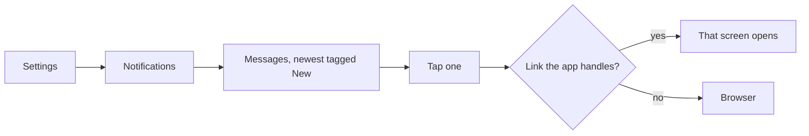

# In-app Notifications

The Notifications list in Settings: messages for the user, each able to open the screen or page it is about.

1. The Notifications list in Settings shows the messages for the user.
2. A notification with a link opens it.

## Expected results

| When | Expected | Why |
|---|---|---|
| The link is one the app handles | that screen opens in the app | |
| Any other link | it opens in the browser | |
| A notification arrived since the last visit | tagged "New", for this visit only | |

## Platform differences

None recorded.
