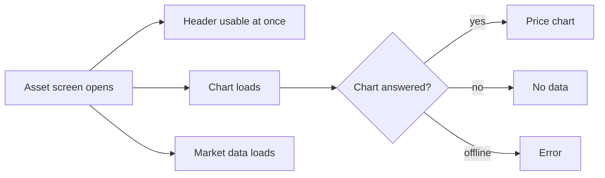

# Market

An asset's price chart and market data, on its asset screen.

1. The asset screen shows the price chart and the asset's market data under the header.

## Expected results

| When | Expected | Why |
|---|---|---|
| The asset screen opens | chart, history and market data load at the same time; the header is usable while they arrive | |
| The price chart cannot load | it shows that there is no data; only being offline shows an error | server text is not written for users |

## Platform differences

None recorded.
