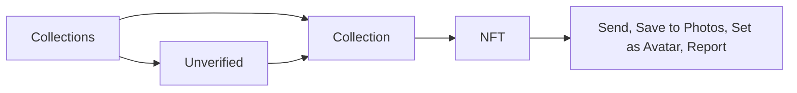

# NFT

See the wallet's NFTs by collection, open one, send it, save its image, use it as the wallet avatar, or report it.

- The wallet screen shows a Collections preview; Collections lists every verified collection with its count, and an "Unverified" row gathers the rest so spam never mixes with the wallet's real NFTs.
- A collection shows its NFTs in a grid; an NFT shows its image, name, collection, Properties, description, links, and its contract and token ID.
- From an NFT the user can Send it, "Save to Photos", "Set as Avatar" for the current wallet, share it, or Report it (Spam, Malicious, Inappropriate Content, Copyright, Other). Android offers "Save to Photos" from Android 10, where saving to the gallery needs no storage permission.
- Receive for an NFT asks which network first.
- A failed refresh keeps the list on screen, an Unverified row alone included, and says so in a toast; the error takes the list's place only when there is nothing to show.
- NFTs are loaded with the wallet's first discovery and on a pull; an empty wallet reads "Your NFTs will appear here. Receive your first NFT".
