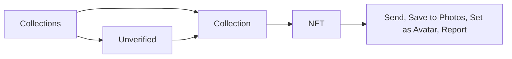

# NFT

See the wallet's NFTs by collection, open one, send it, save its image, use it as the wallet avatar, or report it.

1. NFTs are loaded with the wallet's first discovery and on a pull; the wallet screen shows a Collections preview, and Collections lists every verified collection with its count.
2. A collection shows its NFTs in a grid; an NFT shows its image, name, collection, Properties, description, links, and its contract and token ID.
3. From an NFT the user can Send it, "Save to Photos", "Set as Avatar" for the current wallet, share it, or Report it (Spam, Malicious, Inappropriate Content, Copyright, Other).

## Expected results

| When | Expected | Why |
|---|---|---|
| A collection is not verified | it is gathered under the "Unverified" row | spam never mixes with the wallet's real NFTs |
| The user opens Receive for an NFT | it asks which network first | |
| A refresh fails | the list stays on screen, an Unverified row alone included, and a toast says so | |
| A refresh fails and there is nothing to show | the error takes the list's place | |
| The wallet has no NFTs | "Your NFTs will appear here. Receive your first NFT" | |

## Platform differences

| When | iOS | Android | Expected |
|---|---|---|---|
| The user opens an NFT's actions | "Save to Photos" is offered | "Save to Photos" is offered from Android 10 | Intentional: from Android 10, saving to the gallery needs no storage permission |
| The user opens an NFT the wallet has stored | the NFT keeps its media file, with its link and type | the media file is lost when the NFT is stored, so it has none | Android matches iOS (BD299) |
