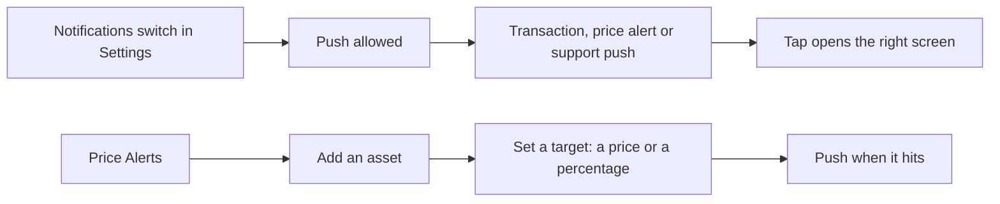

# Notifications

Push notifications for what happens to the wallet, and Price Alerts the user sets on any asset.

- Settings, Notifications holds one switch for push and a link to Price Alerts; the app asks the system for permission when the switch is turned on, and the first ask happens on a moment the user is likely to want it (after the first wallet on iOS, on first use on Android).
- Pushes cover the wallet's transactions, its Price Alerts and support replies; tapping one opens the transaction, the asset or the chat, switching first to the wallet the push belongs to.
- Price Alerts lists the assets the user tracks; adding one enables the automatic alert ("Get notified when there's a significant price change"), and the user can also set a target as a price or a percentage; the direction (over or under, increase or decrease) follows the value against the current price.
- An asset's screen shows whether alerts are on for it; "Set price alert" confirms with the target.

## Rules

- Nothing is pushed without the user's permission.
- A price alert fires once per target and is then removed from the list.
- In-app notifications that arrived since the last visit are tagged "New" for this visit only.
