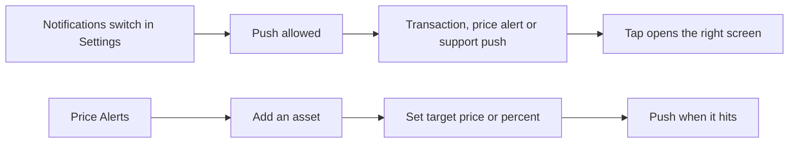

# Notifications

Push notifications for what happens to the wallet, an in-app list of them, and Price Alerts the user sets on any asset.

- Settings, Notifications holds one switch for push and a link to Price Alerts; the app asks the system for permission when the switch is turned on, and the first ask happens on a moment the user is likely to want it (after the first wallet on iOS, on first use on Android).
- Pushes cover the wallet's transactions, its Price Alerts and support replies; tapping one opens the transaction, the asset or the chat.
- Price Alerts lists the assets the user tracks; adding one enables the automatic alert ("Get notified when there's a significant price change"), and the user can set a target instead: over or under a price, or an increase or decrease by a percent from the current price.
- An asset's screen shows whether alerts are on for it; "Set price alert" confirms with the target.
- The in-app notifications screen lists what was pushed, newest first, and marks what was read.

## Rules

- Nothing is pushed without the user's permission, and the ask is never repeated within a month.
- A price alert fires once per target and is then removed from the list.
