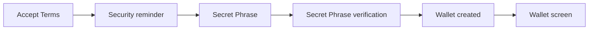
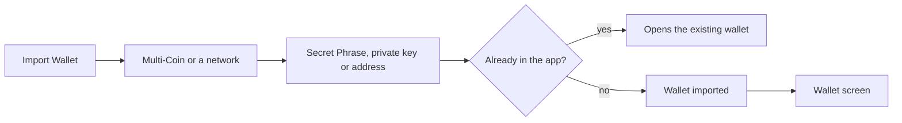
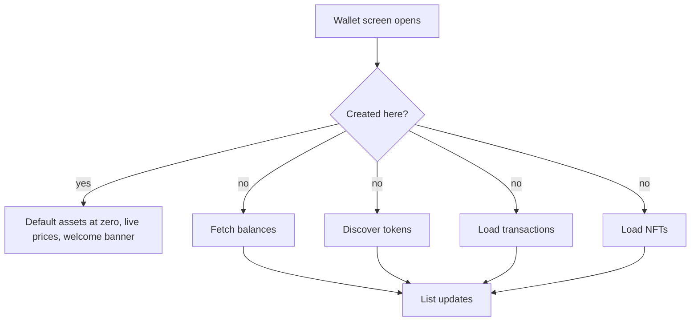

# Onboarding

Getting a wallet into the app: create a new one, or import one with a Secret Phrase, a private key or an address.

## Create wallet

- The user accepts the terms once per install and reads the security reminder on every create.
- The user sees a new 12-word Secret Phrase in two numbered columns and can copy it; the copy expires after one minute.
- The user verifies it on the "Confirm" screen by tapping the words back in order, shuffled inside groups of four.
- The wallet is created, named "Wallet #N", selected, and the wallet screen opens.

## Import wallet

- Multi-Coin takes a Secret Phrase; a single network takes a Secret Phrase, a private key where the network supports one, or an address for a watch-only wallet.
- While typing a Secret Phrase, word suggestions complete the last word and a tap replaces it; with the cursor inside the phrase no suggestions show, so a tap never changes the wrong word.
- An address can be typed as a name; the resolved name becomes the wallet name.
- The wallet is imported, named and selected in one step; a wallet that already exists is simply opened.

## After create and import

- A created wallet has no history, so nothing is fetched until its second refresh; it shows its default assets, live prices and the welcome banner with Buy and Receive.
- An imported wallet fetches its balances, discovers its tokens, and loads its transactions and NFTs, four separate requests at the same time; a "Loading" row stays above the list until token discovery completes.

## Rules

- The Secret Phrase never leaves the device and is never written to a log.
- The Secret Phrase and private key screens hide their content during screen recording and whenever the app is not active; on iOS a screenshot is detected and warned about, Android blocks it.
