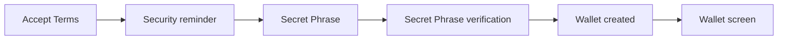
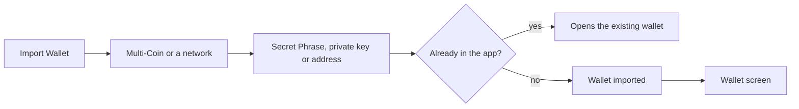
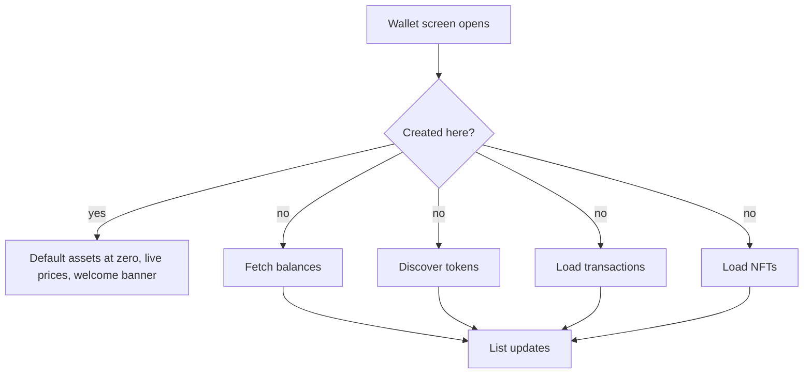

# Onboarding

Getting a wallet into the app: create a new one, or import one with a Secret Phrase, a private key or an address.

## Create wallet

1. The user accepts the terms and reads the security reminder.
2. The user sees a new 12-word Secret Phrase in two numbered columns and can copy it.
3. The user verifies it on the "Confirm" screen by tapping the words back in order, shuffled inside groups of four.
4. The wallet is created, named "Wallet #N", selected, and the wallet screen opens.

| When | Expected | Why |
|---|---|---|
| The terms were already accepted on this install | they are not asked again; the security reminder still shows on every create | |
| The user copies the Secret Phrase | the copy expires after one minute | |

## Import wallet

1. The user taps Import Wallet and picks Multi-Coin or a network.
2. The user enters a Secret Phrase, a private key or an address.
3. The wallet is imported, named and selected in one step, and the wallet screen opens.

| When | Expected | Why |
|---|---|---|
| The user picks Multi-Coin | it takes a Secret Phrase | |
| The user picks a single network | it takes a Secret Phrase, a private key where the network supports one, or an address for a watch-only wallet | |
| The user types a Secret Phrase | word suggestions complete the last word, and a tap replaces it | |
| The cursor is inside the phrase | no suggestions show | a tap never changes the wrong word |
| An address is typed as a name | the resolved name becomes the wallet name | |
| The wallet already exists | it is simply opened | |

## After create and import

| When | Expected | Why |
|---|---|---|
| The wallet was created | its default assets, live prices and the welcome banner with Buy and Receive; nothing is fetched until its second refresh | a created wallet has no history |
| The wallet was imported | it fetches its balances, discovers its tokens, and loads its transactions and NFTs, four separate requests at the same time | |
| An imported wallet's token discovery has not completed | a "Loading" row stays above the list | |

## Platform differences

| When | iOS | Android | Expected |
|---|---|---|---|
| The user types an invalid word while importing a Secret Phrase | no per-word highlight | highlights the invalid word | Intentional: a one-sided feature, added to iOS only when required |
| The user takes a screenshot of the Secret Phrase or private key screen | the screenshot is detected and the user is warned | the screenshot is blocked | Intentional |

## Rules

- The Secret Phrase never leaves the device and is never written to a log.
- The Secret Phrase and private key screens hide their content during screen recording and whenever the app is not active.
