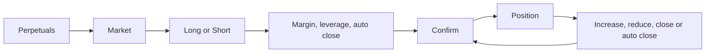
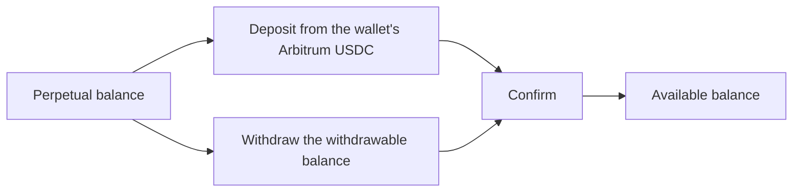

# Perpetuals

Go long or short on Hyperliquid markets with leverage, from a USDC balance the user deposits and withdraws inside the app. Multi-Coin wallets only.

- The user switches Perpetuals on in Settings or from the "Trade Perpetuals on Hyperliquid" banner; the wallet screen gains a Perpetuals section and the Portfolio a Perpetuals view.
- The Perpetuals list shows the balance with Deposit and Withdraw, then Positions, Pinned and Markets; prices move live; a long press pins a market; search filters positions and markets.
- A market shows a candlestick chart with a period picker, the position if there is one, Long and Short (or Modify and Close), Volume, Open Interest and Funding APR, and its activity.
- Long or Short takes the USDC margin, a leverage from 1x to the market's cap (default from Settings), and an Auto Close prefilled from the default take profit and stop loss; changing the leverage refreshes an untouched default and keeps an edited price. Reopening Auto Close before confirming shows the prices already set, with their expected PnL.
- Confirm shows the position ("Long 5x"), the size, the price with 2% slippage, and the take profit and stop loss prices.
- After a position is opened, closed, increased, reduced or modified, a message confirms what was done ("Open Long", "Close position").
- A position shows its PnL with percent, Auto Close, Size, Entry Price, Liquidation price, Margin and Funding Payments; Modify increases or reduces it, Close goes straight to confirmation with the expected PnL.
- Deposit moves USDC from the wallet's Arbitrum account (at least 5 USDC); Withdraw moves the withdrawable balance back (at least 2 USDC).

## Rules

- Perpetuals are offered only to a Multi-Coin wallet with a Hyperliquid account, and only after the user switches them on.
- An order is priced 2% against the trader, because it must fill while the price moves.
- Every perpetual value is in dollars whatever currency the wallet uses, because the collateral is USDC.
- A perpetual opens its market screen wherever it is opened from (search, recents, a transaction, a notification or a link), because Core decides which screen an asset opens for both apps.
