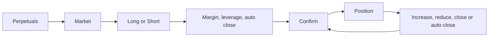
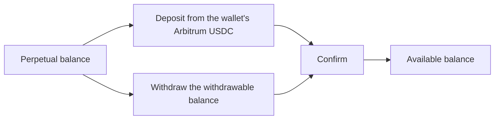

# Perpetuals

Go long or short on Hyperliquid markets with leverage, from a USDC balance the user deposits and withdraws inside the app. Multi-Coin wallets only.

1. The user switches Perpetuals on in Settings or from the "Trade Perpetuals on Hyperliquid" banner; the wallet screen gains a Perpetuals section and the Portfolio a Perpetuals view.
2. The Perpetuals list shows the balance with Deposit and Withdraw, then Positions, Pinned and Markets; prices move live.
3. A market shows a candlestick chart with a period picker, Long and Short, Volume, Open Interest and Funding APR, and its activity.
4. Long or Short takes the USDC margin, a leverage from `1x` to the market's cap, and an Auto Close prefilled from the default take profit and stop loss.
5. Confirm shows the position ("Long 5x"), the size, the price with `2%` slippage, and the take profit and stop loss prices.
6. After a position is opened, closed, increased, reduced or modified, a message confirms what was done ("Open Long", "Close position").
7. A position shows its PnL with percent, Auto Close, Size, Entry Price, Liquidation price, Margin and Funding Payments; Modify increases or reduces it.
8. Deposit moves USDC from the wallet's Arbitrum account, at least `5 USDC`; Withdraw moves the withdrawable balance back, at least `2 USDC`.

## Expected results

| When | Expected | Why |
|---|---|---|
| The wallet is not Multi-Coin or has no Hyperliquid account, or the user has not switched Perpetuals on | Perpetuals are not offered | |
| The user long-presses a market | it is pinned | |
| The user searches | positions and markets are filtered | |
| The market has a position | the position shows, with Modify and Close in place of Long and Short | |
| Long or Short opens | the leverage starts at the default from Settings | |
| The user changes the leverage | an untouched default take profit or stop loss is refreshed; an edited price is kept | |
| The user reopens Auto Close before confirming | the prices already set, with their expected PnL | |
| The user edits Auto Close on an open position | Confirm turns on as soon as the take profit or stop loss changes; what is wrong shows after tapping it | |
| The user sets Auto Close while opening a position | Confirm turns on only when the change can be placed | |
| An order is placed | it is priced `2%` against the trader | it must fill while the price moves |
| The user taps Close on a position | straight to confirmation, with the expected PnL | |
| The wallet's currency is not dollars | every perpetual value is still in dollars | the collateral is USDC |
| A perpetual is opened from search, recents, a transaction, a notification or a link | its market screen | one rule decides which screen an asset opens, for both apps |

## Platform differences

None recorded.
