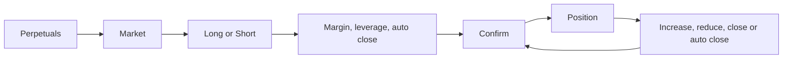
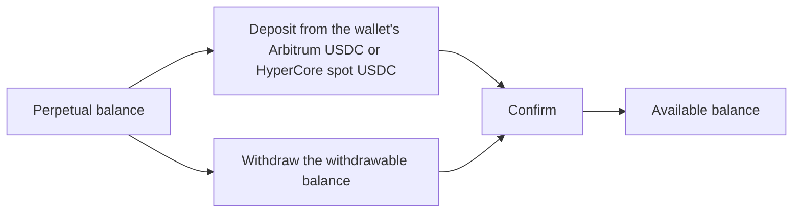

# Perpetuals

Go long or short on Hyperliquid markets with leverage, from a USDC balance the user deposits and withdraws inside the app. Multi-Coin wallets only.

```mermaid
flowchart LR
    A[Perpetuals] --> B[Market] --> C[Long or Short] --> D[Margin, leverage, auto close] --> E[Confirm] --> F[Position]
    F --> G[Increase, reduce, close or auto close] --> E
```

1. The user switches Perpetuals on in Settings or from the "Trade Perpetuals on Hyperliquid" banner; the wallet screen gains a Perpetuals section and the Portfolio a Perpetuals view.
2. The Perpetuals list shows the balance with Deposit and Withdraw, then Positions, Pinned and Markets; prices and their 24h change move live.
3. A market shows a candlestick chart with a period picker, Long and Short, Volume, Open Interest and Funding APR, and its activity.
4. Long or Short takes the USDC margin, a leverage from `1x` to the market's cap, and an Auto Close prefilled from the default take profit and stop loss.
5. Confirm shows the position ("Long 5x"), the size, the price with `2%` slippage, and the take profit and stop loss prices.
6. After a position is opened, closed, increased, reduced or modified, a message confirms what was done ("Open Long", "Close position").
7. A position shows its PnL with percent, Auto Close, Size, Entry Price, Liquidation price, Margin and Funding Payments; Modify increases or reduces it.
8. Deposit moves USDC from the wallet's Arbitrum account, at least `5 USDC`, or, on a standard Hyperliquid account, from its HyperCore spot USDC; Withdraw moves the withdrawable balance back, at least `2 USDC`, plus Hyperliquid's `1 USDC` network fee.

```mermaid
flowchart LR
    A[Perpetual balance] --> B[Deposit from the wallet's Arbitrum USDC or HyperCore spot USDC] --> C[Confirm] --> D[Available balance]
    A --> E[Withdraw the withdrawable balance] --> C
```

## Expected results

| When | Expected | Why |
|---|---|---|
| The wallet is not Multi-Coin or has no Hyperliquid account, or the user has not switched Perpetuals on | Perpetuals are not offered | |
| The user switches Perpetuals off | the markets, positions and every wallet's perpetual recents are removed | search must not offer a market the app no longer has |
| A market's price moves while the list is open | its 24h change moves with it | the change next to the price must agree with it and with Hyperliquid |
| The user long-presses a market | it is pinned | |
| The user searches | positions and markets are filtered | |
| The user pinches the chart | it zooms toward the newest candle while that candle is on screen, and around the point between the fingers once panned back, down to 14 candles on screen; a zoomed chart pans back in time with a swipe; pinching out stops at the whole period; a market with fewer than 14 candles draws them at that width, newest on the right | the live candle is what the user watches; wider bodies than 14 stop reading as a trend `test_magnified` `test_candle_chart` |
| The chart shows its time labels | at most four, on round times of the user's own clock (quarter hours, six hours, whole days, calendar months); a pan slides them with their candles and only a pinch changes the step | a label that jumps or re-spaces while the user drags cannot be read `test_x_ticks` |
| The market has a position | the position shows, with Modify and Close in place of Long and Short | |
| Long or Short opens | the leverage starts at the default from Settings | |
| The user changes the leverage | an untouched default take profit or stop loss is refreshed; an edited price is kept | |
| The user reopens Auto Close before confirming | the prices already set, with their expected PnL | |
| The user edits Auto Close on an open position | Confirm turns on as soon as the take profit or stop loss changes; what is wrong shows after tapping it | |
| The user sets Auto Close while opening a position | Confirm turns on only when the change can be placed | |
| An order is placed | it is priced `2%` against the trader | it must fill while the price moves |
| An opened position appears in Activity | its size (margin × leverage) while it fills, then the filled size in dollars | the row must read the same before and after Hyperliquid reports it; the filled size can differ by cents because size is rounded to the market's step and the fill price moves |
| The user taps Close on a position | straight to confirmation, with the expected PnL | |
| The user withdraws | the amount is what arrives on Arbitrum, the Network Fee shows Hyperliquid's `1 USDC`, and Max leaves the fee out | Hyperliquid takes the fee out of every withdrawal, so the screen shows what actually arrives |
| The wallet's currency is not dollars | every perpetual value is still in dollars | the collateral is USDC |
| The user taps Deposit on a standard Hyperliquid account | a choice between the Arbitrum USDC and the HyperCore spot USDC when both hold USDC, otherwise straight to the amount of the one that does, even when it is not in the wallet list | spot and perpetual balances are separate there, spot USDC often arrives from outside the wallet, and a choice of one is no choice `test_deposit_target` |
| The user taps Deposit on a unified Hyperliquid account | straight to the Arbitrum USDC amount | the spot USDC already is the perpetual balance `test_deposit_target_offers_spot_usdc_only_to_a_standard_account` |
| The user taps Deposit with no USDC to deposit | straight to the Arbitrum USDC amount, which shows the zero balance | the Arbitrum USDC deposits on every account |
| A perpetual is opened from search, recents, a transaction, a notification or a link | its market screen | one rule decides which screen an asset opens, for both apps |

## Platform differences

None recorded.
