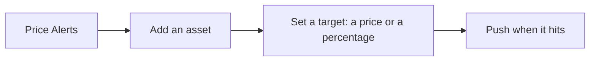

# Price Alerts

Alerts the user sets on any asset, pushed when the price moves.

1. Price Alerts lists the assets the user tracks.
2. Adding an asset enables the automatic alert ("Get notified when there's a significant price change").
3. The user can also set a target as a price or a percentage; "Set price alert" confirms with the target.
4. An asset's screen shows whether alerts are on for it.
5. An asset's Price Alerts screen shows its automatic alert as a switch with the current price, then its targets under "Active".

## Expected results

| When | Expected | Why |
|---|---|---|
| The user sets a target | the direction (over or under, increase or decrease) follows the value against the current price | |
| A target is hit | the alert fires once and is then removed from the list | |
| An asset's automatic alert and targets are both off | its Price Alerts screen shows the empty state, and only then | |

## Platform differences

None recorded.
