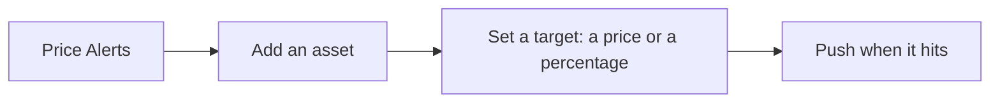

# Price Alerts

Alerts the user sets on any asset, pushed when the price moves.

- Price Alerts lists the assets the user tracks; adding one enables the automatic alert ("Get notified when there's a significant price change"), and the user can also set a target as a price or a percentage; the direction (over or under, increase or decrease) follows the value against the current price.
- An asset's screen shows whether alerts are on for it; "Set price alert" confirms with the target.
- An asset's Price Alerts screen shows its automatic alert as a switch with the current price, then its targets under "Active", and the empty state only when both are off.

## Rules

- A price alert fires once per target and is then removed from the list.
