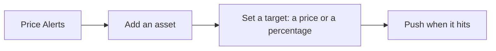

# Price Alerts

Alerts the user sets on any asset, pushed when the price moves.

```mermaid
flowchart LR
    E[Price Alerts] --> F[Add an asset] --> G[Set a target: a price or a percentage] --> H[Push when it hits]
```

1. Price Alerts lists the assets the user tracks.
2. Adding an asset enables the automatic alert ("Get notified when there's a significant price change").
3. The user can also set a target as a price or a percentage; "Set price alert" confirms with the target.
4. An asset's screen shows whether alerts are on for it.
5. An asset's Price Alerts screen shows its automatic alert as a switch with the current price, then its targets under "Active".

## Expected results

| When | Expected | Why |
|---|---|---|
| The user sets a target | the direction (over or under, increase or decrease) follows the value against the current price | |
| A target is hit | the alert fires once and is then removed from the list | |
| The price crosses a round number | the push names the round number and the current price in the user's currency | the milestone is counted in that currency, so both numbers read in one currency |
| An asset's automatic alert and targets are both off | its Price Alerts screen shows the empty state, and only then | |
| The user turns Enable Price Alerts off or on | the server is told at once; if it cannot be reached, the choice is kept, the error is shown and the next sync sends it | price alerts are pushed while the app is closed, so waiting for the next app open would keep pushing alerts the user turned off |
| The user enables an alert but refuses notifications | nothing changes: no alert is kept, no confirmation is shown, the Enable Price Alerts switch stays off | an alert that can never be delivered is not kept |
| The user adds an alert while Enable Price Alerts is on but notifications are off | the app asks for notifications first; allowed turns notifications back on and keeps the alert, refused keeps nothing | the server pushes price alerts only to a device with notifications on |

## Toasts

Toasts follow the shared [Toasts](../PRODUCT.md#toasts) section.

| When | Toast | Shows on |
|---|---|---|
| An asset is added to Price Alerts | 🔔 Price alert enabled for Bitcoin | Price Alerts |
| An alert is set for a price over | 🔔 Alert added for price over $70,000.00 | the screen Set Price Alert was opened from |
| An alert is set for a price under | 🔔 Alert added for price under $60,000.00 | the screen Set Price Alert was opened from |
| An alert is set for a price increase | 🔔 Alert added for price increase of 5% | the screen Set Price Alert was opened from |
| An alert is set for a price decrease | 🔔 Alert added for price decrease of 5% | the screen Set Price Alert was opened from |
| Turning an alert on or off, or deleting one, fails | ❌ the reason | where it happened |

## Platform differences

| When | iOS | Android | Expected |
|---|---|---|---|
| The build cannot push (F-Droid, Huawei) | not applicable | no price alert bell on the asset screen, no price alert row on the asset or chart screen | Intentional: an alert that can never be delivered is not offered |
