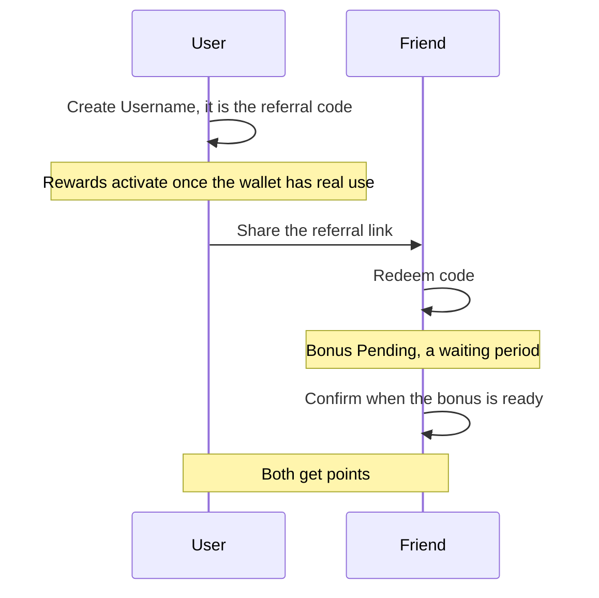
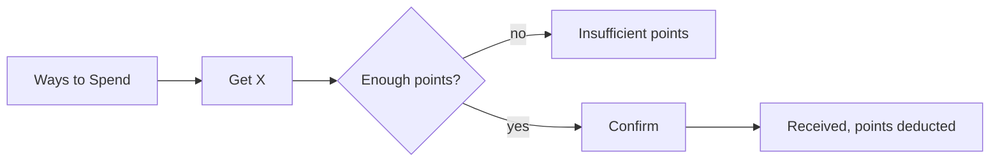

# Rewards

Earn points by inviting friends, and spend them on assets.

1. The user opens Rewards from Settings and sees their points, their referrals and the ways to spend.
2. "Create Username" sets a nickname for the current wallet; it is the referral code.
3. "Invite Friends" says how many points each friend brings, and the user shares the code as a link.
4. A friend taps "Redeem code"; after the waiting period "Your bonus is ready!" and both get points.
5. "Ways to Spend" lists assets the user can get for points; redeeming asks for confirmation and shows the result on the same screen.

## Expected results

| When | Expected | Why |
|---|---|---|
| The user types a username | it takes letters and digits, 4 to 16 characters | |
| The wallet already has a username | it cannot set another | a username is permanent |
| A typed code has spaces around it | the spaces are ignored | |
| The device or its wallets are no longer new enough to be referred | "Redeem code" is not offered | the server refuses a code after that window |
| A code is opened from a referral link | it still reaches the server | the server accepts it from partner codes that have no window |
| The account is disabled | why, in the user's own language, never the internal reason the server stored | |
| The user redeems with too few points, or an option that has run out | it says so instead of a generic error | |

## Platform differences

None recorded.

## Rules

- Rewards belong to one wallet, the one the app picks as the rewards wallet.
