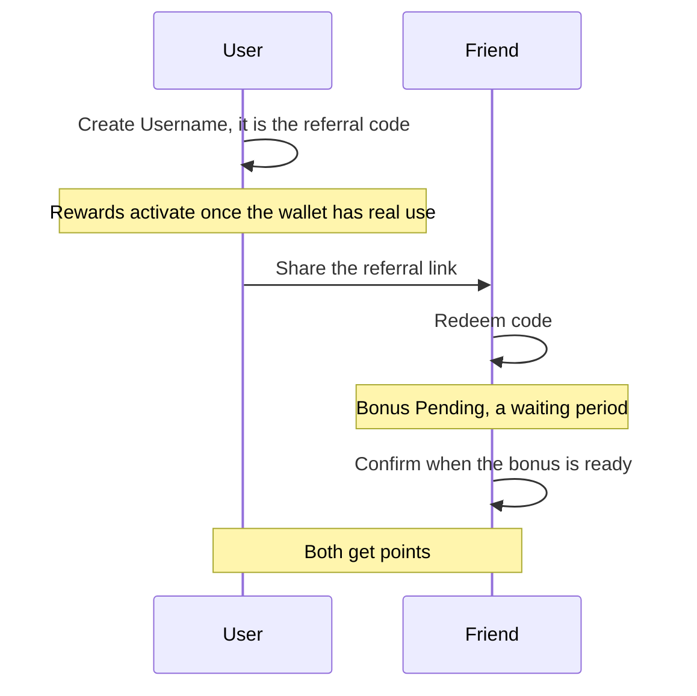
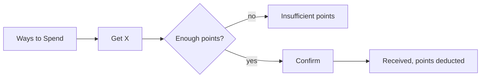

# Rewards

Earn points by inviting friends, and spend them on assets. Rewards belong to one wallet, the one the app picks as the rewards wallet.

- The user opens Rewards from Settings and sees their points, their referrals and the ways to spend.
- "Create Username" sets a nickname for the current wallet (letters and digits, 4 to 16 characters); it is the referral code.
- "Invite Friends" says how many points each friend brings, and the user shares the code as a link.
- A friend taps "Redeem code", and spaces around a typed code are ignored; after the waiting period "Your bonus is ready!" and both get points.
- "Ways to Spend" lists assets the user can get for points; redeeming asks for confirmation and shows the result on the same screen.

## Rules

- A username is permanent; a wallet that has one cannot set another.
- An option can be redeemed only once the account is verified; until then it is listed but not tappable.
