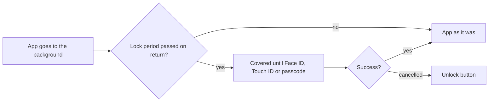
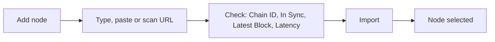

# Settings

Reach the wallets, protect the app, tune currency, language and appearance, choose networks, read about the app, and turn on developer tools.

1. Settings lists Wallets, Security, Notifications, Preferences, WalletConnect, Support, Rewards, About Us and, once turned on, Developer.
2. Preferences: Currency (a searchable list with "Recommended" above "All"), Language, Appearance (System, Light, Dark), Networks, Contacts, and the Perpetuals switch with its default leverage, take profit and stop loss.
3. Security: "Enable Face ID" (or Touch ID, or "Enable Passcode"), then "Require authentication" after Immediately, 1 minute, 5, 15, 1 hour or 6 hours, and Hide Balance.
4. Networks: a Status row with the API, the Stream and each Gem Wallet Node with its latency; per network, the node in use (Gem Wallet Node per region, or one the user added) and the block explorer.
5. Notifications holds one switch for push and a link to Price Alerts; pushes cover the wallet's transactions, its Price Alerts and support replies.
6. About Us: Terms of Services, Privacy Policy, Visit Website, Community links and Version.

## Expected results

| When | Expected | Why |
|---|---|---|
| A currency has no exchange rate | Currency does not offer it | |
| The user picks a currency | every value in the app converts at once | |
| The user opens Language | the system's per-app language setting opens | |
| Hide Balance is turned on | balances are masked everywhere, with no prompt | |
| The lock period has passed, whatever the app was doing | the lock re-engages | |
| A WalletConnect request is open when the lock period passes | the lock still re-engages; the request cannot hold it off | |
| The user turns the push switch on | the app asks the system for permission | |
| A wallet is created or imported, including one that was already on the device | the app offers push right after | |
| The app has offered push | it asks again no sooner than 30 days later, unless the user turned push off | |
| The user taps a push | the app switches to the wallet the push belongs to, then opens the transaction, the asset or the chat | |
| A newer release exists | "New update available!" at launch, with Update and Skip, and in About Us | |
| The update is required | no Skip | |
| The user closes the update prompt | it counts as Skip | |
| The user skipped a version | that version is not offered again | |
| The user long-presses Version | Developer turns on or off | |
| After the fifth launch | the app asks once for a store review | |

## Platform differences

| When | iOS | Android | Expected |
|---|---|---|---|
| The user opens Security | also offers Privacy Lock | does not | Intentional |
| The user opens Developer | includes a deep link URL tool | includes a platform store setting | Intentional (developer-only) |

## Rules

- Nothing is pushed without the user's permission.
