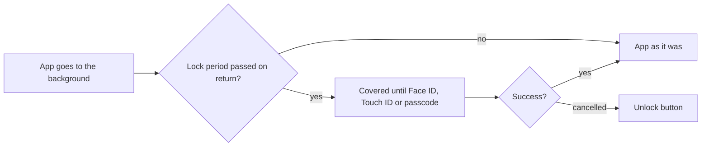
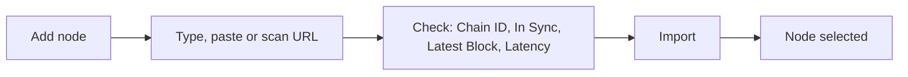

# Settings

Reach the wallets, protect the app, tune currency, language and appearance, choose networks, read about the app, and turn on developer tools.

- Settings lists Wallets, Security, Notifications, Preferences, WalletConnect, Support, Rewards, About Us and, once turned on, Developer.
- Preferences: Currency (a searchable list with "Recommended" above "All", offering only currencies with an exchange rate; every value in the app converts at once), Language (opens the system's per-app language setting), Appearance (System, Light, Dark), Networks, Contacts, and the Perpetuals switch with its default leverage, take profit and stop loss.
- Security: "Enable Face ID" (or Touch ID, or "Enable Passcode"), then "Require authentication" after Immediately, 1 minute, 5, 15, 1 hour or 6 hours; on iOS also Privacy Lock. Hide Balance masks balances everywhere with no prompt.
- Networks: a Status row with the API, the Stream and each Gem Wallet Node with its latency; per network, the node in use (Gem Wallet Node per region, or one the user added) and the block explorer.

- About Us: Terms of Services, Privacy Policy, Visit Website, Community links, Version, and "New update available!" when a newer release exists; a long press on Version turns Developer on or off.
- At launch a newer release shows "New update available!" with Update and, unless the update is required, Skip; a skipped version is not offered again.
- After the fifth launch the app asks once for a store review.

## Rules

- The lock always re-engages once the lock period has passed, whatever the app was doing; an open WalletConnect request cannot hold it off.
