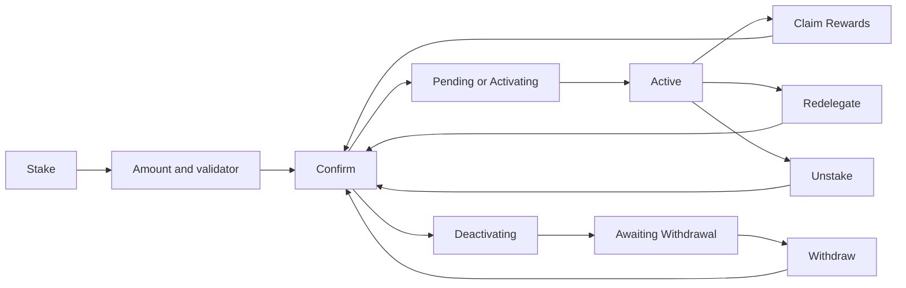

# Stake

Earn rewards on a network's coin by delegating it to a validator (on TRON, by freezing it), see every delegation's state, and unstake, redelegate, withdraw or claim from one place.

1. The user opens a stakeable coin and taps its Staked row or the "Start staking" banner; the Stake screen shows the APR, the Lock Time and the Minimum amount.
2. Stake opens the Amount screen with the available balance, a Max that keeps a little back for future fees, and a recommended validator already picked; the Validators list shows Recommended first, then Active validators by APR.
3. Continue opens the confirmation screen with the amount, the validator, the network and the fee.
4. Each delegation shows its validator, its state (Active, Pending, Activating, Deactivating, Inactive, Awaiting Withdrawal), and its amount and value; delegations are listed largest first.
5. Tapping a delegation opens its details, which offer only the actions its state and network allow: Unstake (part or all), Redelegate, Withdraw and Claim Rewards.

## Expected results

| When | Expected | Why |
|---|---|---|
| An Active delegation has rewards | Rewards shows on it | |
| A delegation has yet to activate or become available | a countdown says when | |
| The user taps a delegation awaiting withdrawal, in a wallet that can sign | straight to Withdraw | |
| No other active validator exists | no Redelegate | |
| The user redelegates | never to the validator being left | |
| The delegation is awaiting withdrawal | Withdraw is offered | |
| The coin is TRX on TRON | the user freezes and unfreezes it, and sees Energy and Bandwidth as "available / total" | |

## Platform differences

| When | iOS | Android | Expected |
|---|---|---|---|
| Earn, not offered yet, opens for a token such as USDC or USDT | the Earn providers are listed | no provider is found, so none is offered | Android matches iOS (BD341) |

## Rules

- Earn (deposit with the best provider) sits behind the same screens but is behind a flag and not offered in the shipped apps.
