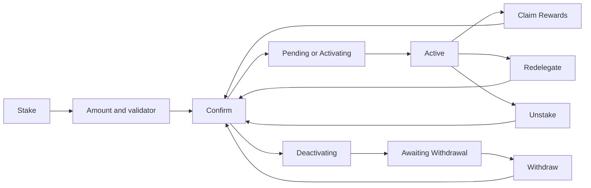

# Stake

Earn rewards on a network's coin by delegating it to a validator (on TRON, by freezing it), see every delegation's state, and unstake, redelegate, withdraw or claim from one place.

- The user opens a stakeable coin and taps its Staked row or the "Start staking" banner; the Stake screen shows the APR, the Lock Time and the Minimum amount.
- Stake opens the Amount screen with the available balance, a Max that keeps a little back for future fees, and a recommended validator already picked; the Validators list shows Recommended first, then Active validators by APR.
- Continue opens the confirmation screen with the amount, the validator, the network and the fee.
- Each delegation shows its validator, its state (Active, Pending, Activating, Deactivating, Inactive, Awaiting Withdrawal), its amount and value, and Rewards when an Active one has any; a countdown says when it activates or becomes available.
- A delegation's details offer only the actions its state and network allow: Unstake (part or all), Redelegate (never to the validator being left), Withdraw when awaiting withdrawal, and Claim Rewards.
- On TRON the user freezes and unfreezes TRX and sees Energy and Bandwidth as "available / total".
- Earn (deposit with the best provider) sits behind the same screens but is behind a flag and not offered in the shipped apps.
