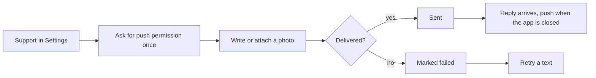

# Support

A chat with the Gem Wallet team inside the app: write, attach photos, read replies, and tap links that open the right screen.

1. The user opens Support in Settings.
2. The user writes a message or attaches a photo; it appears at once, then as sent.
3. Messages are grouped by day, with a typing indicator while an agent writes.
4. A reply arrives, and a support push opens the chat.

## Expected results

| When | Expected | Why |
|---|---|---|
| Support opens while push is off | it offers push under the same rule as a new wallet: never after the user turned push off, and no sooner than 30 days after the last ask | it lets a reply reach the user without overriding the user's choice or sending them to system Settings on every visit |
| The device cannot register for push | the chat says so | |
| A new conversation | "How can we help?" | |
| The user attaches a photo | it is resized before it goes | |
| The user taps a photo | it opens full-size | |
| A message fails | it is marked failed, not removed; a failed text can be retried from the message | |
| A reply has a Gem Wallet link | it opens the right screen inside the app | |
| Any other link | it opens in the browser | |
| The app loses the live connection | the typing indicator goes away | it lives only as long as the live connection, so it never stays under a reply that already arrived |

## Platform differences

None recorded.

## Rules

- A message the user sends never disappears.
