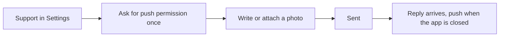

# Support

A chat with the Gem Wallet team inside the app: write, attach photos, read replies, and tap links that open the right screen.

- Opening Support asks for notification permission when push is off and the system can still ask, so a reply can reach the user; it never asks twice.
- A new conversation shows "How can we help?"; a sent message appears at once, then as sent; a photo is resized before it goes and opens full-size on tap.
- Messages are grouped by day with a typing indicator while an agent writes; a failed text can be retried from the message.
- A Gem Wallet link in a reply opens the right screen inside the app; any other link opens in the browser.
- A support push opens the chat.

## Rules

- A message the user sends shows at once and never disappears; a failure marks it, it does not remove it.
