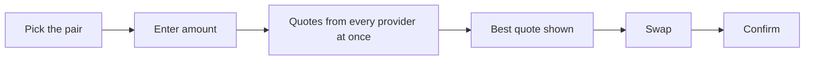

# Swap

Trade one asset for another from inside the wallet, on one network or across two, at the best quote among the providers. The Swap screen prepares the trade; the confirmation screen signs it.

- The user opens Swap from the wallet screen, an asset, or Swap Again on a past swap; the pair is filled in (a token the wallet does not hold is paid with its network's coin, otherwise the most recently used pair), never the same asset on both sides.
- Picking the asset already on the other side turns the pair around, as does the arrow between the two sides.
- The user types an amount or taps 25%, 50% or 100%; shortly after typing stops, every provider that serves the pair is asked at once and You Receive shows the best quote.
- Details lists the Provider, the Rate, the Estimated Time, the Price Impact when the loss is more than 1%, the Minimum Receive and the Slippage; Providers lets the user pick another provider and the choice survives refreshes.
- Slippage is Auto (1%, 3% on Solana) or a chosen value between 0.1% and 20%, with a warning from 3%; the choice is kept for later swaps.
- Quotes refresh every 30 seconds while the screen is open; an answer for an amount or pair the user has already changed is thrown away.
- Swap prepares the trade with the chosen provider and opens the confirmation screen; a price impact of 10% or more asks "High Price Impact" first.

## Rules

- A quote is never cached; every eligible provider is asked again for the live amount.
- A swap that needs a spending approval signs it together with the swap and shows one fee for both.
