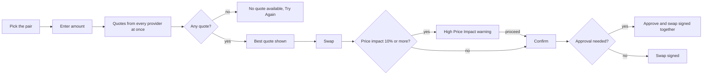

# Swap

Trade one asset for another from inside the wallet, on one network or across two, at the best quote among the providers. The Swap screen prepares the trade; the confirmation screen signs it.

1. The user opens Swap from the wallet screen, an asset, or Swap Again on a past swap; the pair is filled in, never the same asset on both sides.
2. The user types an amount or taps 25%, 50% or 100%; every provider that serves the pair is asked at once and You Receive shows the best quote.
3. Details lists the Provider, the Rate, the Estimated Time, the Minimum Receive and the Slippage; Providers lets the user pick another provider.
4. Slippage is Auto (`1%`, `3%` on Solana) or a chosen value between `0.1%` and `20%`.
5. Swap prepares the trade with the chosen provider and opens the confirmation screen.

## Expected results

| When | Expected | Why |
|---|---|---|
| Swap opens | a token the wallet does not hold is paid with its network's coin; otherwise the most recently used pair | |
| The user picks the asset already on the other side, or taps the arrow between the two sides | the pair turns around | |
| The user picks an asset | quotes are asked at once | |
| The user types an amount | quotes are asked shortly after typing stops | |
| The screen stays open | quotes refresh every `30 seconds` | |
| A refresh | You Receive stays on screen until the new quote arrives | |
| The amount, an asset or the slippage changes | You Receive clears; nothing else clears it | |
| An answer arrives for an amount or pair the user has already changed | it is thrown away | |
| The price impact is a loss of more than `1%` | Details shows the Price Impact | |
| The user picks another provider | the choice survives refreshes | |
| A chosen Slippage is `3%` or more | a warning | |
| Slippage is Auto, including Solana's `3%` | no warning | |
| The user changes Slippage | the choice is kept for later swaps | |
| The price impact is `10%` or more | "High Price Impact" asks first | |
| The swap needs a spending approval | the approval is signed together with the swap, with one fee for both | |
| The quote calls a contract | the confirmation screen shows the Provider with that contract, which opens its address details on the paying network; Swap Details names the provider only | |
| The quote pays a deposit address | no Provider row on the confirmation screen | |
| A max swap of a native coin | the network fee, and anything the provider attaches on top, stay out of the quoted amount | the confirmed amount is the one that can be sent |
| A provider's minimum is then above that amount | the user is told the minimum, not "insufficient balance" | |

## Platform differences

| When | iOS | Android | Expected |
|---|---|---|---|
| The user taps 25%, 50% or 100%, or "Use minimum amount" | quotes are asked at once | quotes wait the same short pause as typing | Android matches iOS (BD374) |

## Rules

- A quote is never cached: every eligible provider is asked again for the live amount; cached routes are only hints and every quote uses live chain state.
- Every eligible provider is awaited, so the slowest one decides how long a quote takes.
