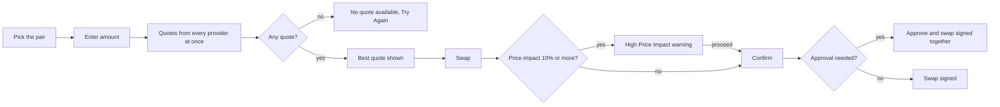
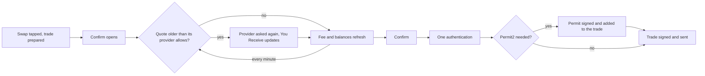
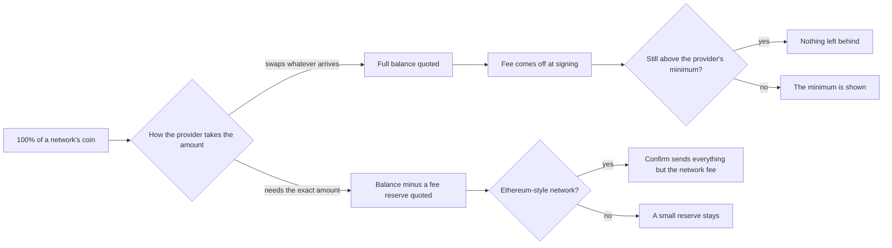

# Swap

Trade one asset for another from inside the wallet, on one network or across two, at the best quote among the providers. The Swap screen prepares the trade; the confirmation screen signs it.

```mermaid
flowchart LR
    A[Pick the pair] --> B[Enter amount] --> C[Quotes from every provider at once] --> D{Any quote?}
    D -- no --> E[No quote available, Try Again]
    D -- yes --> F[Best quote shown] --> G[Swap] --> H{Price impact 10% or more?}
    H -- yes --> I[High Price Impact warning]
    I -- proceed --> J[Confirm]
    H -- no --> J
    J --> K{Approval needed?}
    K -- yes --> L[Approve and swap signed together]
    K -- no --> M[Swap signed]
```

The confirmation screen keeps the quote fresh on its own and asks for the device's authentication once:

```mermaid
flowchart LR
    A[Swap tapped, trade prepared] --> B[Confirm opens] --> C{Quote older than its provider allows?}
    C -- no --> D[Fee and balances refresh] --> E[Confirm]
    C -- yes --> F[Provider asked again, You Receive updates] --> D
    D -- every minute --> C
    E --> G[One authentication] --> H{Permit2 needed?}
    H -- yes --> I[Permit signed and added to the trade] --> J[Trade signed and sent]
    H -- no --> J
```

A quote lives `1 minute` when the swap stays on one network and `5 minutes` when it crosses networks, because a cross-network provider gives a new deposit with every answer.

1. The user opens Swap from the wallet screen, an asset, or Swap Again on a past swap; the pair is filled in, never the same asset on both sides.
2. The user types an amount or taps 25%, 50% or 100%; every provider that serves the pair is asked at once and You Receive shows the best quote.
3. Details lists the Provider, the Rate, the Estimated Time, the Minimum Receive and the Slippage; Providers lets the user pick another provider.
4. Slippage is Auto (`1%`, `3%` on Solana) or a chosen value between `0.1%` and `20%`.
5. Swap prepares the trade with the chosen provider and opens the confirmation screen, which asks that provider again once the quote is old and signs the trade with one authentication.

## Swapping the whole balance

Providers take an amount in one of two ways. Some swap whatever arrives at a deposit address, so they can take the full balance and the network fee simply comes off what is sent. Others run a contract call that spends exactly the amount quoted, so the fee has to be set aside before the quote.

```mermaid
flowchart LR
    A[100% of a network's coin] --> B{How the provider takes the amount}
    B -- swaps whatever arrives --> C[Full balance quoted] --> D[Fee comes off at signing] --> E{Still above the provider's minimum?}
    E -- yes --> F[Nothing left behind]
    E -- no --> G[The minimum is shown]
    B -- needs the exact amount --> H[Balance minus a fee reserve quoted] --> I{Ethereum-style network?}
    I -- yes --> J[Confirm sends everything but the network fee]
    I -- no --> K[A small reserve stays]
```

| When the user swaps 100% of a network's coin and | Expected | Why |
|---|---|---|
| the provider swaps whatever arrives: Near Intents, Chainflip, Thorchain and Relay from Bitcoin and other non-Ethereum networks | the full balance is quoted; the network fee comes off when the transaction is signed, so nothing is left behind | a deposit can be any amount |
| what is left after the fee is under that provider's minimum | the minimum is shown, not a balance error | the provider would reject or refund it |
| the provider needs the exact amount: Uniswap, PancakeSwap, OKX, Jupiter, Squid, Mayan, Across, Bridgers | Swap quotes the balance minus a fee reserve, so the quote is close; the confirmation screen then asks for everything but the actual network fee and shows that amount | the reserve is a guess; the fee is known only on the confirmation screen |
| that provider is used on Solana, TON, Tron, Sui or Aptos | the reserve stays in the wallet | those networks charge more than the fee shown: rent, forwarding, energy |
| the provider says it can take any amount but builds a contract call | it is treated as needing the exact amount | otherwise the full balance would be quoted and the fee would not fit |
| a provider that leaves nothing behind quotes within `0.25%` of the best quote | that provider is chosen | a slightly smaller amount received beats a reserve stuck in the wallet |

## Expected results

| When | Expected | Why |
|---|---|---|
| Swap opens | a token the wallet does not hold is paid with its network's coin; otherwise the most recently used pair | |
| The user picks the asset already on the other side, or taps the arrow between the two sides | the pair turns around | |
| The user picks an asset | quotes are asked at once | |
| The user types an amount | quotes are asked shortly after typing stops | |
| The screen stays open | quotes refresh every `30 seconds` | |
| A refresh, including going back from Confirm | You Receive shows only the loading indicator until the new quote arrives, never the old amount with it | |
| A refresh while Details is open | Details shows the loading indicator until the new quote arrives, never the old quote's details | it matches You Receive |
| A refresh fails while Details is open | Details stays open and shows the error, as the Swap screen does | |
| The amount, an asset or the slippage changes | You Receive clears | |
| An answer arrives for an amount or pair the user has already changed | it is thrown away | |
| The price impact is a loss of more than `1%` | Details shows the Price Impact | |
| The user picks another provider | the choice survives refreshes | |
| A chosen Slippage is `3%` or more | a warning | |
| Slippage is Auto, including Solana's `3%` | no warning | |
| Slippage is Auto and the provider picks its own: OKX, Squid | Minimum Receive is priced with the most OKX may take, and with the slippage Squid picked | the minimum shown is one the trade keeps |
| The user changes Slippage | the choice is kept for later swaps | |
| The price impact is `10%` or more | "High Price Impact" asks first | |
| The swap needs a spending approval | the approval is signed together with the swap, with one fee for both | |
| The confirmation screen loads or refreshes and the quote on screen is older than `1 minute` on one network, or `5 minutes` across networks | the chosen provider is asked again for the same amount and slippage, Auto staying Auto, and You Receive shows its new answer | a quote left on the screen never goes stale, and a cross-network provider is not asked for a new deposit every minute |
| The quote is younger than that | it stays; only the fee and balances are refreshed | |
| The chosen provider no longer answers | the error row with Retry; the provider is never switched behind the user | |
| The user taps Confirm | the trade the screen loaded is signed with one authentication | the amounts signed are the amounts shown |
| The provider needs a Permit2 signature | it is signed at Confirm together with the swap, under that same authentication | nothing is signed before the confirmation screen |
| The quote calls a contract | the confirmation screen shows the Provider with that contract, which opens its address details on the paying network; Swap Details names the provider only | |
| The quote pays a deposit address | no Provider row on the confirmation screen | |
| A provider's minimum is then above that amount | the user is told the minimum, not "insufficient balance" | |
| The user taps 25%, 50% or 100%, or "Use minimum amount" | quotes are asked at once | typing waits a short pause for the amount to settle; a button's amount is already final |

## Rules

- Regional restrictions follow the shared [Feature availability](../PRODUCT.md#feature-availability) table.
- A quote is never cached: every eligible provider is asked again for the live amount; cached routes are only hints and every quote uses live chain state.
- Every eligible provider is awaited, so the slowest one decides how long a quote takes.
- Swap never signs anything: the confirmation screen holds the only authentication and signs the trade it loaded and showed.
- The Slippage row reads Auto on both screens until the user picks a value.
